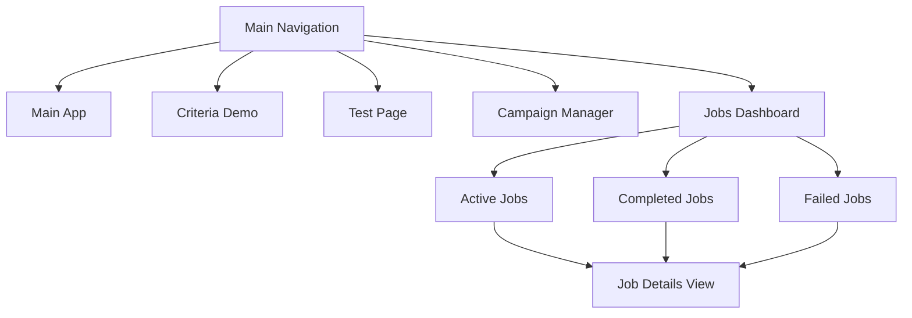

# Detailed Batch Processing Implementation

Based on our initial plan, here are more specific implementation details focusing on technology choices, UI design, and progress reporting.

## Technology Choices

### Backend Worker Service

For the background worker service, I recommend using **Node.js with Bull queue**, a Redis-based queue for Node.js. This combination offers several advantages:

1. **Reliability**: Bull provides robust job processing with automatic retries, persistence, and rate limiting
2. **Scalability**: Can easily scale to multiple workers
3. **Monitoring**: Built-in monitoring and metrics
4. **Consistency**: Same JavaScript/TypeScript language as the rest of the application

**Implementation approach**:

```javascript
// Example Bull queue setup
const Queue = require('bull');
const propertyRadarQueue = new Queue('propertyRadar', 'redis://127.0.0.1:6379');

// Process jobs
propertyRadarQueue.process(async (job) => {
  // Update job status
  await updateJobStatus(job.id, 'PROCESSING');
  
  try {
    const { criteria, batchSize = 400 } = job.data;
    let processedCount = 0;
    let totalCount = 0;
    
    // First, get total count (could be an estimate)
    totalCount = await getEstimatedTotalCount(criteria);
    await updateJobProgress(job.id, processedCount, totalCount);
    
    // Process in batches
    let hasMoreRecords = true;
    let startIndex = 0;
    
    while (hasMoreRecords) {
      // Fetch batch from PropertyRadar
      const batchResult = await fetchPropertyRadarBatch(criteria, startIndex, batchSize);
      
      // Process and store the batch
      await processBatch(batchResult.records);
      
      // Update progress
      processedCount += batchResult.records.length;
      await updateJobProgress(job.id, processedCount, totalCount);
      
      // Report progress (for logging)
      job.progress(Math.floor((processedCount / totalCount) * 100));
      
      // Check if we need to continue
      hasMoreRecords = batchResult.hasMore;
      startIndex += batchSize;
    }
    
    // Mark job as completed
    await updateJobStatus(job.id, 'COMPLETED');
    return { processedCount, totalCount };
  } catch (error) {
    // Log error and update job status
    console.error(`Job ${job.id} failed:`, error);
    await updateJobStatus(job.id, 'FAILED', error.message);
    throw error; // Rethrow to trigger Bull's retry mechanism
  }
});
```

### Job Queue Database Schema

We'll use PostgreSQL for storing job information with the following schema:

```sql
-- Jobs table
CREATE TABLE batch_jobs (
  job_id SERIAL PRIMARY KEY,
  status VARCHAR(20) NOT NULL DEFAULT 'PENDING',
  criteria JSONB NOT NULL,
  total_records INTEGER,
  processed_records INTEGER DEFAULT 0,
  success_count INTEGER DEFAULT 0,
  error_count INTEGER DEFAULT 0,
  error_details TEXT,
  created_at TIMESTAMP DEFAULT NOW(),
  updated_at TIMESTAMP DEFAULT NOW(),
  completed_at TIMESTAMP,
  created_by VARCHAR(100) NOT NULL,
  priority INTEGER DEFAULT 0,
  attempts INTEGER DEFAULT 0,
  max_attempts INTEGER DEFAULT 3
);

-- Job logs table for detailed progress tracking
CREATE TABLE batch_job_logs (
  log_id SERIAL PRIMARY KEY,
  job_id INTEGER REFERENCES batch_jobs(job_id),
  message TEXT NOT NULL,
  level VARCHAR(10) DEFAULT 'INFO',
  timestamp TIMESTAMP DEFAULT NOW()
);
```

## UI Design for Job Monitoring

### Jobs Tab

We'll add a new "Jobs" tab to the main navigation that will display all batch jobs with their status:



### Jobs Dashboard UI

The Jobs Dashboard will include:

1. **Job List View**:
   - Filterable list of all jobs
   - Status indicators with color coding
   - Progress bars for active jobs
   - Quick actions (view details, cancel, retry)

2. **Job Details View**:
   - Comprehensive job information
   - Real-time progress updates
   - Detailed logs
   - Action buttons (cancel, retry, etc.)

Here's a mockup of the Jobs Dashboard:

```
+---------------------------------------------------------------+
| Jobs Dashboard                                   [Filter ▼]    |
+---------------------------------------------------------------+
| Status  | Job ID | Description        | Progress | Created     |
+---------------------------------------------------------------+
| 🟢 ACTIVE| #1001  | AZ Properties      | [====   ] | 2 min ago  |
|         |        |                    | 40%      |             |
+---------------------------------------------------------------+
| 🔴 FAILED| #1000  | CA Foreclosures    | [=      ] | 1 hour ago |
|         |        |                    | 10%      |             |
+---------------------------------------------------------------+
| 🟡 PENDING| #999   | TX Multi-Family    | [       ] | 3 hours ago|
|         |        |                    | 0%       |             |
+---------------------------------------------------------------+
| 🟢 COMPL.| #998   | FL Condos          | [======] | Yesterday   |
|         |        |                    | 100%     |             |
+---------------------------------------------------------------+
```

And the Job Details view:

```
+---------------------------------------------------------------+
| Job #1001: AZ Properties                                      |
+---------------------------------------------------------------+
| Status: 🟢 ACTIVE                                             |
| Created: March 31, 2025 2:30 PM                               |
| Created by: current_user                                      |
+---------------------------------------------------------------+
| Progress: [====================          ] 40%                 |
| 4,000 / 10,000 records processed                              |
| Estimated time remaining: 15 minutes                          |
+---------------------------------------------------------------+
| Criteria:                                                     |
| - State: AZ                                                   |
| - PropertyType: SFR, CND                                      |
| - EquityPercent: 30% to 100%                                  |
+---------------------------------------------------------------+
| Logs:                                                         |
| [2:30:00 PM] Job started                                      |
| [2:31:15 PM] Batch 1 completed (400 records)                  |
| [2:32:30 PM] Batch 2 completed (400 records)                  |
| ...                                                           |
+---------------------------------------------------------------+
| [Cancel Job]    [Pause Job]    [Download Processed Data]      |
+---------------------------------------------------------------+
```

## Progress Reporting

For progress reporting, we'll implement a system similar to tqdm but adapted for our web application:

### Backend Progress Tracking

1. **Batch-level tracking**:
   - Track each batch's progress
   - Store start/end time for performance analysis
   - Log success/failure for each batch

2. **Overall job progress**:
   - Calculate percentage based on processed records vs. total
   - Estimate time remaining based on average processing time
   - Store all progress data in the database for persistence

### Frontend Progress Visualization

1. **Real-time updates**:
   - Poll the server every 5 seconds for job status updates
   - Use WebSockets for more responsive updates if needed
   - Implement exponential backoff for completed jobs

2. **Progress indicators**:
   - Linear progress bars with percentage
   - Circular progress indicators for dashboard
   - Color-coded status indicators

3. **Detailed metrics**:
   - Records processed per minute
   - Success/failure rate
   - Time elapsed and estimated time remaining

## Implementation Approach

### 1. Backend Worker Implementation

We'll create a separate worker process using Node.js and Bull:

1. Create a new directory `property-data-tester/worker`
2. Implement the worker service in `worker/index.js`
3. Add configuration for Redis connection
4. Implement job processing logic with batch handling

### 2. API Endpoints for Job Management

Add new endpoints to the existing Express server:

```javascript
// Create a new batch job
app.post('/api/batch-jobs', async (req, res) => {
  try {
    const { criteria, priority = 0 } = req.body;
    const username = req.session.user?.username || 'current_user';
    
    // Create job record in database
    const jobId = await jobRepository.createJob({
      criteria,
      priority,
      created_by: username
    });
    
    // Add job to queue
    await propertyRadarQueue.add({
      criteria,
      batchSize: 400
    }, {
      jobId: jobId.toString(),
      priority
    });
    
    res.json({
      success: true,
      jobId
    });
  } catch (error) {
    res.status(500).json({
      success: false,
      error: error.message
    });
  }
});

// Get job status
app.get('/api/batch-jobs/:id', async (req, res) => {
  try {
    const jobId = parseInt(req.params.id);
    const job = await jobRepository.getJobById(jobId);
    
    if (!job) {
      return res.status(404).json({
        success: false,
        error: 'Job not found'
      });
    }
    
    res.json({
      success: true,
      job
    });
  } catch (error) {
    res.status(500).json({
      success: false,
      error: error.message
    });
  }
});

// List jobs
app.get('/api/batch-jobs', async (req, res) => {
  try {
    const { status, limit = 10, offset = 0 } = req.query;
    const jobs = await jobRepository.listJobs({ status, limit, offset });
    
    res.json({
      success: true,
      jobs
    });
  } catch (error) {
    res.status(500).json({
      success: false,
      error: error.message
    });
  }
});
```

### 3. Frontend Components

Create new React components for the Jobs UI:

1. `JobsDashboard.tsx` - Main jobs listing page
2. `JobCard.tsx` - Card component for job summary
3. `JobDetails.tsx` - Detailed job view
4. `JobProgressBar.tsx` - Custom progress bar with metrics
5. `JobLogs.tsx` - Component to display job logs

Update the main App component to include the Jobs tab:

```jsx
// In App.tsx
{currentPage === 'jobs' && (
  <JobsDashboard />
)}

// Add to navigation
<Nav.Link
  href="#jobs"
  active={currentPage === 'jobs'}
  onClick={() => setCurrentPage('jobs')}
>
  Jobs
</Nav.Link>
```

## Deployment Considerations

### Running the Worker Process

For development, you can run the worker alongside the main server:

```bash
# In one terminal
npm run dev

# In another terminal
node worker/index.js
```

For production, consider using PM2 or Docker:

```bash
# Using PM2
pm2 start server.js --name api-server
pm2 start worker/index.js --name worker

# Using Docker Compose
# docker-compose.yml will define both services
docker-compose up
```

### Scaling

To handle higher loads, you can:

1. Run multiple worker instances
2. Implement worker concurrency settings
3. Use a load balancer for the API server

## Monitoring and Maintenance

1. **Implement health checks**:
   - Worker heartbeat monitoring
   - Queue size monitoring
   - Job stalling detection

2. **Add admin tools**:
   - Force retry failed jobs
   - Clear stuck jobs
   - Pause/resume queue processing

3. **Set up alerts**:
   - Email notifications for failed jobs
   - Alerts for queue backlog
   - System resource monitoring

## Next Steps

1. Implement the database schema for batch jobs
2. Set up Redis and Bull queue
3. Create the worker service
4. Implement the API endpoints
5. Develop the frontend UI components
6. Test with small batches, then scale up