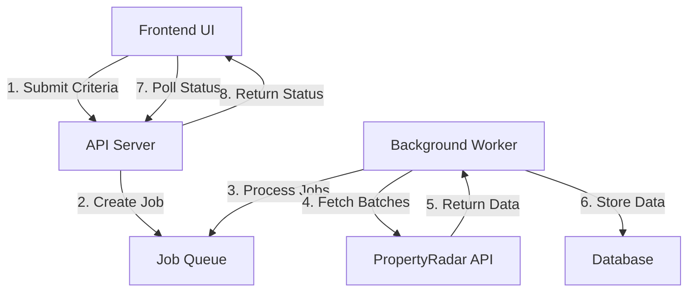

# Batch Processing Implementation Plan for PropertyRadar Leads

## Overview

This implementation plan outlines a system for processing large volumes of PropertyRadar leads (10,000+ records) without locking the UI. The system will query the PropertyRadar API in batches of 400 records, process them asynchronously in the backend, and provide status updates through the dashboard.

## System Architecture



## Components

### 1. Job Queue System

We'll implement a job queue to manage the asynchronous processing of large data requests.

**Implementation Details:**
- Use a database table to store job information
- Each job will have:
  - Unique ID
  - Status (PENDING, PROCESSING, COMPLETED, FAILED)
  - Criteria (search parameters)
  - Progress information (records processed, total records)
  - Error information (if any)
  - Created/updated timestamps

```sql
CREATE TABLE batch_jobs (
  job_id SERIAL PRIMARY KEY,
  status VARCHAR(20) NOT NULL DEFAULT 'PENDING',
  criteria JSONB NOT NULL,
  total_records INTEGER,
  processed_records INTEGER DEFAULT 0,
  success_count INTEGER DEFAULT 0,
  error_count INTEGER DEFAULT 0,
  error_details TEXT,
  created_at TIMESTAMP DEFAULT NOW(),
  updated_at TIMESTAMP DEFAULT NOW(),
  completed_at TIMESTAMP,
  created_by VARCHAR(100) NOT NULL
);
```

### 2. Backend Worker Process

A background worker process that handles the batch processing without blocking the UI.

**Implementation Details:**
- Create a worker service that runs independently of the web server
- Worker will poll the job queue for pending jobs
- For each job:
  1. Update job status to PROCESSING
  2. Calculate total number of batches needed
  3. Process each batch sequentially:
     - Fetch data from PropertyRadar API (400 records per batch)
     - Process and store the data
     - Update job progress
  4. Update job status to COMPLETED when done

### 3. API Endpoints

New API endpoints to manage batch jobs and retrieve status information.

**Implementation Details:**
- `/api/batch-jobs` - POST: Create a new batch job
- `/api/batch-jobs/:id` - GET: Get job status and details
- `/api/batch-jobs` - GET: List all jobs with pagination and filtering

### 4. Frontend UI Updates

Updates to the UI to support batch processing and display job status.

**Implementation Details:**
- Add a "Process in Background" option to the existing search interface
- Create a new "Jobs" tab in the dashboard to display all batch jobs
- Implement a job details view showing:
  - Progress bar
  - Status information
  - Error details (if any)
  - Ability to cancel running jobs
  - Ability to retry failed jobs

## Implementation Steps

### Phase 1: Backend Infrastructure

1. **Create Database Schema**
   - Add batch_jobs table
   - Add batch_job_logs table for detailed logging

2. **Implement Job Queue System**
   - Create JobRepository class
   - Implement CRUD operations for jobs
   - Add methods for updating job status and progress

3. **Create Worker Service**
   - Implement job polling mechanism
   - Create batch processing logic
   - Implement error handling and retry logic

4. **Update PropertyRadar API Integration**
   - Modify existing code to support pagination
   - Add support for processing in batches of 400 records
   - Implement progress tracking

### Phase 2: API Layer

1. **Create Batch Job Controller**
   - Implement endpoint to create batch jobs
   - Implement endpoint to get job status
   - Implement endpoint to list jobs

2. **Update Existing API**
   - Modify property fetching endpoints to support background processing option
   - Add validation for large batch requests

3. **Implement Authentication for Job Management**
   - Ensure only authorized users can manage jobs
   - Add job ownership validation

### Phase 3: Frontend Implementation

1. **Create Job Management UI**
   - Implement Jobs dashboard
   - Create job details view
   - Add progress visualization

2. **Update Search Interface**
   - Add option to process in background
   - Show estimated processing time
   - Provide link to job status after submission

3. **Implement Real-time Updates**
   - Add polling mechanism for job status updates
   - Implement notifications for job completion

### Phase 4: Testing and Optimization

1. **Performance Testing**
   - Test with large datasets (10,000+ records)
   - Optimize batch size if needed
   - Implement rate limiting to avoid API throttling

2. **Error Handling and Recovery**
   - Implement comprehensive error handling
   - Add job recovery mechanisms
   - Create admin tools for managing stuck jobs

3. **Monitoring and Logging**
   - Add detailed logging for debugging
   - Implement monitoring for job queue health
   - Create alerts for failed jobs

## Technical Considerations

### Concurrency and Scaling

- Design the worker to handle multiple jobs concurrently
- Consider implementing multiple workers for horizontal scaling
- Use database transactions to ensure data consistency

### Error Handling

- Implement robust error handling for API failures
- Store detailed error information for debugging
- Add retry mechanisms with exponential backoff

### Security

- Ensure proper authentication for job management
- Validate all input parameters
- Implement rate limiting to prevent abuse

### Performance

- Use connection pooling for database operations
- Implement efficient batch inserts
- Consider using streaming for large datasets

## Timeline

- **Phase 1 (Backend Infrastructure)**: 1-2 weeks
- **Phase 2 (API Layer)**: 1 week
- **Phase 3 (Frontend Implementation)**: 1-2 weeks
- **Phase 4 (Testing and Optimization)**: 1 week

Total estimated time: 4-6 weeks

## Success Criteria

1. System can process 10,000+ records without UI freezing
2. Jobs can be monitored from the dashboard
3. Failed jobs can be retried
4. System handles errors gracefully
5. Performance meets expectations (processing time is reasonable)