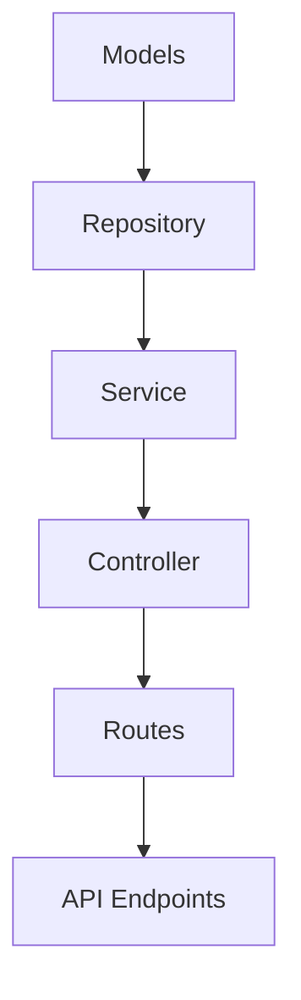

# Campaign Management Implementation Plan - Part 1: Backend

## Overview

This document outlines the backend implementation plan for adding campaign management functionality to the existing PropertyRadar criteria demo. The implementation will focus on:

1. Creating models for campaign-related entities
2. Implementing a repository for database operations
3. Creating a service layer for business logic
4. Implementing controllers for HTTP endpoints
5. Setting up routes for the API



## Implementation Steps

### 1. Models

Create TypeScript interfaces for campaign-related entities:

```typescript
// property-data-tester/server/models/Campaign.ts
export interface Campaign {
  campaign_id?: number;
  campaign_name: string;
  description: string;
  campaign_date: Date;
  status: 'DRAFT' | 'READY' | 'MAILED' | 'COMPLETED' | 'CANCELLED';
  target_loan_types: string[];
  target_states: string[];
  date_range_start?: Date | null;
  date_range_end?: Date | null;
  created_at?: Date;
  updated_at?: Date;
  created_by: string;
}

// property-data-tester/server/models/CampaignStats.ts
export interface CampaignStats extends Campaign {
  total_recipients: number;
  mailed_count: number;
  response_count: number;
}
```

### 2. Repository

Create a repository to handle database operations:

```typescript
// property-data-tester/server/repositories/CampaignRepository.ts
import { Pool } from 'pg';
import { Campaign, CampaignStats } from '../models';

export class CampaignRepository {
  constructor(private pool: Pool) {}

  async getCampaigns(): Promise<Campaign[]> {
    const result = await this.pool.query(`
      SELECT * FROM mail_campaigns
      ORDER BY campaign_date DESC
    `);
    return result.rows;
  }

  async getCampaignById(id: number): Promise<Campaign | null> {
    const result = await this.pool.query(`
      SELECT * FROM mail_campaigns
      WHERE campaign_id = $1
    `, [id]);
    
    return result.rows.length ? result.rows[0] : null;
  }

  async createCampaign(campaign: Campaign): Promise<Campaign> {
    const result = await this.pool.query(`
      INSERT INTO mail_campaigns (
        campaign_name, description, campaign_date, status,
        target_loan_types, target_states, date_range_start,
        date_range_end, created_by
      ) VALUES ($1, $2, $3, $4, $5, $6, $7, $8, $9)
      RETURNING *
    `, [
      campaign.campaign_name,
      campaign.description,
      campaign.campaign_date,
      campaign.status || 'DRAFT',
      campaign.target_loan_types,
      campaign.target_states,
      campaign.date_range_start,
      campaign.date_range_end,
      campaign.created_by
    ]);
    
    return result.rows[0];
  }

  async getCampaignStats(id: number): Promise<CampaignStats | null> {
    const result = await this.pool.query(`
      SELECT 
        c.campaign_id, 
        c.campaign_name, 
        c.description,
        c.campaign_date,
        c.status,
        c.target_loan_types,
        c.target_states,
        COUNT(r.recipient_id) AS total_recipients,
        SUM(CASE WHEN r.status = 'MAILED' THEN 1 ELSE 0 END) AS mailed_count,
        SUM(CASE WHEN r.response_date IS NOT NULL THEN 1 ELSE 0 END) AS response_count
      FROM 
        mail_campaigns c
      LEFT JOIN 
        mail_recipients r ON c.campaign_id = r.campaign_id
      WHERE 
        c.campaign_id = $1
      GROUP BY 
        c.campaign_id, c.campaign_name, c.description, c.campaign_date, 
        c.status, c.target_loan_types, c.target_states
    `, [id]);
    
    return result.rows.length ? result.rows[0] : null;
  }

  async getRecipientsByCampaignId(campaignId: number, limit = 100, offset = 0): Promise<any[]> {
    const result = await this.pool.query(`
      SELECT * FROM mail_recipients
      WHERE campaign_id = $1
      ORDER BY recipient_id
      LIMIT $2 OFFSET $3
    `, [campaignId, limit, offset]);
    
    return result.rows;
  }
}
```

### 3. Service

Create a service to handle business logic:

```typescript
// property-data-tester/server/services/CampaignService.ts
import { Campaign, CampaignStats } from '../models';
import { CampaignRepository } from '../repositories/CampaignRepository';

export class CampaignService {
  constructor(private campaignRepository: CampaignRepository) {}

  async getCampaigns(): Promise<Campaign[]> {
    return this.campaignRepository.getCampaigns();
  }

  async getCampaignById(id: number): Promise<Campaign | null> {
    return this.campaignRepository.getCampaignById(id);
  }

  async createCampaign(campaign: Campaign): Promise<Campaign> {
    return this.campaignRepository.createCampaign(campaign);
  }

  async getCampaignStats(id: number): Promise<CampaignStats | null> {
    return this.campaignRepository.getCampaignStats(id);
  }

  async getRecipientsByCampaignId(campaignId: number, limit = 100, offset = 0): Promise<any[]> {
    return this.campaignRepository.getRecipientsByCampaignId(campaignId, limit, offset);
  }

  // Helper method to generate description from criteria
  generateDescriptionFromCriteria(criteria: Record<string, any>): string {
    const parts: string[] = [];
    
    // Extract state information
    if (criteria.State && criteria.State.value && criteria.State.value.length > 0) {
      parts.push(`${criteria.State.value.join(', ')} state(s)`);
    }
    
    // Extract loan type information
    if (criteria.FirstLoanType && criteria.FirstLoanType.value && criteria.FirstLoanType.value.length > 0) {
      parts.push(`${criteria.FirstLoanType.value.join(', ')} loan type(s)`);
    }
    
    // Extract equity information
    if (criteria.AvailableEquity && criteria.AvailableEquity.value && criteria.AvailableEquity.value.length > 0) {
      const ranges = criteria.AvailableEquity.value.map((range: number[]) => {
        if (range.length === 2) {
          if (range[0] === null && range[1] !== null) {
            return `equity up to $${range[1].toLocaleString()}`;
          } else if (range[0] !== null && range[1] === null) {
            return `equity over $${range[0].toLocaleString()}`;
          } else if (range[0] !== null && range[1] !== null) {
            return `equity between $${range[0].toLocaleString()} and $${range[1].toLocaleString()}`;
          }
        }
        return '';
      }).filter(Boolean);
      
      if (ranges.length > 0) {
        parts.push(ranges.join(', '));
      }
    }
    
    // Add more criteria as needed
    
    // Combine all parts
    if (parts.length > 0) {
      return parts.join(', ');
    }
    
    return 'Custom criteria';
  }
}
```

### 4. Controller

Create a controller to handle HTTP requests:

```typescript
// property-data-tester/server/controllers/CampaignController.ts
import { Request, Response } from 'express';
import { CampaignService } from '../services/CampaignService';

export class CampaignController {
  constructor(private campaignService: CampaignService) {}

  async getCampaigns(req: Request, res: Response): Promise<void> {
    try {
      const campaigns = await this.campaignService.getCampaigns();
      res.json({
        success: true,
        campaigns,
        count: campaigns.length
      });
    } catch (error) {
      res.status(500).json({
        success: false,
        error: error instanceof Error ? error.message : 'Failed to get campaigns'
      });
    }
  }

  async getCampaignById(req: Request, res: Response): Promise<void> {
    try {
      const id = parseInt(req.params.id);
      const campaign = await this.campaignService.getCampaignById(id);
      
      if (!campaign) {
        res.status(404).json({
          success: false,
          error: `Campaign with ID ${id} not found`
        });
        return;
      }
      
      res.json({
        success: true,
        campaign
      });
    } catch (error) {
      res.status(500).json({
        success: false,
        error: error instanceof Error ? error.message : 'Failed to get campaign'
      });
    }
  }

  async createCampaign(req: Request, res: Response): Promise<void> {
    try {
      const campaign = req.body;
      const createdCampaign = await this.campaignService.createCampaign(campaign);
      
      res.status(201).json({
        success: true,
        campaign: createdCampaign
      });
    } catch (error) {
      res.status(500).json({
        success: false,
        error: error instanceof Error ? error.message : 'Failed to create campaign'
      });
    }
  }

  async getCampaignStats(req: Request, res: Response): Promise<void> {
    try {
      const id = parseInt(req.params.id);
      const stats = await this.campaignService.getCampaignStats(id);
      
      if (!stats) {
        res.status(404).json({
          success: false,
          error: `Campaign with ID ${id} not found`
        });
        return;
      }
      
      res.json({
        success: true,
        stats
      });
    } catch (error) {
      res.status(500).json({
        success: false,
        error: error instanceof Error ? error.message : 'Failed to get campaign stats'
      });
    }
  }

  async getRecipientsByCampaignId(req: Request, res: Response): Promise<void> {
    try {
      const id = parseInt(req.params.id);
      const limit = req.query.limit ? parseInt(req.query.limit as string) : 100;
      const offset = req.query.offset ? parseInt(req.query.offset as string) : 0;
      
      const recipients = await this.campaignService.getRecipientsByCampaignId(id, limit, offset);
      
      res.json({
        success: true,
        recipients,
        count: recipients.length
      });
    } catch (error) {
      res.status(500).json({
        success: false,
        error: error instanceof Error ? error.message : 'Failed to get campaign recipients'
      });
    }
  }
}
```

### 5. Routes

Add routes for campaign management:

```typescript
// property-data-tester/server/routes/campaign.routes.ts
import { Router } from 'express';
import { CampaignController } from '../controllers/CampaignController';
import { CampaignService } from '../services/CampaignService';
import { CampaignRepository } from '../repositories/CampaignRepository';
import { pool } from '../config/database';

const router = Router();
const campaignRepository = new CampaignRepository(pool);
const campaignService = new CampaignService(campaignRepository);
const campaignController = new CampaignController(campaignService);

// Get all campaigns
router.get('/', (req, res) => campaignController.getCampaigns(req, res));

// Get campaign by ID
router.get('/:id', (req, res) => campaignController.getCampaignById(req, res));

// Create campaign
router.post('/', (req, res) => campaignController.createCampaign(req, res));

// Get campaign stats
router.get('/:id/stats', (req, res) => campaignController.getCampaignStats(req, res));

// Get campaign recipients
router.get('/:id/recipients', (req, res) => campaignController.getRecipientsByCampaignId(req, res));

export default router;
```

Update the main routes file:

```typescript
// property-data-tester/server/routes/index.ts
import { Router } from 'express';
import propertyRoutes from './property.routes';
import criteriaRoutes from './criteria.routes';
import campaignRoutes from './campaign.routes';

const router = Router();

router.use('/properties', propertyRoutes);
router.use('/criteria', criteriaRoutes);
router.use('/campaigns', campaignRoutes);

export default router;
```

## Timeline for Backend Implementation

1. Models and Repository: 1 day
2. Service and Controller: 1-2 days
3. Routes and Testing: 1 day

Total estimated time for backend: 3-4 days