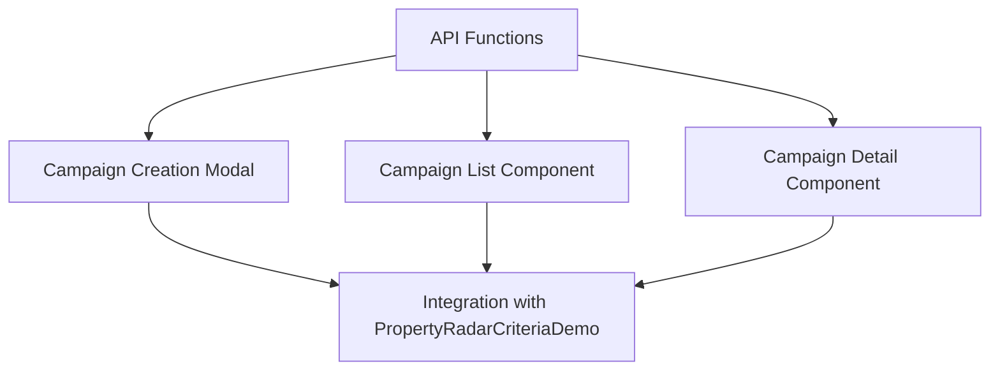

# Campaign Management Implementation Plan - Part 2: Frontend

## Overview

This document outlines the frontend implementation plan for adding campaign management functionality to the existing PropertyRadar criteria demo. The implementation will focus on:

1. Adding campaign-related API functions
2. Creating a modal for campaign creation
3. Implementing components for campaign listing and details
4. Integrating with the existing criteria selection workflow



## Implementation Steps

### 1. API Functions

Add campaign-related API functions to the existing api.ts file:

```typescript
// property-data-tester/src/services/api.ts
// Add these interfaces and functions to the existing api.ts file

export interface Campaign {
  campaign_id?: number;
  campaign_name: string;
  description: string;
  campaign_date: string;
  status: string;
  target_loan_types: string[];
  target_states: string[];
  created_by: string;
}

export interface CampaignStats extends Campaign {
  total_recipients: number;
  mailed_count: number;
  response_count: number;
}

export const fetchCampaigns = async (): Promise<CampaignsResponse> => {
  try {
    const response = await api.get<CampaignsResponse>('/campaigns');
    return response.data;
  } catch (error) {
    console.error('Error fetching campaigns:', error);
    return {
      success: false,
      error: error instanceof Error ? error.message : 'Failed to fetch campaigns',
      campaigns: [],
      count: 0
    };
  }
};

export const fetchCampaignById = async (id: number): Promise<CampaignResponse> => {
  // Implementation details...
};

export const createCampaign = async (campaign: Campaign): Promise<CampaignResponse> => {
  // Implementation details...
};

export const fetchCampaignStats = async (id: number): Promise<CampaignStatsResponse> => {
  // Implementation details...
};

export const fetchCampaignRecipients = async (
  id: number,
  limit: number = 100,
  offset: number = 0
): Promise<RecipientsResponse> => {
  // Implementation details...
};
```

### 2. Campaign Creation Modal

Create a modal component for campaign creation:

```typescript
// property-data-tester/src/components/campaigns/CampaignCreationModal.tsx
import React, { useState, useEffect } from 'react';
import { Modal, Button, Form } from 'react-bootstrap';
import { createCampaign } from '../../services/api';

interface CampaignCreationModalProps {
  show: boolean;
  onHide: () => void;
  criteria: Record<string, any>;
  onSuccess: (campaignId: number) => void;
}

export const CampaignCreationModal: React.FC<CampaignCreationModalProps> = ({
  show,
  onHide,
  criteria,
  onSuccess
}) => {
  const [campaignName, setCampaignName] = useState<string>('');
  const [campaignDate, setCampaignDate] = useState<string>('');
  const [loading, setLoading] = useState<boolean>(false);
  const [error, setError] = useState<string | null>(null);
  
  // Generate description from criteria
  const generateDescription = (): string => {
    // Implementation details...
    return 'Custom criteria';
  };
  
  // Extract target states from criteria
  const extractTargetStates = (): string[] => {
    // Implementation details...
    return [];
  };
  
  // Extract target loan types from criteria
  const extractTargetLoanTypes = (): string[] => {
    // Implementation details...
    return [];
  };
  
  // Handle form submission
  const handleSubmit = async (e: React.FormEvent) => {
    // Implementation details...
  };
  
  // Set default campaign date to today
  useEffect(() => {
    const today = new Date();
    const formattedDate = today.toISOString().split('T')[0];
    setCampaignDate(formattedDate);
  }, []);
  
  return (
    <Modal show={show} onHide={onHide} centered>
      <Modal.Header closeButton>
        <Modal.Title>Create New Campaign</Modal.Title>
      </Modal.Header>
      <Modal.Body>
        {/* Form implementation */}
      </Modal.Body>
      <Modal.Footer>
        <Button variant="secondary" onClick={onHide}>
          Cancel
        </Button>
        <Button 
          variant="primary" 
          onClick={handleSubmit}
          disabled={loading || !campaignName.trim() || !campaignDate}
        >
          {loading ? 'Creating...' : 'Create Campaign'}
        </Button>
      </Modal.Footer>
    </Modal>
  );
};
```

### 3. Campaign List Component

Create a component to display the list of campaigns:

```typescript
// property-data-tester/src/components/campaigns/CampaignList.tsx
import React, { useState, useEffect } from 'react';
import { Table, Button, Badge } from 'react-bootstrap';
import { fetchCampaigns, Campaign } from '../../services/api';

interface CampaignListProps {
  onSelectCampaign: (campaignId: number) => void;
}

export const CampaignList: React.FC<CampaignListProps> = ({ onSelectCampaign }) => {
  const [campaigns, setCampaigns] = useState<Campaign[]>([]);
  const [loading, setLoading] = useState<boolean>(true);
  const [error, setError] = useState<string | null>(null);
  
  // Load campaigns
  const loadCampaigns = async () => {
    // Implementation details...
  };
  
  // Load campaigns on component mount
  useEffect(() => {
    loadCampaigns();
  }, []);
  
  return (
    <div className="campaign-list">
      <div className="d-flex justify-content-between align-items-center mb-3">
        <h3>Campaigns</h3>
        <Button variant="outline-primary" onClick={() => loadCampaigns()}>
          Refresh
        </Button>
      </div>
      
      {/* Loading, error, and table implementation */}
    </div>
  );
};
```

### 4. Campaign Detail Component

Create a component to display campaign details:

```typescript
// property-data-tester/src/components/campaigns/CampaignDetail.tsx
import React, { useState, useEffect } from 'react';
import { Card, Table, Badge, Button } from 'react-bootstrap';
import { fetchCampaignById, fetchCampaignStats, fetchCampaignRecipients, Campaign, CampaignStats } from '../../services/api';

interface CampaignDetailProps {
  campaignId: number;
  onBack: () => void;
}

export const CampaignDetail: React.FC<CampaignDetailProps> = ({ campaignId, onBack }) => {
  const [campaign, setCampaign] = useState<Campaign | null>(null);
  const [stats, setStats] = useState<CampaignStats | null>(null);
  const [recipients, setRecipients] = useState<any[]>([]);
  const [loading, setLoading] = useState<boolean>(true);
  const [error, setError] = useState<string | null>(null);
  
  // Load campaign data
  const loadCampaignData = async () => {
    // Implementation details...
  };
  
  // Load campaign data on component mount
  useEffect(() => {
    loadCampaignData();
  }, [campaignId]);
  
  return (
    <div className="campaign-detail">
      {/* Campaign details implementation */}
    </div>
  );
};
```

### 5. Integration with PropertyRadarCriteriaDemo

Modify the PropertyRadarCriteriaDemo component to integrate the campaign functionality:

```typescript
// property-data-tester/src/components/PropertyRadarCriteriaDemo.tsx
import React, { useState } from 'react';
import { CriteriaSelector } from './CriteriaSelector';
import { fetchProperties } from '../services';
import { CampaignCreationModal } from './campaigns/CampaignCreationModal';
import { CampaignList } from './campaigns/CampaignList';
import { CampaignDetail } from './campaigns/CampaignDetail';

export const PropertyRadarCriteriaDemo: React.FC = () => {
  // Existing state
  const [criteria, setCriteria] = useState<Record<string, any>>({});
  const [results, setResults] = useState<any[]>([]);
  const [loading, setLoading] = useState<boolean>(false);
  const [error, setError] = useState<string | null>(null);
  
  // New state for campaign management
  const [showCampaignModal, setShowCampaignModal] = useState<boolean>(false);
  const [activeTab, setActiveTab] = useState<'criteria' | 'campaigns'>('criteria');
  const [selectedCampaignId, setSelectedCampaignId] = useState<number | null>(null);
  
  // Default fields to fetch
  const defaultFields = [
    'RadarID',
    'Address',
    'City',
    'State',
    'ZipFive',
    // Additional fields...
  ];
  
  // Handle criteria change
  const handleCriteriaChange = (newCriteria: Record<string, any>) => {
    setCriteria(newCriteria);
  };
  
  // Handle search and show campaign modal
  const handleSearch = async () => {
    // Implementation details...
  };
  
  // Handle campaign creation success
  const handleCampaignCreated = (campaignId: number) => {
    setActiveTab('campaigns');
    setSelectedCampaignId(campaignId);
  };
  
  return (
    <div className="property-radar-criteria-demo container mt-4">
      <h1>PropertyRadar Campaign Manager</h1>
      
      <ul className="nav nav-tabs mb-4">
        <li className="nav-item">
          <button 
            className={`nav-link ${activeTab === 'criteria' ? 'active' : ''}`}
            onClick={() => setActiveTab('criteria')}
          >
            Criteria Selection
          </button>
        </li>
        <li className="nav-item">
          <button 
            className={`nav-link ${activeTab === 'campaigns' ? 'active' : ''}`}
            onClick={() => setActiveTab('campaigns')}
          >
            Campaigns
          </button>
        </li>
      </ul>
      
      {activeTab === 'criteria' ? (
        // Criteria selection tab implementation
        <div className="row">
          {/* Criteria selection UI */}
        </div>
      ) : (
        // Campaigns tab implementation
        <div className="row">
          {selectedCampaignId ? (
            <CampaignDetail 
              campaignId={selectedCampaignId}
              onBack={() => setSelectedCampaignId(null)}
            />
          ) : (
            <CampaignList 
              onSelectCampaign={(id) => setSelectedCampaignId(id)}
            />
          )}
        </div>
      )}
      
      {/* Campaign creation modal */}
      <CampaignCreationModal 
        show={showCampaignModal}
        onHide={() => setShowCampaignModal(false)}
        criteria={criteria}
        onSuccess={handleCampaignCreated}
      />
    </div>
  );
};
```

## Timeline for Frontend Implementation

1. API Functions: 1 day
2. Campaign Creation Modal: 1 day
3. Campaign List and Detail Components: 1-2 days
4. Integration with Existing Components: 1 day
5. Testing and Refinement: 1-2 days

Total estimated time for frontend: 5-7 days
