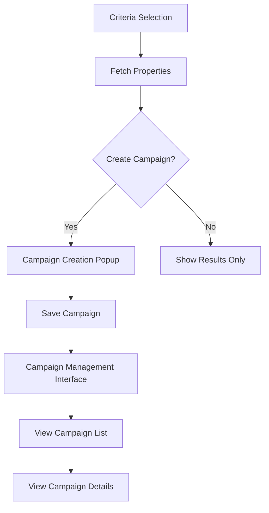

# Campaign Management Implementation Plan

## Overview

This document outlines the implementation plan for adding campaign management functionality to the existing PropertyRadar criteria demo. The implementation will focus on:

1. Creating a campaign management interface
2. Adding a popup for campaign creation when fetching properties
3. Implementing backend services for campaign management
4. Integrating with the existing criteria selection workflow



## 1. Backend Implementation

### 1.1 Models

First, we'll create TypeScript interfaces for our campaign-related entities:

```typescript
// property-data-tester/server/models/Campaign.ts
export interface Campaign {
  campaign_id?: number;
  campaign_name: string;
  description: string;
  campaign_date: Date;
  status: 'DRAFT' | 'READY' | 'MAILED' | 'COMPLETED' | 'CANCELLED';
  target_loan_types: string[];
  target_states: string[];
  date_range_start?: Date | null;
  date_range_end?: Date | null;
  created_at?: Date;
  updated_at?: Date;
  created_by: string;
}

// property-data-tester/server/models/CampaignStats.ts
export interface CampaignStats extends Campaign {
  total_recipients: number;
  mailed_count: number;
  response_count: number;
}
```

### 1.2 Repository

Create a repository to handle database operations:

```typescript
// property-data-tester/server/repositories/CampaignRepository.ts
import { Pool } from 'pg';
import { Campaign, CampaignStats } from '../models';

export class CampaignRepository {
  constructor(private pool: Pool) {}

  async getCampaigns(): Promise<Campaign[]> {
    const result = await this.pool.query(`
      SELECT * FROM mail_campaigns
      ORDER BY campaign_date DESC
    `);
    return result.rows;
  }

  async getCampaignById(id: number): Promise<Campaign | null> {
    const result = await this.pool.query(`
      SELECT * FROM mail_campaigns
      WHERE campaign_id = $1
    `, [id]);
    
    return result.rows.length ? result.rows[0] : null;
  }

  async createCampaign(campaign: Campaign): Promise<Campaign> {
    const result = await this.pool.query(`
      INSERT INTO mail_campaigns (
        campaign_name, description, campaign_date, status,
        target_loan_types, target_states, date_range_start,
        date_range_end, created_by
      ) VALUES ($1, $2, $3, $4, $5, $6, $7, $8, $9)
      RETURNING *
    `, [
      campaign.campaign_name,
      campaign.description,
      campaign.campaign_date,
      campaign.status || 'DRAFT',
      campaign.target_loan_types,
      campaign.target_states,
      campaign.date_range_start,
      campaign.date_range_end,
      campaign.created_by
    ]);
    
    return result.rows[0];
  }

  async getCampaignStats(id: number): Promise<CampaignStats | null> {
    const result = await this.pool.query(`
      SELECT 
        c.campaign_id, 
        c.campaign_name, 
        c.description,
        c.campaign_date,
        c.status,
        c.target_loan_types,
        c.target_states,
        COUNT(r.recipient_id) AS total_recipients,
        SUM(CASE WHEN r.status = 'MAILED' THEN 1 ELSE 0 END) AS mailed_count,
        SUM(CASE WHEN r.response_date IS NOT NULL THEN 1 ELSE 0 END) AS response_count
      FROM 
        mail_campaigns c
      LEFT JOIN 
        mail_recipients r ON c.campaign_id = r.campaign_id
      WHERE 
        c.campaign_id = $1
      GROUP BY 
        c.campaign_id, c.campaign_name, c.description, c.campaign_date, 
        c.status, c.target_loan_types, c.target_states
    `, [id]);
    
    return result.rows.length ? result.rows[0] : null;
  }

  async getRecipientsByCampaignId(campaignId: number, limit = 100, offset = 0): Promise<any[]> {
    const result = await this.pool.query(`
      SELECT * FROM mail_recipients
      WHERE campaign_id = $1
      ORDER BY recipient_id
      LIMIT $2 OFFSET $3
    `, [campaignId, limit, offset]);
    
    return result.rows;
  }
}
```

### 1.3 Service

Create a service to handle business logic:

```typescript
// property-data-tester/server/services/CampaignService.ts
import { Campaign, CampaignStats } from '../models';
import { CampaignRepository } from '../repositories/CampaignRepository';

export class CampaignService {
  constructor(private campaignRepository: CampaignRepository) {}

  async getCampaigns(): Promise<Campaign[]> {
    return this.campaignRepository.getCampaigns();
  }

  async getCampaignById(id: number): Promise<Campaign | null> {
    return this.campaignRepository.getCampaignById(id);
  }

  async createCampaign(campaign: Campaign): Promise<Campaign> {
    return this.campaignRepository.createCampaign(campaign);
  }

  async getCampaignStats(id: number): Promise<CampaignStats | null> {
    return this.campaignRepository.getCampaignStats(id);
  }

  async getRecipientsByCampaignId(campaignId: number, limit = 100, offset = 0): Promise<any[]> {
    return this.campaignRepository.getRecipientsByCampaignId(campaignId, limit, offset);
  }

  // Helper method to generate description from criteria
  generateDescriptionFromCriteria(criteria: Record<string, any>): string {
    const parts: string[] = [];
    
    // Extract state information
    if (criteria.State && criteria.State.value && criteria.State.value.length > 0) {
      parts.push(`${criteria.State.value.join(', ')} state(s)`);
    }
    
    // Extract loan type information
    if (criteria.FirstLoanType && criteria.FirstLoanType.value && criteria.FirstLoanType.value.length > 0) {
      parts.push(`${criteria.FirstLoanType.value.join(', ')} loan type(s)`);
    }
    
    // Extract equity information
    if (criteria.AvailableEquity && criteria.AvailableEquity.value && criteria.AvailableEquity.value.length > 0) {
      const ranges = criteria.AvailableEquity.value.map((range: number[]) => {
        if (range.length === 2) {
          if (range[0] === null && range[1] !== null) {
            return `equity up to $${range[1].toLocaleString()}`;
          } else if (range[0] !== null && range[1] === null) {
            return `equity over $${range[0].toLocaleString()}`;
          } else if (range[0] !== null && range[1] !== null) {
            return `equity between $${range[0].toLocaleString()} and $${range[1].toLocaleString()}`;
          }
        }
        return '';
      }).filter(Boolean);
      
      if (ranges.length > 0) {
        parts.push(ranges.join(', '));
      }
    }
    
    // Add more criteria as needed
    
    // Combine all parts
    if (parts.length > 0) {
      return parts.join(', ');
    }
    
    return 'Custom criteria';
  }
}
```

### 1.4 Controller

Create a controller to handle HTTP requests:

```typescript
// property-data-tester/server/controllers/CampaignController.ts
import { Request, Response } from 'express';
import { CampaignService } from '../services/CampaignService';

export class CampaignController {
  constructor(private campaignService: CampaignService) {}

  async getCampaigns(req: Request, res: Response): Promise<void> {
    try {
      const campaigns = await this.campaignService.getCampaigns();
      res.json({
        success: true,
        campaigns,
        count: campaigns.length
      });
    } catch (error) {
      res.status(500).json({
        success: false,
        error: error instanceof Error ? error.message : 'Failed to get campaigns'
      });
    }
  }

  async getCampaignById(req: Request, res: Response): Promise<void> {
    try {
      const id = parseInt(req.params.id);
      const campaign = await this.campaignService.getCampaignById(id);
      
      if (!campaign) {
        res.status(404).json({
          success: false,
          error: `Campaign with ID ${id} not found`
        });
        return;
      }
      
      res.json({
        success: true,
        campaign
      });
    } catch (error) {
      res.status(500).json({
        success: false,
        error: error instanceof Error ? error.message : 'Failed to get campaign'
      });
    }
  }

  async createCampaign(req: Request, res: Response): Promise<void> {
    try {
      const campaign = req.body;
      const createdCampaign = await this.campaignService.createCampaign(campaign);
      
      res.status(201).json({
        success: true,
        campaign: createdCampaign
      });
    } catch (error) {
      res.status(500).json({
        success: false,
        error: error instanceof Error ? error.message : 'Failed to create campaign'
      });
    }
  }

  async getCampaignStats(req: Request, res: Response): Promise<void> {
    try {
      const id = parseInt(req.params.id);
      const stats = await this.campaignService.getCampaignStats(id);
      
      if (!stats) {
        res.status(404).json({
          success: false,
          error: `Campaign with ID ${id} not found`
        });
        return;
      }
      
      res.json({
        success: true,
        stats
      });
    } catch (error) {
      res.status(500).json({
        success: false,
        error: error instanceof Error ? error.message : 'Failed to get campaign stats'
      });
    }
  }

  async getRecipientsByCampaignId(req: Request, res: Response): Promise<void> {
    try {
      const id = parseInt(req.params.id);
      const limit = req.query.limit ? parseInt(req.query.limit as string) : 100;
      const offset = req.query.offset ? parseInt(req.query.offset as string) : 0;
      
      const recipients = await this.campaignService.getRecipientsByCampaignId(id, limit, offset);
      
      res.json({
        success: true,
        recipients,
        count: recipients.length
      });
    } catch (error) {
      res.status(500).json({
        success: false,
        error: error instanceof Error ? error.message : 'Failed to get campaign recipients'
      });
    }
  }
}
```

### 1.5 Routes

Add routes for campaign management:

```typescript
// property-data-tester/server/routes/campaign.routes.ts
import { Router } from 'express';
import { CampaignController } from '../controllers/CampaignController';
import { CampaignService } from '../services/CampaignService';
import { CampaignRepository } from '../repositories/CampaignRepository';
import { pool } from '../config/database';

const router = Router();
const campaignRepository = new CampaignRepository(pool);
const campaignService = new CampaignService(campaignRepository);
const campaignController = new CampaignController(campaignService);

// Get all campaigns
router.get('/', (req, res) => campaignController.getCampaigns(req, res));

// Get campaign by ID
router.get('/:id', (req, res) => campaignController.getCampaignById(req, res));

// Create campaign
router.post('/', (req, res) => campaignController.createCampaign(req, res));

// Get campaign stats
router.get('/:id/stats', (req, res) => campaignController.getCampaignStats(req, res));

// Get campaign recipients
router.get('/:id/recipients', (req, res) => campaignController.getRecipientsByCampaignId(req, res));

export default router;
```

Update the main routes file:

```typescript
// property-data-tester/server/routes/index.ts
import { Router } from 'express';
import propertyRoutes from './property.routes';
import criteriaRoutes from './criteria.routes';
import campaignRoutes from './campaign.routes';

const router = Router();

router.use('/properties', propertyRoutes);
router.use('/criteria', criteriaRoutes);
router.use('/campaigns', campaignRoutes);

export default router;
```

## 2. Frontend Implementation

### 2.1 API Service

Add campaign-related API functions:

```typescript
// property-data-tester/src/services/api.ts
// Add these functions to the existing api.ts file

/**
 * Interface for campaign
 */
export interface Campaign {
  campaign_id?: number;
  campaign_name: string;
  description: string;
  campaign_date: string;
  status: string;
  target_loan_types: string[];
  target_states: string[];
  date_range_start?: string | null;
  date_range_end?: string | null;
  created_at?: string;
  updated_at?: string;
  created_by: string;
}

/**
 * Interface for campaign stats
 */
export interface CampaignStats extends Campaign {
  total_recipients: number;
  mailed_count: number;
  response_count: number;
}

/**
 * Interface for campaign response
 */
interface CampaignResponse extends ApiResponse<Campaign> {
  campaign: Campaign;
}

/**
 * Interface for campaigns response
 */
interface CampaignsResponse extends ApiResponse<Campaign[]> {
  campaigns: Campaign[];
  count: number;
}

/**
 * Interface for campaign stats response
 */
interface CampaignStatsResponse extends ApiResponse<CampaignStats> {
  stats: CampaignStats;
}

/**
 * Interface for recipients response
 */
interface RecipientsResponse extends ApiResponse<any[]> {
  recipients: any[];
  count: number;
}

/**
 * Fetch all campaigns
 * @returns Promise with campaigns response
 */
export const fetchCampaigns = async (): Promise<CampaignsResponse> => {
  try {
    const response = await api.get<CampaignsResponse>('/campaigns');
    return response.data;
  } catch (error) {
    console.error('Error fetching campaigns:', error);
    return {
      success: false,
      error: error instanceof Error ? error.message : 'Failed to fetch campaigns',
      campaigns: [],
      count: 0
    };
  }
};

/**
 * Fetch campaign by ID
 * @param id The campaign ID
 * @returns Promise with campaign response
 */
export const fetchCampaignById = async (id: number): Promise<CampaignResponse> => {
  try {
    const response = await api.get<CampaignResponse>(`/campaigns/${id}`);
    return response.data;
  } catch (error) {
    console.error(`Error fetching campaign ${id}:`, error);
    return {
      success: false,
      error: error instanceof Error ? error.message : `Failed to fetch campaign ${id}`,
      campaign: {} as Campaign
    };
  }
};

/**
 * Create campaign
 * @param campaign The campaign to create
 * @returns Promise with campaign response
 */
export const createCampaign = async (campaign: Campaign): Promise<CampaignResponse> => {
  try {
    const response = await api.post<CampaignResponse>('/campaigns', campaign);
    return response.data;
  } catch (error) {
    console.error('Error creating campaign:', error);
    return {
      success: false,
      error: error instanceof Error ? error.message : 'Failed to create campaign',
      campaign: {} as Campaign
    };
  }
};

/**
 * Fetch campaign stats
 * @param id The campaign ID
 * @returns Promise with campaign stats response
 */
export const fetchCampaignStats = async (id: number): Promise<CampaignStatsResponse> => {
  try {
    const response = await api.get<CampaignStatsResponse>(`/campaigns/${id}/stats`);
    return response.data;
  } catch (error) {
    console.error(`Error fetching campaign stats ${id}:`, error);
    return {
      success: false,
      error: error instanceof Error ? error.message : `Failed to fetch campaign stats ${id}`,
      stats: {} as CampaignStats
    };
  }
};

/**
 * Fetch campaign recipients
 * @param id The campaign ID
 * @param limit The maximum number of results to return
 * @param offset The offset for pagination
 * @returns Promise with recipients response
 */
export const fetchCampaignRecipients = async (
  id: number,
  limit: number = 100,
  offset: number = 0
): Promise<RecipientsResponse> => {
  try {
    const response = await api.get<RecipientsResponse>(
      `/campaigns/${id}/recipients?limit=${limit}&offset=${offset}`
    );
    return response.data;
  } catch (error) {
    console.error(`Error fetching campaign recipients ${id}:`, error);
    return {
      success: false,
      error: error instanceof Error ? error.message : `Failed to fetch campaign recipients ${id}`,
      recipients: [],
      count: 0
    };
  }
};
```

### 2.2 Campaign Creation Modal

Create a modal component for campaign creation:

```typescript
// property-data-tester/src/components/campaigns/CampaignCreationModal.tsx
import React, { useState, useEffect } from 'react';
import { Modal, Button, Form } from 'react-bootstrap';
import { createCampaign } from '../../services/api';

interface CampaignCreationModalProps {
  show: boolean;
  onHide: () => void;
  criteria: Record<string, any>;
  onSuccess: (campaignId: number) => void;
}

export const CampaignCreationModal: React.FC<CampaignCreationModalProps> = ({
  show,
  onHide,
  criteria,
  onSuccess
}) => {
  const [campaignName, setCampaignName] = useState<string>('');
  const [campaignDate, setCampaignDate] = useState<string>('');
  const [loading, setLoading] = useState<boolean>(false);
  const [error, setError] = useState<string | null>(null);
  
  // Generate description from criteria
  const generateDescription = (): string => {
    const parts: string[] = [];
    
    // Extract state information
    if (criteria.State && criteria.State.value && criteria.State.value.length > 0) {
      parts.push(`${criteria.State.value.join(', ')} state(s)`);
    }
    
    // Extract loan type information
    if (criteria.FirstLoanType && criteria.FirstLoanType.value && criteria.FirstLoanType.value.length > 0) {
      parts.push(`${criteria.FirstLoanType.value.join(', ')} loan type(s)`);
    }
    
    // Extract equity information
    if (criteria.AvailableEquity && criteria.AvailableEquity.value && criteria.AvailableEquity.value.length > 0) {
      const ranges = criteria.AvailableEquity.value.map((range: number[]) => {
        if (range.length === 2) {
          if (range[0] === null && range[1] !== null) {
            return `equity up to $${range[1].toLocaleString()}`;
          } else if (range[0] !== null && range[1] === null) {
            return `equity over $${range[0].toLocaleString()}`;
          } else if (range[0] !== null && range[1] !== null) {
            return `equity between $${range[0].toLocaleString()} and $${range[1].toLocaleString()}`;
          }
        }
        return '';
      }).filter(Boolean);
      
      if (ranges.length > 0) {
        parts.push(ranges.join(', '));
      }
    }
    
    // Add more criteria as needed
    
    // Combine all parts
    if (parts.length > 0) {
      return parts.join(', ');
    }
    
    return 'Custom criteria';
  };
  
  // Extract target states from criteria
  const extractTargetStates = (): string[] => {
    if (criteria.State && criteria.State.value && criteria.State.value.length > 0) {
      return criteria.State.value;
    }
    return [];
  };
  
  // Extract target loan types from criteria
  const extractTargetLoanTypes = (): string[] => {
    if (criteria.FirstLoanType && criteria.FirstLoanType.value && criteria.FirstLoanType.value.length > 0) {
      return criteria.FirstLoanType.value;
    }
    return [];
  };
  
  // Handle form submission
  const handleSubmit = async (e: React.FormEvent) => {
    e.preventDefault();
    
    if (!campaignName.trim()) {
      setError('Campaign name is required');
      return;
    }
    
    if (!campaignDate) {
      setError('Campaign date is required');
      return;
    }
    
    try {
      setLoading(true);
      setError(null);
      
      const response = await createCampaign({
        campaign_name: campaignName,
        description: generateDescription(),
        campaign_date: campaignDate,
        status: 'DRAFT',
        target_loan_types: extractTargetLoanTypes(),
        target_states: extractTargetStates(),
        created_by: 'current_user' // This should be replaced with the actual user
      });
      
      if (response.success && response.campaign && response.campaign.campaign_id) {
        onSuccess(response.campaign.campaign_id);
        onHide();
      } else {
        setError(response.error || 'Failed to create campaign');
      }
    } catch (err) {
      setError('Error creating campaign: ' + (err instanceof Error ? err.message : String(err)));
    } finally {
      setLoading(false);
    }
  };
  
  // Set default campaign date to today
  useEffect(() => {
    const today = new Date();
    const formattedDate = today.toISOString().split('T')[0];
    setCampaignDate(formattedDate);
  }, []);
  
  return (
    <Modal show={show} onHide={onHide} centered>
      <Modal.Header closeButton>
        <Modal.Title>Create New Campaign</Modal.Title>
      </Modal.Header>
      <Modal.Body>
        {error && (
          <div className="alert alert-danger">{error}</div>
        )}
        
        <Form onSubmit={handleSubmit}>
          <Form.Group className="mb-3">
            <Form.Label>Campaign Name</Form.Label>
            <Form.Control
              type="text"
              value={campaignName}
              onChange={(e) => setCampaignName(e.target.value)}
              placeholder="Enter campaign name"
              required
            />
          </Form.Group>
          
          <Form.Group className="mb-3">
            <Form.Label>Campaign Date</Form.Label>
            <Form.Control
              type="date"
              value={campaignDate}
              onChange={(e) => setCampaignDate(e.target.value)}
              required
            />
          </Form.Group>
          
          <Form.Group className="mb-3">
            <Form.Label>Description (Auto-generated)</Form.Label>
            <Form.Control
              as="textarea"
              rows={3}
              value={generateDescription()}
              readOnly
            />
          </Form.Group>
          
          <Form.Group className="mb-3">
            <Form.Label>Target States</Form.Label>
            <Form.Control
              type="text"
              value={extractTargetStates().join(', ')}
              readOnly
            />
          </Form.Group>
          
          <Form.Group className="mb-3">
            <Form.Label>Target Loan Types</Form.Label>
            <Form.Control
              type="text"
              value={extractTargetLoanTypes().join(', ')}
              readOnly
            />
          </Form.Group>
        </Form>
      </Modal.Body>
      <Modal.Footer>
        <Button variant="secondary" onClick={onHide}>
          Cancel
        </Button>
        <Button 
          variant="primary" 
          onClick={handleSubmit}
          disabled={loading || !campaignName.trim() || !campaignDate}
        >
          {loading ? 'Creating...' : 'Create Campaign'}
        </Button>
      </Modal.Footer>
    </Modal>
  );
};
```

### 2.3 Campaign List Component

Create a component to display the list of campaigns:

```typescript
// property-data-tester/src/components/campaigns/CampaignList.tsx
import React, { useState, useEffect } from 'react';
import { Table, Button, Badge } from 'react-bootstrap';
import { fetchCampaigns, Campaign } from '../../services/api';

interface CampaignListProps {
  onSelectCampaign: (campaignId: number) => void;
}

export const CampaignList: React.FC<CampaignListProps> = ({ onSelectCampaign }) => {
  const [campaigns, setCampaigns] = useState<Campaign[]>([]);
  const [loading, setLoading] = useState<boolean>(true);
  const [error, setError] = useState<string | null>(null);
  
  // Load campaigns
  const loadCampaigns = async () => {
    try {
      setLoading(true);
      setError(null);
      
      const response = await fetchCampaigns();
      
      if (response.success) {
        setCampaigns(response.campaigns || []);
      } else {
        setError(response.error || 'Failed to fetch campaigns');
      }
    } catch (err) {
      setError('Error fetching campaigns: ' + (err instanceof Error ? err.message : String(err)));
    } finally {
      setLoading(false);
    }
  };
  
  // Load campaigns on component mount
  useEffect(() => {
    loadCampaigns();
  }, []);
  
  // Get status badge color
  const getStatusBadgeVariant = (status: string): string => {
    switch (status) {
      case 'DRAFT':
        return 'secondary';
      case 'READY':
        return 'primary';
      case 'MAILED':
        return 'success';
      case 'COMPLETED':
        return 'info';
      case 'CANCELLED':
        return 'danger';
      default:
        return 'light';
    }
  };
  
  // Format date
  const formatDate = (dateString: string): string => {
    const date = new Date(dateString);
    return date.toLocaleDateString();
  };
  
  return (
    <div className="campaign-list">
      <div className="d-flex justify-content-between align-items-center mb-3">
        <h3>Campaigns</h3>
        <Button variant="outline-primary" onClick={() => loadCampaigns()}>
          Refresh
        </Button>
      </div>
      
      {error && (
        <div className="alert alert-danger">{error}</div>
      )}
      
      {loading && (
        <div className="text-center p-4">
          <div className="spinner-border text-primary" role="status">
            <span className="visually-hidden">Loading...</span>
          </div>
          <p className="mt-2">Loading campaigns...</p>
        </div>
      )}
      
      {!loading && !error && campaigns.length === 0 && (
        <div className="alert alert-info">
          No campaigns found. Create a new campaign by searching for properties.
        </div>
      )}
      
      {!loading && !error && campaigns.length > 0 && (
        <Table striped hover responsive>
          <thead>
            <tr>
              <th>ID</th>
              <th>Name</th>
              <th>Description</th>
              <th>Date</th>
              <th>Status</th>
              <th>Actions</th>
            </tr>
          </thead>
          <tbody>
            {campaigns.map((campaign) => (
              <tr key={campaign.campaign_id}>
                <td>{campaign.campaign_id}</td>
                <td>{campaign.campaign_name}</td>
                <td>{campaign.description}</td>
                <td>{formatDate(campaign.campaign_date)}</td>
                <td>
                  <Badge bg={getStatusBadgeVariant(campaign.status)}>
                    {campaign.status}
                  </Badge>
                </td>
                <td>
                  <Button 
                    variant="outline-primary" 
                    size="sm"
                    onClick={() => onSelectCampaign(campaign.campaign_id!)}
                  >
                    View
                  </Button>
                </td>
              </tr>
            ))}
          </tbody>
        </Table>
      )}
    </div>
  );
};
```

### 2.4 Campaign Detail Component

Create a component to display campaign details:

```typescript
// property-data-tester/src/components/campaigns/CampaignDetail.tsx
import React, { useState, useEffect } from 'react';
import { Card, Table, Badge, Button } from 'react-bootstrap';
import { fetchCampaignById, fetchCampaignStats, fetchCampaignRecipients, Campaign, CampaignStats } from '../../services/api';

interface CampaignDetailProps {
  campaignId: number;
  onBack: () => void;
}

export const CampaignDetail: React.FC<CampaignDetailProps> = ({ campaignId, onBack }) => {
  const [campaign, setCampaign] = useState<Campaign | null>(null);
  const [stats, setStats] = useState<CampaignStats | null>(null);
  const [recipients, setRecipients] = useState<any[]>([]);
  const [loading, setLoading] = useState<boolean>(true);
  const [error, setError] = useState<string | null>(null);
  
  // Load campaign data
  const loadCampaignData = async () => {
    try {
      setLoading(true);
      setError(null);
      
      // Fetch campaign details
