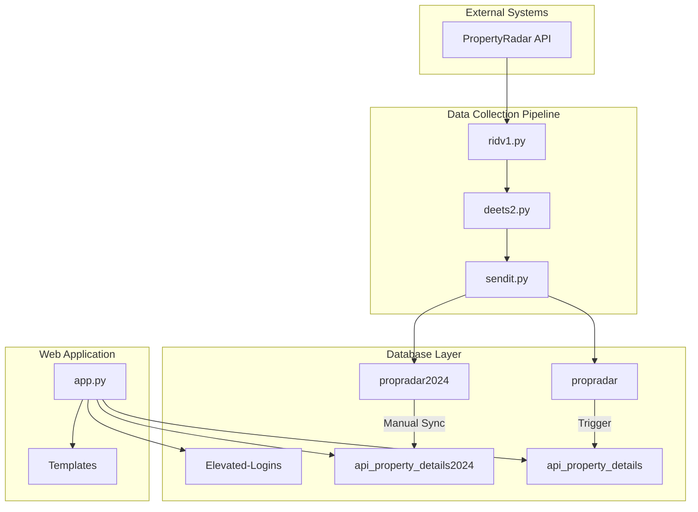
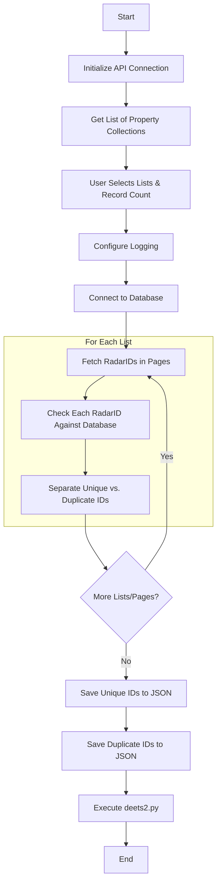
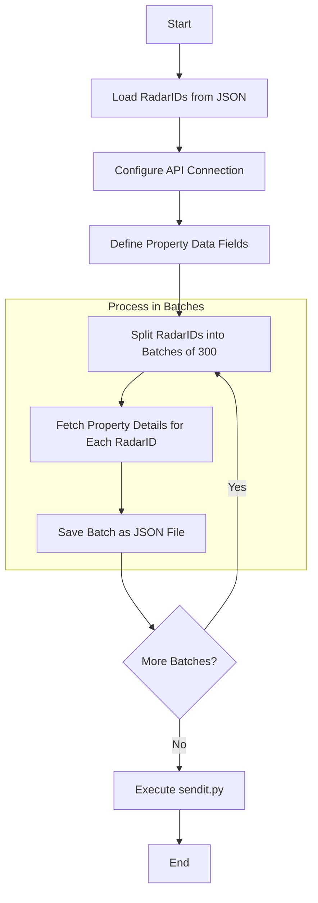
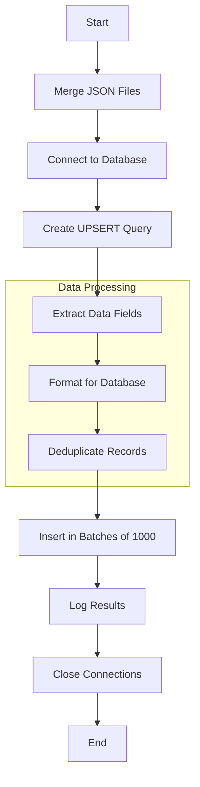
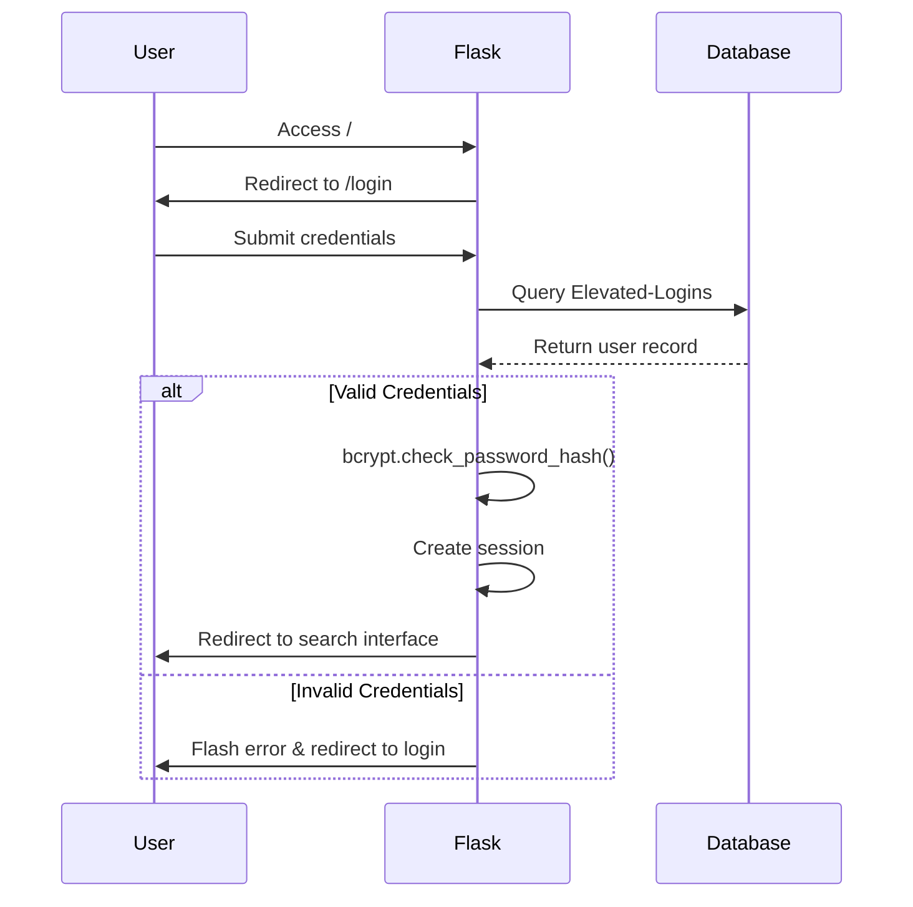
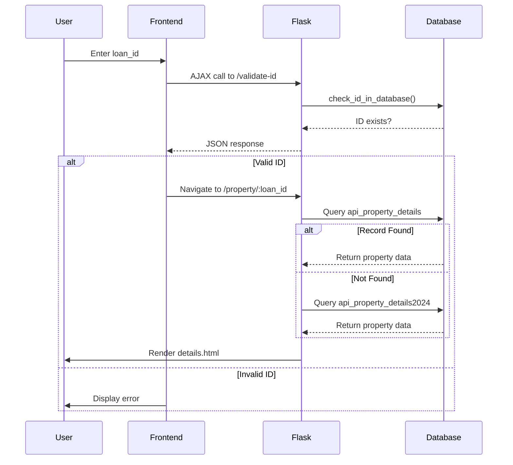
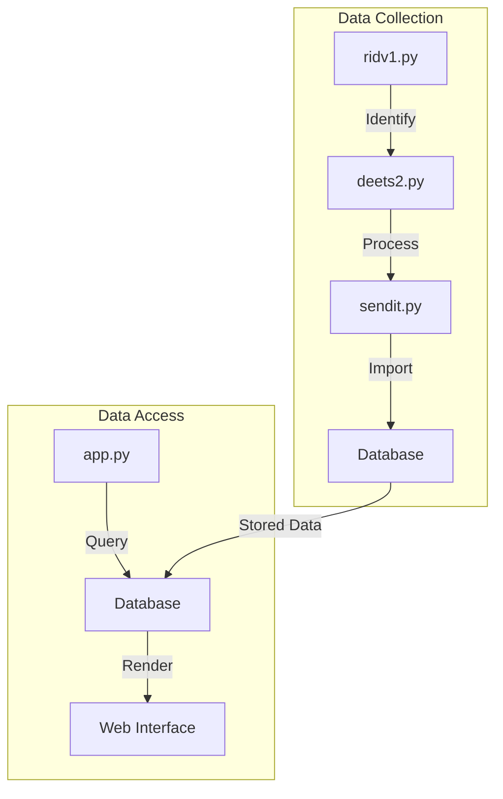

# Property Data Management System Technical Documentation

> **Note on Viewing This Document**: This documentation contains Mermaid diagrams that require rendering. For best viewing experience:
> 
> 1. Open in VS Code with the [Markdown Preview Mermaid Support](https://marketplace.visualstudio.com/items?itemName=bierner.markdown-mermaid) extension
> 2. View on GitHub which natively supports Mermaid
> 3. Use a Markdown viewer that supports Mermaid diagrams (like Typora)
> 4. Or paste the Mermaid code blocks into the [Mermaid Live Editor](https://mermaid.live/)

## Table of Contents
1. [System Overview](#1-system-overview)
2. [Database Architecture](#2-database-architecture)
3. [Data Collection Pipeline](#3-data-collection-pipeline)
4. [Web Application](#4-web-application)
5. [Integration Points](#5-integration-points)
6. [Security Features](#6-security-features)
7. [Error Handling & Logging](#7-error-handling--logging)
8. [Maintenance & Troubleshooting](#8-maintenance--troubleshooting)

---

## 1. System Overview

### 1.1 System Purpose
This integrated system fetches, processes, stores, and displays property data from PropertyRadar's API. It consists of:
- A data collection pipeline (Python scripts)
- PostgreSQL database storage
- Web application interface (Flask)

### 1.2 High-Level Architecture



### 1.3 System Components
1. **Data Collection Pipeline**: Three Python scripts that fetch, process, and store property data
2. **Database Layer**: PostgreSQL database with multiple tables for current and historical data
3. **Web Application**: Flask application providing user authentication and property data views

---

## 2. Database Architecture

### 2.1 Database Schema

```mermaid
erDiagram
    propradar {
        varchar radarid PK
        varchar state
        varchar county
        varchar city
        varchar address
        varchar owner
        varchar owner2
        timestamp created_date
        timestamp last_updated
    }
    
    api_property_details {
        varchar input_id PK
        varchar loan_id UK
        varchar data_propertyinfo_address_state
        varchar data_ownerinfo_owner1fullname
        varchar data_currentmortgages_loantypecode
        timestamp insert_date
    }
    
    propradar ||--o{ api_property_details : "trigger_sync"
    
    propradar2024 {
        varchar radarid PK
        varchar state
        varchar county
        timestamp created_date
    }
    
    api_property_details2024 {
        varchar input_id PK
        varchar loan_id UK
        varchar data_propertyinfo_address_state
    }
    
    Elevated-Logins {
        varchar "User Name" PK
        varchar "Password"
    }
```

### 2.2 Table Definitions

#### 2.2.1 propradar
- **Purpose**: Primary data storage for property records
- **Key Fields**:
  - radarid (PK): Unique identifier from PropertyRadar
  - state: Property state code
  - county: Property county
  - address: Physical address
  - owner/owner2: Property owners
  - firstloantype: Type code for first mortgage
  - created_date: Record creation timestamp
  - last_updated: Record update timestamp

#### 2.2.2 api_property_details
- **Purpose**: Formatted property data for application consumption
- **Key Fields**:
  - input_id (PK): Matches radarid from propradar
  - loan_id (UK): Generated ID for application reference
  - data_propertyinfo_*: Property attributes
  - data_ownerinfo_*: Owner information
  - data_currentmortgages_*: Mortgage details
  - insert_date: Record creation timestamp

#### 2.2.3 propradar2024 & api_property_details2024
- **Purpose**: Historical/archival data storage from 2024
- **Structure**: Mirrors the main tables

#### 2.2.4 Elevated-Logins
- **Purpose**: User authentication for web application
- **Key Fields**:
  - "User Name" (PK): Login username
  - "Password": Bcrypt hashed password

### 2.3 Triggers and Functions

#### 2.3.1 api_property_details_before_insert
- **Type**: BEFORE INSERT
- **Action**: Executes set_loan_id() function
- **Purpose**: Generates loan_id for new records

#### 2.3.2 set_loan_id()
```sql
CREATE OR REPLACE FUNCTION public.set_loan_id()
RETURNS trigger
LANGUAGE plpgsql
AS $function$
BEGIN
    NEW.loan_id := generate_loan_id(NEW.data_propertyinfo_address_state, NEW.data_currentmortgages_loantypecode);
    RETURN NEW;
END;
$function$
```

#### 2.3.3 generate_loan_id()
```sql
CREATE OR REPLACE FUNCTION public.generate_loan_id(state_abbreviation text, loantypecode text)
RETURNS text
LANGUAGE plpgsql
AS $function$
DECLARE
    first_letter_loantype TEXT := SUBSTRING(loantypecode FROM 1 FOR 1);
    current_year TEXT := TO_CHAR(CURRENT_DATE, 'YY');
    current_week TEXT := TO_CHAR(CURRENT_DATE, 'IW');
    sequence_number TEXT := LPAD(nextval('loan_id_sequence')::TEXT, 5, '0');
BEGIN
    RETURN first_letter_loantype || state_abbreviation || current_year || current_week || '-' || sequence_number;
END;
$function$
```

#### 2.3.4 Propradar-to-API Triggers
- **insert_api_property_details**: Syncs data from propradar to api_property_details
- **sync_to_api_property_details**: Redundant sync mechanism for data integrity
- **trigger_insert_mailedradarid**: Tracks processed radarIDs
- **log_propradar_updates**: Records changes to property data

### 2.4 Database Sequences
- **loan_id_sequence**:
  - Current value: ~81840
  - Max value: 99999
  - Used by generate_loan_id()

---

## 3. Data Collection Pipeline

### 3.1 ridv1.py - Data Identification

#### 3.1.1 Purpose
Identifies and filters property records from PropertyRadar API that need to be processed.

#### 3.1.2 Process Flow



#### 3.1.3 Key Components

**API Connection**
```python
base_url = "https://api.propertyradar.com/v1/lists"
api_key = os.environ.get('prapik')
headers = {"Authorization": f"Bearer {api_key}"}
```

**Database Check**
```python
def check_radarids_in_db(radar_ids, connection):
    # Checks radar_ids against propradar table
    # Returns set of matching IDs
```

**Output Files**
- `C:\Users\SeanBoggs\Scripts\propertyradar\radarids\{list_ids}_{date}_rid.json`
- `C:\Users\SeanBoggs\Scripts\propertyradar\radarids\{list_ids}_{date}_duplicates.json`

**Logging**
- `C:\Users\SeanBoggs\Scripts\propertyradar\logs\{list_ids}_{date}.log`

### 3.2 deets2.py - Data Collection

#### 3.2.1 Purpose
Fetches detailed property information for the unique RadarIDs identified by ridv1.py.

#### 3.2.2 Process Flow



#### 3.2.3 Key Components

**Property Fields**
```python
fields = "RadarID,OwnershipType,Owner,Owner2,...,ListingStatus"
```

**API Request**
```python
def fetch_property_data(radar_id, page=1):
    property_url = f'https://api.propertyradar.com/v1/properties/{radar_id}'
    query = {
        "Fields": fields,
        "Purchase": 1,
    }
    response = requests.get(property_url, headers=headers, params=query)
    # Error handling and response processing
    return response.json()
```

**Batch Processing**
- Processes in batches of 300 records
- Saves each batch to separate JSON files
- Includes timestamps for traceability

**Output Files**
- `C:\Users\SeanBoggs\Scripts\propertyradar\results\{original_file}_{batch_number}_{date}_{timestamp}.json`

**Logging**
- `C:\Users\SeanBoggs\Scripts\propertyradar\logs\{list_id}_{date}_deets2runlog.txt`

### 3.3 sendit.py - Data Import

#### 3.3.1 Purpose
Processes and imports property data into the database system.

#### 3.3.2 Process Flow



#### 3.3.3 Key Components

**Data Consolidation**
```python
def merge_json_files(directory, output_file):
    # Combines all batch JSON files into a single file
```

**UPSERT Query Construction**
```python
insert_query = sql.SQL("""
    INSERT INTO propradar (
        {insert_columns}
    ) VALUES %s
    ON CONFLICT (radarid) DO UPDATE SET 
    {update_parts}
""").format(
    insert_columns=insert_columns,
    update_parts=sql.SQL(", ").join(update_parts)
)
```

**Batch Processing**
```python
# Process in batches of 1000 records
for i in range(0, len(deduped_rows), batch_size):
    batch = deduped_rows[i:i+batch_size]
    execute_values(cur, insert_query, batch)
```

**Output Files**
- `C:\Users\SeanBoggs\Scripts\propertyradar\batches\merged_data.json`

**Logging**
- `C:\Users\SeanBoggs\Scripts\propertyradar\logs\{date}-successful-import-{timestamp}.log`

---

## 4. Web Application

### 4.1 Flask Application Architecture

#### 4.1.1 Structure

```mermaid
flowchart TD
    A[app.py] --> B[Templates]
    A --> C[Static Files]
    
    subgraph "Core Routes"
        D[/ - index]
        E[/login - login]
        F[/validate-login - validate_login]
        G[/validate-id - validate_id]
        H[/property/:loan_id - details]
    end
    
    subgraph "Helper Functions"
        I[get_db_connection]
        J[check_id_in_database]
        K[property_details]
        L[format_currency]
    end
    
    A --> D
    A --> E
    A --> F
    A --> G
    A --> H
    A --> I
    A --> J
    A --> K
    A --> L
```

#### 4.1.2 Route Definitions

1. **/** (index)
   - Redirects to login if no session
   - Shows search interface if authenticated

2. **/login** (login)
   - Displays login form

3. **/validate-login** (validate_login)
   - Authenticates users against Elevated-Logins
   - Creates session on success

4. **/validate-id** (validate_id)
   - AJAX endpoint for validating loan_id
   - Checks both current and 2024 tables

5. **/property/:loan_id** (details)
   - Displays property details for a loan_id
   - Tries both current and 2024 tables

### 4.2 Authentication Flow



### 4.3 Property Search Flow



### 4.4 Key Functions

#### 4.4.1 Database Connection
```python
def get_db_connection():
    conn = psycopg2.connect(
        host=os.getenv('DB_HOST'),
        database=os.getenv('DB_NAME'),
        user=os.getenv('DB_USER'),
        password=os.getenv('DB_PASSWORD'),
        port=os.getenv('DB_PORT')
    )
    return conn
```

#### 4.4.2 ID Validation
```python
def check_id_in_database(loan_id):
    # Checks both current and 2024 tables
    # Returns True if ID exists in either
```

#### 4.4.3 Property Details
```python
def property_details(loan_id):
    # First tries api_property_details
    # Falls back to api_property_details2024
    # Formats property data for template
```

---

## 5. Integration Points

### 5.1 Data Flow Integration



### 5.2 Database to Application Mapping

| Pipeline Output | Database Table | Application Access |
|-----------------|----------------|-------------------|
| Property Data JSON | propradar | Through triggers |
| | api_property_details | Direct query in app.py |
| Historical Data | propradar2024 | Through manual sync |
| | api_property_details2024 | Fallback query in app.py |

### 5.3 Key Integration Points

#### 5.3.1 Database Connection Configuration
Both systems use the same database connection parameters, stored as environment variables.

#### 5.3.2 loan_id Generation
Generated by the database trigger for api_property_details and used as the primary identifier in the web application.

#### 5.3.3 Data Format Standardization
Field names and formats are consistent between database and application:
- Database: data_propertyinfo_address_label
- Application: {{data_propertyinfo_address_label}}

---

## 6. Security Features

### 6.1 Authentication System

#### 6.1.1 Password Hashing
```python
bcrypt = Bcrypt(app)
# Password verification
bcrypt.check_password_hash(hashed_password, password)
```

#### 6.1.2 Session Management
```python
app.secret_key = os.getenv('FLASK_SECRET_KEY')
# Session storage
session['user'] = username
```

#### 6.1.3 Route Protection
```python
@app.route('/')
def index():
    if 'user' not in session:
        return redirect(url_for('login'))
```

### 6.2 Database Security

#### 6.2.1 Parameterized Queries
```python
cur.execute("SELECT EXISTS(SELECT 1 FROM api_property_details WHERE loan_id = %s)", (loan_id,))
```

#### 6.2.2 Environment Variable Configuration
```python
conn = psycopg2.connect(
    host=os.getenv('DB_HOST'),
    database=os.getenv('DB_NAME'),
    user=os.getenv('DB_USER'),
    password=os.getenv('DB_PASSWORD')
)
```

---

## 7. Error Handling & Logging

### 7.1 Pipeline Logging

#### 7.1.1 ridv1.py
```python
logging.info(f"Found {len(matched_radar_ids)} matching RadarIDs in the database.")
logging.error(f"Error querying the database: {e}")
```

#### 7.1.2 deets2.py
```python
logging.info(f"API response for RadarID {radar_id}: {json.dumps(property_data, indent=4)}")
logging.error(f"Error occurred while running sendit.py: {str(e)}")
```

#### 7.1.3 sendit.py
```python
logging.info(f"Total records processed: {inserted_count}")
logging.info("Processed RadarIDs:")
```

### 7.2 Application Logging

#### 7.2.1 Request Logging
```python
@app.after_request
def log_response(response):
    logging.debug(f"Response Status: {response.status}")
    logging.debug(f"Response Data: {response.get_data(as_text=True)}")
    return response
```

#### 7.2.2 Error Handling
```python
try:
    # Database operations
except Exception as e:
    logging.error(f"Database error when checking ID {loan_id}: {e}")
    return False
finally:
    cur.close()
    conn.close()
```

---

## 8. Maintenance & Troubleshooting

### 8.1 Common Issues and Solutions

#### 8.1.1 Pipeline Issues
- **API Rate Limiting**: The deets2.py script may encounter rate limiting if fetching large batches
  - Solution: Adjust batch sizes or implement retry mechanism with backoff
  
- **Database Connection Failures**: Connection timeouts during long-running operations
  - Solution: Implement connection pooling or retry logic

#### 8.1.2 Application Issues
- **Missing Property Data**: Loan ID exists but no data displayed
  - Check both current and 2024 tables manually
  - Verify data in propradar table and trigger functionality

- **Authentication Failures**: Users unable to log in
  - Verify user exists in Elevated-Logins table
  - Check bcrypt password hash formatting

### 8.2 System Monitoring

- **Log Monitoring**:
  - Review daily import logs in C:\Users\SeanBoggs\Scripts\propertyradar\logs
  - Check application logs for errors or unusual patterns

- **Database Monitoring**:
  - Monitor loan_id_sequence value (approaching max of 99999)
  - Check for trigger failures or data integrity issues

### 8.3 System Updates

- **API Changes**: If PropertyRadar API changes, update corresponding fields in:
  - deets2.py (fields variable)
  - sendit.py (json_keys and db_columns)
  
- **Database Schema Updates**:
  - Update both propradar and api_property_details tables
  - Modify triggers and functions as needed
  - Update application queries to match new schema

This comprehensive documentation covers all aspects of the integrated Property Data Management System, from data collection through database storage to web display. Each component is thoroughly explained with relevant code snippets and diagrams for clarity.
