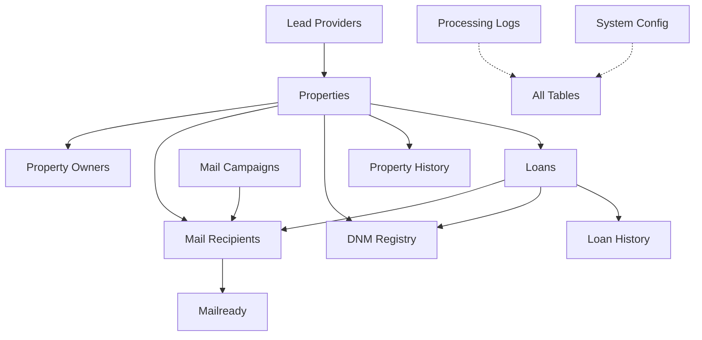

# Property Mail System

A PostgreSQL-based system for managing direct mail campaigns targeting property owners with loan opportunities. The system handles property data management, loan tracking, and mail campaign automation with a focus on data integrity and compliance.

## Overview

The Property Mail System streamlines and automates the process of:
- Managing property data from multiple lead providers
- Tracking loan information and opportunities
- Organizing direct mail campaigns
- Handling recipient responses
- Ensuring compliance with mailing regulations

## Key Features

- **Multi-Provider Support**: Normalized database structure supporting multiple lead providers
- **Multiple Owner Handling**: Flexible design supporting multiple owners per property
- **Unique Loan ID System**: Format: `[LoanType][State][YY][Week]-[Sequence]`
- **Automated Workflows**: Database triggers for consistent data processing
- **Complete History Tracking**: Full audit trail of all changes
- **DNM Registry**: Automated enforcement of Do Not Mail restrictions
- **Quick Lookups**: Optimized views for loan officer interfaces
- **Campaign Management**: Comprehensive mail campaign organization
- **Archival System**: Automated archival of historical data

## Database Structure



## Implementation Guide

The database implementation guide is split into two files:

1. `Seans-dumbdumb-db-guide.md`: Core database structure and setup (Steps 1-16)
   - Lead providers table
   - Properties table
   - Property owners table
   - Loans table
   - History tracking
   - DNM registry
   - Mail campaign structure
   - Database views

2. `guide2.md`: Additional features and examples (Steps 17+)
   - Archival processes
   - Usage examples
   - Maintenance tasks
   - Field mapping reference

## Requirements

- PostgreSQL 12+
- PropertyRadar API access (or other lead provider)
- Task Scheduler/Cron for maintenance tasks
- Database backup system
- CSV processing capabilities

## Setup

1. Create the database:
   ```sql
   CREATE DATABASE "Api-Property-Details";
   ```

2. Follow the implementation guide in order:
   - Execute SQL scripts from `Seans-dumbdumb-db-guide.md`
   - Execute SQL scripts from `guide2.md`

3. Configure scheduled tasks:
   ```bash
   # Refresh materialized views daily
   0 1 * * * psql -U your_db_user -d Api-Property-Details -c "SELECT refresh_mail_campaign_overview_mv();"

   # Archive old data monthly
   0 3 1 * * psql -U your_db_user -d Api-Property-Details -c "SELECT run_all_archival_processes();"

   # Database maintenance weekly
   0 2 * * 0 psql -U your_db_user -d Api-Property-Details -c "VACUUM ANALYZE;"
   ```

## Usage Examples

### Adding a New Property with Multiple Owners

```sql
-- Insert property
INSERT INTO properties (
    provider_id,
    radar_id,
    property_address,
    /* ... other fields ... */
) VALUES (
    1,
    'P12345',
    '123 Main St',
    /* ... other values ... */
);

-- Insert primary owner
INSERT INTO property_owners (
    property_id,
    first_name,
    last_name,
    /* ... other fields ... */
) VALUES (
    1,
    'John',
    'Smith',
    /* ... other values ... */
);

-- Insert co-owner
INSERT INTO property_owners (
    property_id,
    first_name,
    last_name,
    /* ... other fields ... */
) VALUES (
    1,
    'Jane',
    'Smith',
    /* ... other values ... */
);
```

### Looking Up a Property

```sql
-- When a customer calls with a loan ID
SELECT * FROM complete_property_view WHERE loan_id = 'VCA2512-00001';
```

## Maintenance

Regular maintenance tasks are automated through scheduled jobs:
- Daily materialized view refresh
- Monthly data archival
- Weekly database maintenance
- Regular backups (implementation-specific)

## Documentation

- `property-mail-system.md`: System overview and workflows
- `propertyradar-fieldmapping.md`: Field mapping documentation
- `Seans-dumbdumb-db-guide.md`: Core implementation guide
- `guide2.md`: Extended implementation guide

## Contributing

1. Fork the repository
2. Create a feature branch
3. Commit your changes
4. Push to the branch
5. Create a Pull Request

## License

[Your chosen license]

## Author

[Your name/organization]

## Acknowledgments

- PropertyRadar for property data integration
- PostgreSQL for robust database capabilities
