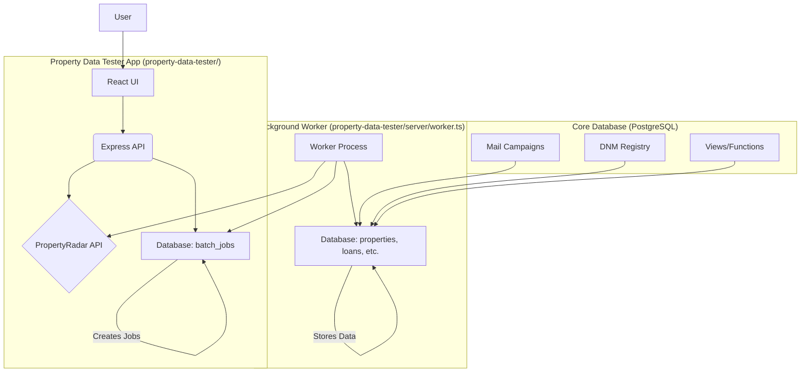

# Property Mail System & Data Loader

This project consists of two main parts:

1.  **Property Mail System Database**: A PostgreSQL-based system for managing direct mail campaigns targeting property owners with loan opportunities. It handles property data management, loan tracking, and mail campaign automation.
2.  **Property Data Tester**: A Node.js application (React frontend + Express backend + Background Worker) for fetching property data from the PropertyRadar API, inserting it into the database via a job queue, and monitoring the process.

## Overview

The combined system streamlines and automates the process of:

*   Fetching property data from lead providers (initially PropertyRadar) using a dedicated tester UI.
*   Managing property data from multiple lead providers in a normalized database.
*   Processing fetched data asynchronously using a background worker and a database-driven job queue.
*   Tracking loan information and opportunities.
*   Organizing direct mail campaigns.
*   Handling recipient responses.
*   Ensuring compliance with mailing regulations.

## System Components



1.  **Property Data Tester UI (React)**: Allows users to configure PropertyRadar API criteria, select fields, and initiate data fetching jobs.
2.  **Property Data Tester API (Express)**: Handles requests from the UI, interacts with the PropertyRadar API, and creates job entries in the `batch_jobs` database table.
3.  **Background Worker (Node.js)**: Polls the `batch_jobs` table for pending jobs, fetches data from PropertyRadar in batches based on job criteria, processes the data, and inserts it into the main property/loan tables.
4.  **Core Database (PostgreSQL)**: Stores all property data, loan information, campaign details, job queue status, history, and configuration. Provides views and functions for data management and access.

## Key Features

*   **Modular Design**: Separate application for data loading and testing.
*   **Asynchronous Processing**: Background worker handles potentially long-running data fetching and insertion tasks using a PostgreSQL-based job queue.
*   **Multi-Provider Support**: Normalized database structure supporting multiple lead providers.
*   **Multiple Owner Handling**: Flexible design supporting multiple owners per property.
*   **Unique Loan ID System**: Format: `[LoanType][State][YY][Week]-[Sequence]`.
*   **Automated Workflows**: Database triggers and worker logic for consistent data processing.
*   **Complete History Tracking**: Full audit trail of all changes in the database.
*   **DNM Registry**: Automated enforcement of Do Not Mail restrictions.
*   **Quick Lookups**: Optimized views for loan officer interfaces.
*   **Campaign Management**: Comprehensive mail campaign organization.
*   **Archival System**: Automated archival of historical data.

## Requirements

*   PostgreSQL 12+
*   Node.js (v16+ recommended)
*   PropertyRadar API access token
*   Task Scheduler/Cron for database maintenance tasks
*   Database backup system

## Setup

1.  **Database Setup**:
    *   Create the database:
        ```sql
        CREATE DATABASE "Api-Property-Details"; -- Or your preferred name
        ```
    *   Follow the database implementation guides in order:
        *   Execute SQL scripts from `Seans-dumbdumb-db-guide.md`
        *   Execute SQL scripts from `guide2.md` (if applicable)

2.  **Application Setup**:
    *   Navigate to the tester application directory:
        ```bash
        cd property-data-tester
        ```
    *   Install dependencies:
        ```bash
        npm install
        ```
    *   Create a `.env` file in the `property-data-tester` directory with database credentials and the PropertyRadar API token. See `property-data-tester/README.md` for details.
    *   Return to the root directory:
        ```bash
        cd ..
        ```

3.  **Database Maintenance Tasks**:
    *   Configure scheduled tasks (Cron/Task Scheduler) for database maintenance as outlined in the original "Setup" section (refreshing views, archiving, vacuuming). Example:
        ```bash
        # Refresh materialized views daily
        0 1 * * * psql -U your_db_user -d your_db_name -c "SELECT refresh_mail_campaign_overview_mv();"
        # Archive old data monthly
        0 3 1 * * psql -U your_db_user -d your_db_name -c "SELECT run_all_archival_processes();"
        # Database maintenance weekly
        0 2 * * 0 psql -U your_db_user -d your_db_name -c "VACUUM ANALYZE;"
        ```

## Running the System

1.  **Run the Background Worker**:
    *   Open a terminal in the root directory (`Mail_Machine`).
    *   Start the worker:
        ```bash
        npm run worker
        ```
    *   This will keep running, polling the database for jobs.

2.  **Run the Property Data Tester Application**:
    *   Open *another* terminal in the root directory (`Mail_Machine`).
    *   Start the tester UI and API server:
        ```bash
        npm run dev
        ```
    *   Access the UI at `http://localhost:3000` (or the configured port).

## Usage

1.  Use the **Property Data Tester UI** (`http://localhost:3000`) to:
    *   Define criteria for fetching properties from PropertyRadar.
    *   Initiate a fetch job. This creates an entry in the `batch_jobs` table.
2.  The **Background Worker** (running separately) will:
    *   Detect the new job in the `batch_jobs` table.
    *   Fetch data from PropertyRadar based on the job criteria.
    *   Process and insert the data into the relevant database tables (`properties`, `property_owners`, `loans`, etc.).
    *   Update the job status in `batch_jobs`.
3.  Monitor job progress via the database `batch_jobs` and `batch_job_logs` tables or potentially through future UI enhancements.
4.  Use database views (e.g., `complete_property_view`) for querying processed data.

## Documentation

*   `README.md` (This file): Overall system overview.
*   `property-data-tester/README.md`: Details on the tester application setup and usage.
*   `property-mail-system.md`: Original system overview and workflows (database focus).
*   `propertyradar-fieldmapping.md`: Field mapping documentation.
*   `Seans-dumbdumb-db-guide.md`: Core database implementation guide.
*   `guide2.md`: Extended database implementation guide.

## Contributing

1.  Fork the repository
2.  Create a feature branch
3.  Commit your changes
4.  Push to the branch
5.  Create a Pull Request

## License

[Your chosen license]

## Author

[Your name/organization]

## Acknowledgments

*   PropertyRadar for property data integration
*   PostgreSQL for robust database capabilities
