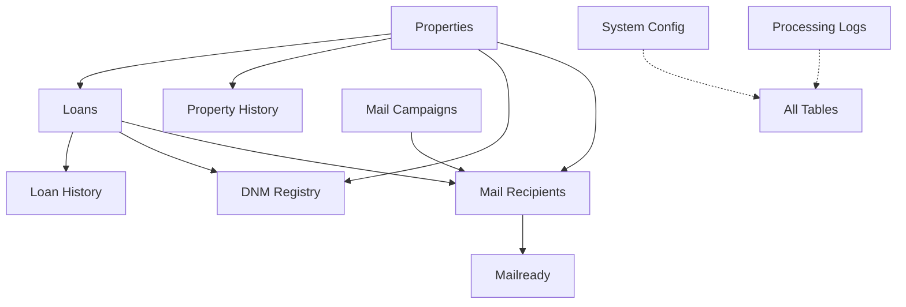

# Sean's Step-by-Step Database Implementation Guide

This guide walks you through implementing the database for your Property Mail System, step by step, with explanations in plain English.

## Database Relationships Overview



## Step 1: Create the Properties Table

**What we're doing:** Creating the main table to store property information.

**Why:** This is the foundation of your system - it stores all the property data you get from PropertyRadar.

```sql
CREATE TABLE properties (
    property_id SERIAL PRIMARY KEY,
    radar_id VARCHAR(50) NOT NULL UNIQUE,
    
    -- Core property data
    property_address VARCHAR(255),
    property_city VARCHAR(100),
    property_state VARCHAR(2),
    property_zip VARCHAR(10),
    property_type VARCHAR(50),
    property_type_code VARCHAR(10),
    year_built INTEGER,
    
    -- Owner 1 information
    owner1_first_name VARCHAR(100),
    owner1_last_name VARCHAR(100),
    owner1_full_name VARCHAR(255),
    owner1_email VARCHAR(255),
    owner1_phone VARCHAR(20),
    
    -- Owner 2 information
    owner2_first_name VARCHAR(100),
    owner2_last_name VARCHAR(100),
    owner2_full_name VARCHAR(255),
    owner2_email VARCHAR(255),
    owner2_phone VARCHAR(20),
    
    -- Owner 3 information
    owner3_first_name VARCHAR(100),
    owner3_last_name VARCHAR(100),
    owner3_full_name VARCHAR(255),
    owner3_email VARCHAR(255),
    owner3_phone VARCHAR(20),
    
    -- Owner 4 information
    owner4_first_name VARCHAR(100),
    owner4_last_name VARCHAR(100),
    owner4_full_name VARCHAR(255),
    owner4_email VARCHAR(255),
    owner4_phone VARCHAR(20),
    
    -- Shared owner information
    ownership_type VARCHAR(50), -- 'INDIVIDUAL', 'JOINT', 'TRUST', 'LLC', etc.
    owner_mailing_address VARCHAR(255),
    owner_mailing_city VARCHAR(100),
    owner_mailing_state VARCHAR(2),
    owner_mailing_zip VARCHAR(10),
    
    -- Financial information
    estimated_value DECIMAL(15, 2),
    assessed_value DECIMAL(15, 2),
    annual_taxes DECIMAL(15, 2),
    
    -- Additional fields
    is_owner_occupied BOOLEAN,
    is_vacant BOOLEAN,
    is_listed_for_sale BOOLEAN,
    last_sale_date DATE,
    last_sale_price DECIMAL(15, 2),
    
    -- Tracking fields
    created_at TIMESTAMP DEFAULT NOW(),
    updated_at TIMESTAMP DEFAULT NOW(),
    is_active BOOLEAN DEFAULT TRUE
);

-- Create indexes for faster lookups
CREATE INDEX idx_properties_radar_id ON properties(radar_id);
CREATE INDEX idx_properties_location ON properties(property_state, property_city);
CREATE INDEX idx_properties_owner1 ON properties(owner1_last_name, owner1_first_name);
CREATE INDEX idx_properties_owner2 ON properties(owner2_last_name, owner2_first_name);

**Expected outcome:** You now have a table to store all property information with proper indexes for fast lookups.

## Step 2: Create the Loans Table

**What we're doing:** Creating a table to store loan information linked to properties.

**Why:** You need to track mortgage details for each property, which is essential for your mail campaigns.

```sql
CREATE TABLE loans (
    loan_id VARCHAR(20) PRIMARY KEY,
    property_id INTEGER REFERENCES properties(property_id),
    
    -- Core loan data
    loan_type VARCHAR(50),
    loan_purpose VARCHAR(100),
    loan_amount DECIMAL(15, 2),
    loan_balance DECIMAL(15, 2),
    interest_rate DECIMAL(5, 3),
    term_years INTEGER,
    
    -- Lender information
    lender_name VARCHAR(255),
    
    -- Dates
    origination_date DATE,
    maturity_date DATE,
    
    -- Equity information
    equity_amount DECIMAL(15, 2),
    equity_percentage DECIMAL(5, 2),
    
    -- Tracking fields
    created_at TIMESTAMP DEFAULT NOW(),
    updated_at TIMESTAMP DEFAULT NOW(),
    is_active BOOLEAN DEFAULT TRUE
);

-- Create indexes for faster lookups
CREATE INDEX idx_loans_property_id ON loans(property_id);
CREATE INDEX idx_loans_loan_type ON loans(loan_type);
CREATE INDEX idx_loans_lender ON loans(lender_name);
```

**Expected outcome:** You now have a table to store loan information with a link to the properties table.

## Step 3: Set Up the Loan ID Generation System

**What we're doing:** Creating a system to generate unique loan IDs that follow your format.

**Why:** The loan ID is critical because it appears on mailers and customers reference it when calling in.

### Step 3.1: Create the Loan ID Sequence Table

```sql
CREATE TABLE loan_id_sequence (
    sequence_id SERIAL PRIMARY KEY,
    loan_id VARCHAR(20) NOT NULL UNIQUE,
    loan_type VARCHAR(50),
    state VARCHAR(2),
    year VARCHAR(2),
    week VARCHAR(2),
    random_part VARCHAR(5),
    generated_at TIMESTAMP DEFAULT NOW(),
    is_used BOOLEAN DEFAULT FALSE,
    used_at TIMESTAMP,
    property_id INTEGER
);

CREATE INDEX idx_loan_id_sequence_loan_id ON loan_id_sequence(loan_id);
```

**Why:** This table tracks all generated loan IDs to prevent duplicates.

### Step 3.2: Create the Loan ID Generation Function

```sql
CREATE OR REPLACE FUNCTION generate_loan_id(p_loan_type TEXT, p_state TEXT)
RETURNS TEXT AS $$
DECLARE
    v_year TEXT := TO_CHAR(CURRENT_DATE, 'YY');
    v_week TEXT := LPAD(TO_CHAR(CURRENT_DATE, 'IW'), 2, '0');
    v_loan_type CHAR := SUBSTRING(UPPER(p_loan_type) FROM 1 FOR 1);
    v_state TEXT := UPPER(p_state);
    v_random TEXT;
BEGIN
    -- Generate a random 5-character string
    v_random := array_to_string(ARRAY(
        SELECT substr('ABCDEFGHIJKLMNOPQRSTUVWXYZ0123456789', floor(random() * 36 + 1)::integer, 1)
        FROM generate_series(1, 5)
    ), '');
    
    -- Format: [Type][State][YY][WEEK]-[RANDOM]
    RETURN v_loan_type || v_state || v_year || v_week || '-' || v_random;
END;
$$ LANGUAGE plpgsql;
```

**Why:** This function creates loan IDs in the format you need (e.g., `VCA2412-XY123`).

### Step 3.3: Create the Loan ID Trigger

```sql
CREATE OR REPLACE FUNCTION set_loan_id()
RETURNS TRIGGER AS $$
DECLARE
    v_loan_id VARCHAR(20);
    v_loan_type TEXT;
    v_state TEXT;
    v_attempts INTEGER := 0;
    v_max_attempts INTEGER := 20;
    v_year VARCHAR(2);
    v_week VARCHAR(2);
    v_random VARCHAR(5);
BEGIN
    -- Get loan type and state
    v_loan_type := NEW.loan_type;
    
    -- Get state from property
    SELECT property_state INTO v_state
    FROM properties
    WHERE property_id = NEW.property_id;
    
    -- Default values if missing
    IF v_loan_type IS NULL THEN
        v_loan_type := 'U'; -- Unknown
    END IF;
    
    IF v_state IS NULL THEN
        v_state := 'XX'; -- Unknown state
    END IF;
    
    -- Generate a unique loan ID (with collision handling)
    LOOP
        -- After max attempts, use MD5 hash for guaranteed uniqueness
        IF v_attempts >= v_max_attempts THEN
            v_year := TO_CHAR(CURRENT_DATE, 'YY');
            v_week := LPAD(TO_CHAR(CURRENT_DATE, 'IW'), 2, '0');
            v_random := LEFT(md5(random()::text), 5);
            v_loan_id := v_loan_type || v_state || v_year || v_week || '-' || v_random;
        ELSE
            v_loan_id := generate_loan_id(v_loan_type, v_state);
        END IF;
        
        -- Parse the components
        v_year := SUBSTRING(v_loan_id FROM 4 FOR 2);
        v_week := SUBSTRING(v_loan_id FROM 6 FOR 2);
        v_random := SUBSTRING(v_loan_id FROM 9 FOR 5);
        
        -- Check if this loan ID already exists
        BEGIN
            INSERT INTO loan_id_sequence(
                loan_id, 
                loan_type, 
                state, 
                year, 
                week, 
                random_part, 
                is_used, 
                used_at, 
                property_id
            )
            VALUES (
                v_loan_id, 
                v_loan_type, 
                v_state, 
                v_year, 
                v_week, 
                v_random, 
                TRUE, 
                NOW(), 
                NEW.property_id
            );
            
            -- If we get here, the insert succeeded (no collision)
            EXIT;
        EXCEPTION WHEN unique_violation THEN
            -- Collision occurred, try again
            v_attempts := v_attempts + 1;
        END;
    END LOOP;
    
    -- Set the loan ID
    NEW.loan_id := v_loan_id;
    
    RETURN NEW;
END;
$$ LANGUAGE plpgsql;

-- Trigger to set loan ID before inserting a loan
CREATE TRIGGER set_loan_id
BEFORE INSERT ON loans
FOR EACH ROW
WHEN (NEW.loan_id IS NULL)
EXECUTE FUNCTION set_loan_id();
```

**Why:** This trigger automatically generates a unique loan ID whenever you insert a new loan record without specifying an ID.

**Expected outcome:** Now when you insert a loan record, it automatically gets a unique loan ID in the format you need.

## Step 4: Create History Tracking Tables

**What we're doing:** Setting up tables and triggers to track changes to properties and loans.

**Why:** This gives you an audit trail of all changes, which is important for compliance and troubleshooting.

### Step 4.1: Create the Property History Table

```sql
CREATE TABLE property_history (
    history_id SERIAL PRIMARY KEY,
    property_id INTEGER REFERENCES properties(property_id),
    change_type VARCHAR(50) NOT NULL, -- 'UPDATE', 'DELETE', etc.
    changed_at TIMESTAMP DEFAULT NOW(),
    changed_by VARCHAR(100),
    
    -- Previous values of important fields
    prev_property_address VARCHAR(255),
    prev_property_city VARCHAR(100),
    prev_property_state VARCHAR(2),
    prev_property_zip VARCHAR(10),
    prev_property_type VARCHAR(50),
    prev_year_built INTEGER,
    prev_owner_first_name VARCHAR(100),
    prev_owner_last_name VARCHAR(100),
    prev_owner_full_name VARCHAR(255),
    prev_estimated_value DECIMAL(15, 2),
    prev_assessed_value DECIMAL(15, 2),
    prev_annual_taxes DECIMAL(15, 2),
    
    -- Fields to track what changed
    changed_fields TEXT[]
);

CREATE INDEX idx_property_history_property_id ON property_history(property_id);
```

### Step 4.2: Create the Property History Trigger

```sql
CREATE TABLE property_history (
    history_id SERIAL PRIMARY KEY,
    property_id INTEGER REFERENCES properties(property_id),
    change_type VARCHAR(50) NOT NULL, -- 'UPDATE', 'DELETE', etc.
    changed_at TIMESTAMP DEFAULT NOW(),
    changed_by VARCHAR(100),
    
    -- Previous values of important fields
    prev_property_address VARCHAR(255),
    prev_property_city VARCHAR(100),
    prev_property_state VARCHAR(2),
    prev_property_zip VARCHAR(10),
    prev_property_type VARCHAR(50),
    prev_year_built INTEGER,
    
    -- Previous owner 1 values
    prev_owner1_first_name VARCHAR(100),
    prev_owner1_last_name VARCHAR(100),
    prev_owner1_full_name VARCHAR(255),
    
    -- Previous owner 2 values
    prev_owner2_first_name VARCHAR(100),
    prev_owner2_last_name VARCHAR(100),
    prev_owner2_full_name VARCHAR(255),
    
    -- Previous owner 3 values
    prev_owner3_first_name VARCHAR(100),
    prev_owner3_last_name VARCHAR(100),
    prev_owner3_full_name VARCHAR(255),
    
    -- Previous owner 4 values
    prev_owner4_first_name VARCHAR(100),
    prev_owner4_last_name VARCHAR(100),
    prev_owner4_full_name VARCHAR(255),
    
    -- Previous shared owner values
    prev_ownership_type VARCHAR(50),
    prev_owner_mailing_address VARCHAR(255),
    prev_owner_mailing_city VARCHAR(100),
    prev_owner_mailing_state VARCHAR(2),
    prev_owner_mailing_zip VARCHAR(10),
    
    -- Previous financial values
    prev_estimated_value DECIMAL(15, 2),
    prev_assessed_value DECIMAL(15, 2),
    prev_annual_taxes DECIMAL(15, 2),
    
    -- Fields to track what changed
    changed_fields TEXT[]
);

CREATE OR REPLACE FUNCTION track_property_changes()
RETURNS TRIGGER AS $$
DECLARE
    changed_field_list TEXT[] := '{}';
BEGIN
    -- Build list of changed fields
    IF OLD.property_address IS DISTINCT FROM NEW.property_address THEN
        changed_field_list := array_append(changed_field_list, 'property_address');
    END IF;
    
    -- Property fields
    IF OLD.property_city IS DISTINCT FROM NEW.property_city THEN
        changed_field_list := array_append(changed_field_list, 'property_city');
    END IF;
    
    IF OLD.property_state IS DISTINCT FROM NEW.property_state THEN
        changed_field_list := array_append(changed_field_list, 'property_state');
    END IF;
    
    IF OLD.property_zip IS DISTINCT FROM NEW.property_zip THEN
        changed_field_list := array_append(changed_field_list, 'property_zip');
    END IF;
    
    IF OLD.property_type IS DISTINCT FROM NEW.property_type THEN
        changed_field_list := array_append(changed_field_list, 'property_type');
    END IF;
    
    IF OLD.year_built IS DISTINCT FROM NEW.year_built THEN
        changed_field_list := array_append(changed_field_list, 'year_built');
    END IF;
    
    -- Owner 1 fields
    IF OLD.owner1_first_name IS DISTINCT FROM NEW.owner1_first_name THEN
        changed_field_list := array_append(changed_field_list, 'owner1_first_name');
    END IF;
    
    IF OLD.owner1_last_name IS DISTINCT FROM NEW.owner1_last_name THEN
        changed_field_list := array_append(changed_field_list, 'owner1_last_name');
    END IF;
    
    IF OLD.owner1_full_name IS DISTINCT FROM NEW.owner1_full_name THEN
        changed_field_list := array_append(changed_field_list, 'owner1_full_name');
    END IF;
    
    -- Owner 2 fields
    IF OLD.owner2_first_name IS DISTINCT FROM NEW.owner2_first_name THEN
        changed_field_list := array_append(changed_field_list, 'owner2_first_name');
    END IF;
    
    IF OLD.owner2_last_name IS DISTINCT FROM NEW.owner2_last_name THEN
        changed_field_list := array_append(changed_field_list, 'owner2_last_name');
    END IF;
    
    IF OLD.owner2_full_name IS DISTINCT FROM NEW.owner2_full_name THEN
        changed_field_list := array_append(changed_field_list, 'owner2_full_name');
    END IF;
    
    -- Owner 3 fields
    IF OLD.owner3_first_name IS DISTINCT FROM NEW.owner3_first_name THEN
        changed_field_list := array_append(changed_field_list, 'owner3_first_name');
    END IF;
    
    IF OLD.owner3_last_name IS DISTINCT FROM NEW.owner3_last_name THEN
        changed_field_list := array_append(changed_field_list, 'owner3_last_name');
    END IF;
    
    IF OLD.owner3_full_name IS DISTINCT FROM NEW.owner3_full_name THEN
        changed_field_list := array_append(changed_field_list, 'owner3_full_name');
    END IF;
    
    -- Owner 4 fields
    IF OLD.owner4_first_name IS DISTINCT FROM NEW.owner4_first_name THEN
        changed_field_list := array_append(changed_field_list, 'owner4_first_name');
    END IF;
    
    IF OLD.owner4_last_name IS DISTINCT FROM NEW.owner4_last_name THEN
        changed_field_list := array_append(changed_field_list, 'owner4_last_name');
    END IF;
    
    IF OLD.owner4_full_name IS DISTINCT FROM NEW.owner4_full_name THEN
        changed_field_list := array_append(changed_field_list, 'owner4_full_name');
    END IF;
    
    -- Shared owner fields
    IF OLD.ownership_type IS DISTINCT FROM NEW.ownership_type THEN
        changed_field_list := array_append(changed_field_list, 'ownership_type');
    END IF;
    
    IF OLD.owner_mailing_address IS DISTINCT FROM NEW.owner_mailing_address THEN
        changed_field_list := array_append(changed_field_list, 'owner_mailing_address');
    END IF;
    
    IF OLD.owner_mailing_city IS DISTINCT FROM NEW.owner_mailing_city THEN
        changed_field_list := array_append(changed_field_list, 'owner_mailing_city');
    END IF;
    
    IF OLD.owner_mailing_state IS DISTINCT FROM NEW.owner_mailing_state THEN
        changed_field_list := array_append(changed_field_list, 'owner_mailing_state');
    END IF;
    
    IF OLD.owner_mailing_zip IS DISTINCT FROM NEW.owner_mailing_zip THEN
        changed_field_list := array_append(changed_field_list, 'owner_mailing_zip');
    END IF;
    
    -- Financial fields
    IF OLD.estimated_value IS DISTINCT FROM NEW.estimated_value THEN
        changed_field_list := array_append(changed_field_list, 'estimated_value');
    END IF;
    
    IF OLD.assessed_value IS DISTINCT FROM NEW.assessed_value THEN
        changed_field_list := array_append(changed_field_list, 'assessed_value');
    END IF;
    
    IF OLD.annual_taxes IS DISTINCT FROM NEW.annual_taxes THEN
        changed_field_list := array_append(changed_field_list, 'annual_taxes');
    END IF;
    
    -- Only track if something changed
    IF array_length(changed_field_list, 1) > 0 THEN
        -- Store the old data in the history table
        INSERT INTO property_history(
            property_id,
            change_type,
            changed_by,
            prev_property_address,
            prev_property_city,
            prev_property_state,
            prev_property_zip,
            prev_property_type,
            prev_year_built,
            prev_owner1_first_name,
            prev_owner1_last_name,
            prev_owner1_full_name,
            prev_owner2_first_name,
            prev_owner2_last_name,
            prev_owner2_full_name,
            prev_owner3_first_name,
            prev_owner3_last_name,
            prev_owner3_full_name,
            prev_owner4_first_name,
            prev_owner4_last_name,
            prev_owner4_full_name,
            prev_ownership_type,
            prev_owner_mailing_address,
            prev_owner_mailing_city,
            prev_owner_mailing_state,
            prev_owner_mailing_zip,
            prev_estimated_value,
            prev_assessed_value,
            prev_annual_taxes,
            changed_fields
        ) VALUES (
            OLD.property_id,
            TG_OP,
            current_user,
            OLD.property_address,
            OLD.property_city,
            OLD.property_state,
            OLD.property_zip,
            OLD.property_type,
            OLD.year_built,
            OLD.owner1_first_name,
            OLD.owner1_last_name,
            OLD.owner1_full_name,
            OLD.owner2_first_name,
            OLD.owner2_last_name,
            OLD.owner2_full_name,
            OLD.owner3_first_name,
            OLD.owner3_last_name,
            OLD.owner3_full_name,
            OLD.owner4_first_name,
            OLD.owner4_last_name,
            OLD.owner4_full_name,
            OLD.ownership_type,
            OLD.owner_mailing_address,
            OLD.owner_mailing_city,
            OLD.owner_mailing_state,
            OLD.owner_mailing_zip,
            OLD.estimated_value,
            OLD.assessed_value,
            OLD.annual_taxes,
            changed_field_list
        );
    END IF;
    
    -- For updates, return the NEW record with updated timestamp
    IF TG_OP = 'UPDATE' THEN
        NEW.updated_at = NOW();
        RETURN NEW;
    END IF;
    
    -- For deletes, return the OLD record
    RETURN OLD;
END;
$$ LANGUAGE plpgsql;

### Step 4.3: Create the Loan History Table and Trigger

```sql
CREATE TABLE loan_history (
    history_id SERIAL PRIMARY KEY,
    loan_id VARCHAR(20) NOT NULL,
    property_id INTEGER,
    change_type VARCHAR(50) NOT NULL,
    changed_at TIMESTAMP DEFAULT NOW(),
    changed_by VARCHAR(100),
    
    -- Previous values of important fields
    prev_loan_type VARCHAR(50),
    prev_loan_purpose VARCHAR(100),
    prev_loan_amount DECIMAL(15, 2),
    prev_loan_balance DECIMAL(15, 2),
    prev_interest_rate DECIMAL(5, 3),
    prev_term_years INTEGER,
    prev_lender_name VARCHAR(255),
    
    -- Fields to track what changed
    changed_fields TEXT[]
);

CREATE INDEX idx_loan_history_loan_id ON loan_history(loan_id);

CREATE OR REPLACE FUNCTION track_loan_changes()
RETURNS TRIGGER AS $$
DECLARE
    changed_field_list TEXT[] := '{}';
BEGIN
    -- Build list of changed fields
    IF OLD.loan_type IS DISTINCT FROM NEW.loan_type THEN
        changed_field_list := array_append(changed_field_list, 'loan_type');
    END IF;
    
    IF OLD.loan_purpose IS DISTINCT FROM NEW.loan_purpose THEN
        changed_field_list := array_append(changed_field_list, 'loan_purpose');
    END IF;
    
    IF OLD.loan_amount IS DISTINCT FROM NEW.loan_amount THEN
        changed_field_list := array_append(changed_field_list, 'loan_amount');
    END IF;
    
    IF OLD.loan_balance IS DISTINCT FROM NEW.loan_balance THEN
        changed_field_list := array_append(changed_field_list, 'loan_balance');
    END IF;
    
    IF OLD.interest_rate IS DISTINCT FROM NEW.interest_rate THEN
        changed_field_list := array_append(changed_field_list, 'interest_rate');
    END IF;
    
    IF OLD.term_years IS DISTINCT FROM NEW.term_years THEN
        changed_field_list := array_append(changed_field_list, 'term_years');
    END IF;
    
    IF OLD.lender_name IS DISTINCT FROM NEW.lender_name THEN
        changed_field_list := array_append(changed_field_list, 'lender_name');
    END IF;
    
    IF OLD.origination_date IS DISTINCT FROM NEW.origination_date THEN
        changed_field_list := array_append(changed_field_list, 'origination_date');
    END IF;
    
    IF OLD.maturity_date IS DISTINCT FROM NEW.maturity_date THEN
        changed_field_list := array_append(changed_field_list, 'maturity_date');
    END IF;
    
    IF OLD.equity_amount IS DISTINCT FROM NEW.equity_amount THEN
        changed_field_list := array_append(changed_field_list, 'equity_amount');
    END IF;
    
    IF OLD.equity_percentage IS DISTINCT FROM NEW.equity_percentage THEN
        changed_field_list := array_append(changed_field_list, 'equity_percentage');
    END IF;
    
    -- Only track if something changed
    IF array_length(changed_field_list, 1) > 0 THEN
        -- Store the old data in the history table
        INSERT INTO loan_history(
            loan_id,
            property_id,
            change_type,
            changed_by,
            prev_loan_type,
            prev_loan_purpose,
            prev_loan_amount,
            prev_loan_balance,
            prev_interest_rate,
            prev_term_years,
            prev_lender_name,
            prev_origination_date,
            prev_maturity_date,
            prev_equity_amount,
            prev_equity_percentage,
            changed_fields
        ) VALUES (
            OLD.loan_id,
            OLD.property_id,
            TG_OP,
            current_user,
            OLD.loan_type,
            OLD.loan_purpose,
            OLD.loan_amount,
            OLD.loan_balance,
            OLD.interest_rate,
            OLD.term_years,
            OLD.lender_name,
            OLD.origination_date,
            OLD.maturity_date,
            OLD.equity_amount,
            OLD.equity_percentage,
            changed_field_list
        );
    END IF;
    
    -- For updates, return the NEW record with updated timestamp
    IF TG_OP = 'UPDATE' THEN
        NEW.updated_at = NOW();
        RETURN NEW;
    END IF;
    
    -- For deletes, return the OLD record
    RETURN OLD;
END;
$$ LANGUAGE plpgsql;

-- Trigger to track loan changes
CREATE TRIGGER track_loan_changes
BEFORE UPDATE OR DELETE ON loans
FOR EACH ROW EXECUTE FUNCTION track_loan_changes();
```

**Expected outcome:** Now whenever properties or loans are updated or deleted, the changes are automatically tracked in the history tables.

## Step 5: Create the DNM (Do Not Mail) Registry

**What we're doing:** Setting up a table to track properties that should not receive mail.

**Why:** This is critical for compliance - you need to ensure you don't mail to people who have opted out.

```sql
CREATE TABLE dnm_registry (
    dnm_id SERIAL PRIMARY KEY,
    property_id INTEGER REFERENCES properties(property_id),
    radar_id VARCHAR(50),
    loan_id VARCHAR(20),
    
    -- Reason for DNM status
    reason VARCHAR(255) NOT NULL,
    reason_category VARCHAR(50) NOT NULL, -- 'CUSTOMER_REQUEST', 'COMPLIANCE', 'RETURNED_MAIL', 'OTHER'
    source VARCHAR(100) NOT NULL, -- 'USER', 'SYSTEM', 'COMPLIANCE'
    
    -- Tracking fields
    blocked_at TIMESTAMP DEFAULT NOW(),
    blocked_by VARCHAR(100),
    is_active BOOLEAN DEFAULT TRUE,
    notes TEXT
);

CREATE INDEX idx_dnm_registry_property_id ON dnm_registry(property_id);
CREATE INDEX idx_dnm_registry_radar_id ON dnm_registry(radar_id);
CREATE INDEX idx_dnm_registry_loan_id ON dnm_registry(loan_id);
CREATE INDEX idx_dnm_registry_active ON dnm_registry(is_active);
```

**Expected outcome:** You now have a table to track properties that should not receive mail.

## Step 6: Set Up the Mail Campaign Structure

**What we're doing:** Creating tables to manage mail campaigns and recipients.

**Why:** This organizes your mailings and tracks which properties have been contacted.

### Step 6.1: Create the Mail Campaigns Table

```sql
CREATE TABLE mail_campaigns (
    campaign_id SERIAL PRIMARY KEY,
    campaign_name VARCHAR(100) NOT NULL,
    description TEXT,
    campaign_date DATE NOT NULL,
    status VARCHAR(50) DEFAULT 'DRAFT', -- DRAFT, ACTIVE, COMPLETED, CANCELLED
    
    -- Campaign parameters
    target_loan_types VARCHAR[] DEFAULT '{}',
    target_states VARCHAR[] DEFAULT '{}',
    date_range_start DATE,
    date_range_end DATE,
    
    -- Tracking fields
    created_at TIMESTAMP DEFAULT NOW(),
    updated_at TIMESTAMP DEFAULT NOW(),
    created_by VARCHAR(100)
);

CREATE INDEX idx_mail_campaigns_status ON mail_campaigns(status);
CREATE INDEX idx_mail_campaigns_date ON mail_campaigns(campaign_date);
```

### Step 6.2: Create the Mail Recipients Table

```sql
CREATE TABLE mail_recipients (
    recipient_id SERIAL PRIMARY KEY,
    campaign_id INTEGER REFERENCES mail_campaigns(campaign_id),
    property_id INTEGER REFERENCES properties(property_id),
    loan_id VARCHAR(20) REFERENCES loans(loan_id),
    
    -- Mailing information
    first_name VARCHAR(100),
    last_name VARCHAR(100),
    address VARCHAR(255),
    city VARCHAR(100),
    state VARCHAR(2),
    zip_code VARCHAR(10),
    city_state_zip VARCHAR(255),
    
    -- Campaign specific data
    close_month VARCHAR(20),
    skip_month VARCHAR(20),
    next_pay_month VARCHAR(20),
    mail_date DATE,
    phone_number VARCHAR(20),
    
    -- Mailing vendor data
    presort_tray VARCHAR(255),
    barcode VARCHAR(255),
    
    -- Status tracking
    status VARCHAR(50) DEFAULT 'PENDING', -- PENDING, MAILED, RETURNED, RESPONDED
    mailed_date DATE,
    response_date DATE,
    
    -- Tracking fields
    created_at TIMESTAMP DEFAULT NOW(),
    updated_at TIMESTAMP DEFAULT NOW()
);

CREATE INDEX idx_mail_recipients_campaign_id ON mail_recipients(campaign_id);
CREATE INDEX idx_mail_recipients_loan_id ON mail_recipients(loan_id);
CREATE INDEX idx_mail_recipients_status ON mail_recipients(status);
```

### Step 6.3: Create the Mailready Table (For Backward Compatibility)

```sql
CREATE TABLE mailready (
    id SERIAL PRIMARY KEY,
    first_name VARCHAR(255),
    last_name VARCHAR(255),
    loan_id VARCHAR(20) REFERENCES loans(loan_id),
    address VARCHAR(255),
    city_state_zip VARCHAR(255),
    presort_tray VARCHAR(255),
    barcode VARCHAR(255),
    lender VARCHAR(255),
    loan_type VARCHAR(255),
    balance NUMERIC(10,2),
    close_month VARCHAR(20),
    skip_month VARCHAR(20),
    next_pay_month VARCHAR(20),
    mail_date DATE,
    phone_number VARCHAR(20),
    city TEXT,
    
    -- Link to new structure
    recipient_id INTEGER REFERENCES mail_recipients(recipient_id),
    
    -- Tracking fields
    created_at TIMESTAMP DEFAULT NOW()
);

CREATE INDEX idx_mailready_loan_id ON mailready(loan_id);
```

**Expected outcome:** You now have tables to manage mail campaigns, track recipients, and maintain backward compatibility with your existing processes.

## Step 7: Create the DNM Enforcement Trigger

**What we're doing:** Setting up a trigger to prevent mailing to properties in the DNM registry.

**Why:** This automatically enforces your DNM policy without requiring manual checks.

```sql
CREATE OR REPLACE FUNCTION check_dnm_status()
RETURNS TRIGGER AS $$
BEGIN
    -- Check if the property is in the DNM registry
    IF EXISTS (
        SELECT 1 FROM dnm_registry
        WHERE (property_id = NEW.property_id OR loan_id = NEW.loan_id)
        AND is_active = TRUE
    ) THEN
        -- Prevent the insert
        RAISE EXCEPTION 'Property is in the Do Not Mail registry';
    END IF;
    
    RETURN NEW;
END;
$$ LANGUAGE plpgsql;

-- Trigger to enforce DNM before adding to mail_recipients
CREATE TRIGGER enforce_dnm
BEFORE INSERT ON mail_recipients
FOR EACH ROW EXECUTE FUNCTION check_dnm_status();
```

**Expected outcome:** Now if you try to add a property to a mail campaign that's in the DNM registry, the database will prevent it automatically.

## Step 8: Set Up the System Configuration Table

**What we're doing:** Creating a table to store system configuration values.

**Why:** This replaces hardcoded values with configurable settings, making the system more flexible.

```sql
CREATE TABLE system_config (
    config_id SERIAL PRIMARY KEY,
    config_key VARCHAR(100) NOT NULL UNIQUE,
    config_value TEXT NOT NULL,
    description TEXT,
    is_sensitive BOOLEAN DEFAULT FALSE,
    
    -- Tracking fields
    created_at TIMESTAMP DEFAULT NOW(),
    updated_at TIMESTAMP DEFAULT NOW(),
    updated_by VARCHAR(100)
);

-- Insert initial configuration
INSERT INTO system_config (config_key, config_value, description, is_sensitive) VALUES
-- Database configuration
('database_name', 'Api-Property-Details', 'Database name for the system', false),

-- File paths
('csv_base_path', 'C:\Users\SeanBoggs\Scripts\dbmailprep', 'Base path for CSV files', false),
('log_base_path', 'C:\Users\SeanBoggs\Scripts\propertyradar\logs', 'Base path for log files', false),

-- Mail campaign constants
('mail_phone_number', '855-235-5834', 'Phone number for mail campaigns', false),
('close_month_days', '21', 'Days to add to current date for close month', false),
('skip_month_days', '53', 'Days to add to current date for skip month', false),
('next_pay_month_days', '85', 'Days to add to current date for next pay month', false);
```

**Expected outcome:** You now have a table to store configuration values, with your current constants pre-loaded.

## Step 9: Create the Mail Date Calculation Function

**What we're doing:** Creating a function to calculate mail campaign dates.

**Why:** This centralizes the date calculation logic and uses the configuration values.

```sql
CREATE OR REPLACE FUNCTION calculate_mail_dates()
RETURNS TABLE (
    close_month VARCHAR,
    skip_month VARCHAR,
    next_pay_month VARCHAR,
    mail_date DATE,
    phone_number VARCHAR
) AS $$
DECLARE
    today DATE := CURRENT_DATE;
    close_days INT;
    skip_days INT;
    next_pay_days INT;
    days_until_friday INT;
    phone VARCHAR;
BEGIN
    -- Get configuration values
    SELECT config_value::INT INTO close_days FROM system_config WHERE config_key = 'close_month_days';
    SELECT config_value::INT INTO skip_days FROM system_config WHERE config_key = 'skip_month_days';
    SELECT config_value::INT INTO next_pay_days FROM system_config WHERE config_key = 'next_pay_month_days';
    SELECT config_value INTO phone FROM system_config WHERE config_key = 'mail_phone_number';
    
    -- Calculate days until Friday
    days_until_friday := (4 - EXTRACT(DOW FROM today)::INT) % 7;
    
    -- Return the calculated dates
    RETURN QUERY SELECT
        TO_CHAR(today + (close_days || ' days')::INTERVAL, 'Month') AS close_month,
        TO_CHAR(today + (skip_days || ' days')::INTERVAL, 'Month') AS skip_month,
        TO_CHAR(today + (next_pay_days || ' days')::INTERVAL, 'Month') AS next_pay_month,
        today + days_until_friday AS mail_date,
        phone AS phone_number;
END;
$$ LANGUAGE plpgsql;
```

**Expected outcome:** You now have a function to calculate mail dates based on your configuration values.

## Step 10: Create the Processing Logs Table

**What we're doing:** Setting up a table to log system events and errors.

**Why:** This provides an audit trail and helps with troubleshooting.

```sql
CREATE TABLE processing_logs (
    log_id SERIAL PRIMARY KEY,
    log_level VARCHAR(20) NOT NULL, -- 'INFO', 'WARNING', 'ERROR', 'CRITICAL'
    component VARCHAR(50) NOT NULL,
    message TEXT NOT NULL,
    
    -- Context fields
    entity_type VARCHAR(50), -- 'PROPERTY', 'LOAN', 'CAMPAIGN', etc.
    entity_id VARCHAR(100),
    property_id INTEGER,
    loan_id VARCHAR(20),
    campaign_id INTEGER,
    
    -- Tracking fields
    occurred_at TIMESTAMP DEFAULT NOW(),
    user_id VARCHAR(100)
);

CREATE INDEX idx_processing_logs_level ON processing_logs(log_level);
CREATE INDEX idx_processing_logs_component ON processing_logs(component);
CREATE INDEX idx_processing_logs_time ON processing_logs(occurred_at);
```

**Expected outcome:** You now have a table to log system events and errors.

## Step 11: Create Database Views

**What we're doing:** Creating views to simplify common queries.

**Why:** This makes it easier to get the information you need without writing complex joins every time.

### Step 11.1: Create the Complete Property View for Loan Officers

```sql
CREATE VIEW complete_property_view AS
SELECT 
    -- Property Information
    p.property_id,
    p.radar_id,
    p.property_address,
    p.property_city,
    p.property_state,
    p.property_zip,
    p.property_type,
    p.property_type_code,
    p.year_built,
    p.is_owner_occupied,
    p.is_vacant,
    p.is_listed_for_sale,
    
    -- Owner 1 Information
    p.owner1_first_name,
    p.owner1_last_name,
    p.owner1_full_name,
    p.owner1_email,
    p.owner1_phone,
    
    -- Owner 2 Information
    p.owner2_first_name,
    p.owner2_last_name,
    p.owner2_full_name,
    p.owner2_email,
    p.owner2_phone,
    
    -- Owner 3 Information
    p.owner3_first_name,
    p.owner3_last_name,
    p.owner3_full_name,
    p.owner3_email,
    p.owner3_phone,
    
    -- Owner 4 Information
    p.owner4_first_name,
    p.owner4_last_name,
    p.owner4_full_name,
    p.owner4_email,
    p.owner4_phone,
    
    -- Shared Owner Information
    p.ownership_type,
    p.owner_mailing_address,
    p.owner_mailing_city,
    p.owner_mailing_state,
    p.owner_mailing_zip,
    
    -- Financial Information
    p.estimated_value,
    p.assessed_value,
    p.annual_taxes,
    p.last_sale_date,
    p.last_sale_price,
    
    -- Loan Information
    l.loan_id,
    l.loan_type,
    l.loan_purpose,
    l.loan_amount,
    l.loan_balance,
    l.interest_rate,
    l.term_years,
    l.lender_name,
    l.origination_date,
    l.maturity_date,
    l.equity_amount,
    l.equity_percentage,
    
    -- DNM Status
    CASE 
        WHEN dnm.dnm_id IS NOT NULL THEN TRUE
        ELSE FALSE
    END AS is_dnm,
    dnm.reason AS dnm_reason,
    dnm.reason_category AS dnm_category,
    dnm.blocked_at AS dnm_date,
    
    -- Most Recent Mailing Information
    mr.recipient_id,
    mr.campaign_id,
    mr.close_month,
    mr.skip_month,
    mr.next_pay_month,
    mr.mail_date,
    mr.phone_number,
    mr.status AS mail_status,
    mr.mailed_date,
    mr.response_date,
    
    -- Campaign Information
    mc.campaign_name,
    mc.campaign_date,
    mc.status AS campaign_status,
    
    -- Tracking Information
    p.created_at AS property_created_at,
    p.updated_at AS property_updated_at,
    l.created_at AS loan_created_at,
    l.updated_at AS loan_updated_at
FROM 
    properties p
LEFT JOIN 
    loans l ON p.property_id = l.property_id
LEFT JOIN 
    dnm_registry dnm ON (p.property_id = dnm.property_id OR l.loan_id = dnm.loan_id) AND dnm.is_active = TRUE
LEFT JOIN 
    mail_recipients mr ON (p.property_id = mr.property_id AND l.loan_id = mr.loan_id)
LEFT JOIN 
    mail_campaigns mc ON mr.campaign_id = mc.campaign_id
WHERE
    p.is_active = TRUE
    AND (l.is_active IS NULL OR l.is_active = TRUE);
    

**Why this view is important:** This view pulls together ALL data points from all tables into a single view that your loan officers can use to render the UI. It includes:

1. All property details
2. All loan information
3. DNM status and reason
4. Mailing history and status
5. Campaign information

This is the "one-stop shop" for your loan officers to see everything about a property and its loan in one place.

### Step 11.2: Create the Mail Campaign Overview Materialized View

```sql
CREATE MATERIALIZED VIEW mail_campaign_overview_mv AS
SELECT 
    mc.campaign_id,
    mc.campaign_name,
    mc.description,
    mc.campaign_date,
    mc.status,
    COUNT(mr.recipient_id) AS total_recipients,
    SUM(CASE WHEN mr.status = 'PENDING' THEN 1 ELSE 0 END) AS pending_count,
    SUM(CASE WHEN mr.status = 'MAILED' THEN 1 ELSE 0 END) AS mailed_count,
    SUM(CASE WHEN mr.status = 'RETURNED' THEN 1 ELSE 0 END) AS returned_count,
    SUM(CASE WHEN mr.status = 'RESPONDED' THEN 1 ELSE 0 END) AS responded_count
FROM 
    mail_campaigns mc
LEFT JOIN 
    mail_recipients mr ON mc.campaign_id = mr.campaign_id
GROUP BY 
    mc.campaign_id,
    mc.campaign_name,
    mc.description,
    mc.campaign_date,
    mc.status;

-- Create indexes on the materialized view
CREATE UNIQUE INDEX idx_mail_campaign_overview_mv_id ON mail_campaign_overview_mv(campaign_id);
```

**Expected outcome:** You now have views to simplify common queries, including a comprehensive view for loan officers that includes ALL data points from all tables.

## Step 12: Set Up Materialized View Refresh

**What we're doing:** Creating a function to refresh the materialized view.

**Why:** Materialized views need to be refreshed to show current data.

```sql
CREATE OR REPLACE FUNCTION refresh_mail_campaign_overview_mv()
RETURNS VOID AS $$
BEGIN
    REFRESH MATERIALIZED VIEW CONCURRENTLY mail_campaign_overview_mv;
    
    -- Log the refresh
    INSERT INTO processing_logs(
        log_level,
        component,
        message
    ) VALUES (
        'INFO',
        'MATERIALIZED_VIEW',
        'Refreshed mail_campaign_overview_mv'
    );
END;
$$ LANGUAGE plpgsql;
```

**Expected outcome:** You now have a function to refresh the materialized view, which you can call from a cron job.

## Step 13: Create Archive Tables

**What we're doing:** Setting up tables to archive old data.

**Why:** This keeps your active tables lean while preserving historical data.

```sql
-- Create archive tables with the same structure as the original tables
CREATE TABLE property_history_archive (LIKE property_history INCLUDING ALL);
CREATE TABLE loan_history_archive (LIKE loan_history INCLUDING ALL);
CREATE TABLE processing_logs_archive (LIKE processing_logs INCLUDING ALL);
```

**Expected outcome:** You now have tables to archive old data.

## Step 14: Create Archival Functions

**What we're doing:** Creating functions to move old data to archive tables.

**Why:** This automates the archival process and ensures it's done consistently.

```sql
CREATE OR REPLACE FUNCTION archive_property_history(p_months INTEGER)
RETURNS INTEGER AS $$
DECLARE
    v_cutoff_date TIMESTAMP;
    v_archived_count INTEGER;
BEGIN
    -- Calculate cutoff date
    v_cutoff_date := NOW() - (p_months || ' months')::INTERVAL;
    
    -- Move records to archive
    WITH moved_rows AS (
        DELETE FROM property_history
        WHERE changed_at < v_cutoff_date
        RETURNING *
    )
    INSERT INTO property_history_archive
    SELECT * FROM moved_rows;
    
    -- Get count of archived records
    GET DIAGNOSTICS v_archived_count = ROW_COUNT;
    
    RETURN v_archived_count;
END;
$$ LANGUAGE plpgsql;

-- Create similar functions for loan_history and processing_logs
-- (Code omitted for brevity - follow the same pattern)
```

**Expected outcome:** You now have functions to archive old data, which you can call from a cron job.

## Step 15: Create a Master Archival Function

**What we're doing:** Creating a function to run all archival processes.

**Why:** This simplifies scheduling by providing a single entry point.

```sql
CREATE OR REPLACE FUNCTION run_all_archival_processes()
RETURNS VOID AS $$
DECLARE
    v_property_history_months INTEGER := 12; -- Default to 12 months
    v_loan_history_months INTEGER := 12;
    v_processing_logs_months INTEGER := 6;
BEGIN
    -- Run archival processes
    PERFORM archive_property_history(v_property_history_months);
    PERFORM archive_loan_history(v_loan_history_months);
    PERFORM archive_processing_logs(v_processing_logs_months);
    
    -- Log the archival
    INSERT INTO processing_logs(
        log_level,
        component,
        message
    ) VALUES (
        'INFO',
        'DATA_ARCHIVAL',
        'Ran all archival processes'
    );
END;
$$ LANGUAGE plpgsql;
```

**Expected outcome:** You now have a master function to run all archival processes, which you can call from a cron job.

## How to Use This Database in Practice

### Example 1: Adding a New Property and Loan

```sql
-- Insert a property
INSERT INTO properties (
    radar_id,
    property_address,
    property_city,
    property_state,
    property_zip,
    property_type,
    year_built,
    owner_first_name,
    owner_last_name,
    owner_full_name,
    estimated_value,
    assessed_value,
    annual_taxes,
    is_owner_occupied
) VALUES (
    'P12345',
    '123 Main St',
    'Los Angeles',
    'CA',
    '90001',
    'Single Family',
    1985,
    'John',
    'Smith',
    'John Smith',
    500000,
    450000,
    5000,
    TRUE
);

-- Get the property_id
SELECT property_id FROM properties WHERE radar_id = 'P12345';

-- Insert a loan (loan_id will be generated automatically)
INSERT INTO loans (
    property_id,
    loan_type,
    loan_purpose,
    loan_amount,
    loan_balance,
    interest_rate,
    term_years,
    lender_name,
    origination_date,
    maturity_date,
    equity_amount,
    equity_percentage
) VALUES (
    1, -- Use the property_id from the previous query
    'VA',
    'Purchase',
    400000,
    380000,
    4.5,
    30,
    'ABC Mortgage',
    '2020-01-15',
    '2050-01-15',
    120000,
    24
);
```

### Example 2: Creating a Mail Campaign

```sql
-- Create a campaign
INSERT INTO mail_campaigns (
    campaign_name,
    description,
    campaign_date,
    target_loan_types,
    target_states
) VALUES (
    'VA Loans California April 2025',
    'VA loans in California for April 2025 campaign',
    '2025-04-15',
    ARRAY['VA'],
    ARRAY['CA']
);

-- Select recipients
INSERT INTO mail_recipients (
    campaign_id,
    property_id,
    loan_id,
    first_name,
    last_name,
    address,
    city,
    state,
    zip_code,
    city_state_zip
)
SELECT 
    1, -- campaign_id
    p.property_id,
    l.loan_id,
    p.owner_first_name,
    p.owner_last_name,
    p.property_address,
    p.property_city,
    p.property_state,
    p.property_zip,
    p.property_city || ', ' || p.property_state || ' ' || p.property_zip
FROM 
    properties p
JOIN 
    loans l ON p.property_id = l.property_id
WHERE 
    l.loan_type = 'VA'
    AND p.property_state = 'CA'
    AND NOT EXISTS (
        SELECT 1 FROM dnm_registry 
        WHERE (property_id = p.property_id OR loan_id = l.loan_id)
        AND is_active = TRUE
    );

-- Calculate mail dates
UPDATE mail_recipients mr
SET 
    (close_month, skip_month, next_pay_month, mail_date, phone_number) = 
    (SELECT close_month, skip_month, next_pay_month, mail_date, phone_number 
     FROM calculate_mail_dates())
WHERE 
    campaign_id = 1;

-- Copy to mailready table
INSERT INTO mailready (
    first_name, last_name, loan_id, address, city_state_zip,
    lender, loan_type, balance, close_month, skip_month, 
    next_pay_month, mail_date, phone_number, city, recipient_id
)
SELECT 
    mr.first_name, mr.last_name, mr.loan_id, mr.address, mr.city_state_zip,
    l.lender_name, l.loan_type, l.loan_balance, mr.close_month, mr.skip_month,
    mr.next_pay_month, mr.mail_date, mr.phone_number, mr.city, mr.recipient_id
FROM 
    mail_recipients mr
JOIN 
    loans l ON mr.loan_id = l.loan_id
WHERE 
    mr.campaign_id = 1;
```

### Example 3: Looking Up a Property by Loan ID

```sql
-- When a customer calls with a loan ID, use the complete_property_view
SELECT * FROM complete_property_view WHERE loan_id = 'VCA2512-AB123';
```

This query gives your loan officers EVERYTHING they need to know about the property, loan, mailing history, and DNM status - all in one query!

### Example 4: Adding to DNM Registry

```sql
-- When a customer asks to be removed from mailings
INSERT INTO dnm_registry (
    property_id,
    loan_id,
    reason,
    reason_category,
    source,
    blocked_by,
    notes
) VALUES (
    (SELECT property_id FROM loans WHERE loan_id = 'VCA2512-AB123'),
    'VCA2512-AB123',
    'Customer requested no more mail',
    'CUSTOMER_REQUEST',
    'PHONE',
    'Jane Operator',
    'Customer called on 2025-04-20 and requested to be removed from all mailings'
);
```

### Example 5: Refreshing the Campaign Overview

```sql
-- Refresh the materialized view
SELECT refresh_mail_campaign_overview_mv();

-- Query the materialized view
SELECT * FROM mail_campaign_overview_mv;
```

### Example 6: Running Archival Processes

```sql
-- Run all archival processes
SELECT run_all_archival_processes();
```

## Maintenance Tasks to Schedule

1. **Refresh Materialized Views**: Daily
   ```
   0 1 * * * psql -U your_db_user -d Api-Property-Details -c "SELECT refresh_mail_campaign_overview_mv();"
   ```

2. **Archive Old Data**: Monthly
   ```
   0 3 1 * * psql -U your_db_user -d Api-Property-Details -c "SELECT run_all_archival_processes();"
   ```

3. **Database Maintenance**: Weekly
   ```
   0 2 * * 0 psql -U your_db_user -d Api-Property-Details -c "VACUUM ANALYZE;"
   ```

## Conclusion

You now have a complete database implementation for your Property Mail System. This design:

1. Stores property and loan information in a structured way
2. Generates unique loan IDs for your mailers
3. Tracks changes to properties and loans
4. Prevents mailing to properties in the DNM registry
5. Organizes mail campaigns and recipients
6. Calculates mail dates based on configurable values
7. Provides a comprehensive view (complete_property_view) that includes ALL data points from ALL tables for your loan officers' UI
8. Archives old data to keep the system performant

The system is designed to be flexible, maintainable, and scalable, while preserving compatibility with your existing processes.