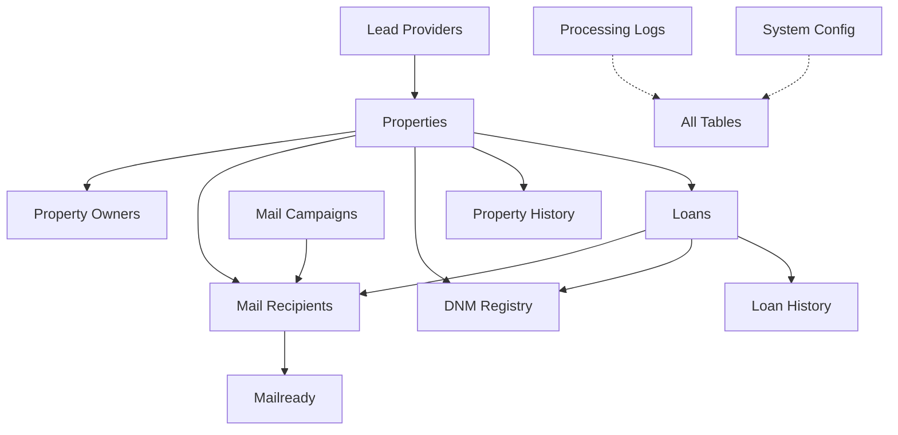

# Sean's Step-by-Step Database Implementation Guide

This guide walks you through implementing the database for your Property Mail System, step by step, with explanations in plain English.

## Database Relationships Overview



## Step 1: Create the Lead Providers Table

**What we're doing:** Creating a table to store information about different lead providers.

**Why:** This allows the system to support multiple lead providers with a consistent field naming convention.

```sql
CREATE TABLE lead_providers (
    provider_id SERIAL PRIMARY KEY,
    provider_name VARCHAR(100) NOT NULL UNIQUE,
    provider_code VARCHAR(20) NOT NULL UNIQUE,
    api_key VARCHAR(255),
    api_endpoint VARCHAR(255),
    is_active BOOLEAN DEFAULT TRUE,
    
    -- Tracking fields
    created_at TIMESTAMP DEFAULT NOW(),
    updated_at TIMESTAMP DEFAULT NOW()
);

-- Insert initial lead provider
INSERT INTO lead_providers (provider_name, provider_code) 
VALUES ('PropertyRadar', 'PR');

-- Create indexes
CREATE INDEX idx_lead_providers_active ON lead_providers(is_active);
```

**Expected outcome:** You now have a table to store information about different lead providers, with PropertyRadar as the initial provider.

## Step 2: Create the Properties Table

**What we're doing:** Creating the main table to store property information.

**Why:** This is the foundation of your system - it stores all the property data you get from lead providers.

```sql
CREATE TABLE properties (
    property_id SERIAL PRIMARY KEY,
    provider_id INTEGER REFERENCES lead_providers(provider_id),
    radar_id VARCHAR(50) NOT NULL UNIQUE,
    
    -- Core property data
    property_address VARCHAR(255),
    property_city VARCHAR(100),
    property_state VARCHAR(2),
    property_zip VARCHAR(10),
    property_type VARCHAR(50),
    property_type_code VARCHAR(10),
    county VARCHAR(100),
    apn VARCHAR(50),
    year_built INTEGER,
    
    -- Ownership information
    ownership_type VARCHAR(50), -- 'INDIVIDUAL', 'JOINT', 'TRUST', 'LLC', etc.
    is_same_mailing_or_exempt BOOLEAN,
    is_mail_vacant BOOLEAN,
    
    -- Financial information
    avm DECIMAL(15, 2),
    available_equity DECIMAL(15, 2),
    equity_percent DECIMAL(5, 2),
    cltv DECIMAL(5, 2),
    total_loan_balance DECIMAL(15, 2),
    number_loans INTEGER,
    annual_taxes DECIMAL(15, 2),
    estimated_tax_rate DECIMAL(5, 3),
    
    -- Transaction information
    last_transfer_rec_date DATE,
    last_transfer_value DECIMAL(15, 2),
    last_transfer_down_payment_percent DECIMAL(5, 2),
    
    -- Tax Assessment Information (Added)
    assessed_value DECIMAL(15, 2),
    owner_exemption_amount DECIMAL(15, 2),
    improvement_value DECIMAL(15, 2),
    assessment_year INTEGER,
    
    -- Status flags
    is_owner_occupied BOOLEAN,
    is_vacant BOOLEAN,
    is_listed_for_sale BOOLEAN,
    listing_price DECIMAL(15, 2),
    days_on_market INTEGER,
    in_foreclosure BOOLEAN,
    foreclosure_stage VARCHAR(100),
    default_amount DECIMAL(15, 2),
    in_tax_delinquency BOOLEAN,
    delinquent_amount DECIMAL(15, 2),
    delinquent_year INTEGER,
    
    -- Tracking fields
    created_at TIMESTAMP DEFAULT NOW(),
    updated_at TIMESTAMP DEFAULT NOW(),
    is_active BOOLEAN DEFAULT TRUE
);

-- Create indexes for faster lookups
CREATE INDEX idx_properties_radar_id ON properties(radar_id);
CREATE INDEX idx_properties_location ON properties(property_state, property_city);
CREATE INDEX idx_properties_provider ON properties(provider_id);
CREATE INDEX idx_properties_apn ON properties(apn);
```

**Expected outcome:** You now have a table to store all property information, including tax assessment details, with proper indexes for fast lookups. Note that owner information has been moved to a separate table, and `last_transfer_seller` has been moved to the `loans` table.

## Step 3: Create the Property Owners Table

**What we're doing:** Creating a table to store property owner information.

**Why:** This allows the system to support multiple owners per property.

```sql
CREATE TABLE property_owners (
    owner_id SERIAL PRIMARY KEY,
    property_id INTEGER REFERENCES properties(property_id),
    
    -- Owner information
    first_name VARCHAR(100),
    last_name VARCHAR(100),
    full_name VARCHAR(255),
    email VARCHAR(255),
    phone VARCHAR(20),
    
    -- Mailing address (if different from property)
    mailing_address VARCHAR(255),
    mailing_city VARCHAR(100),
    mailing_state VARCHAR(2),
    mailing_zip VARCHAR(10),
    
    -- Owner metadata
    owner_type VARCHAR(50), -- 'PRIMARY', 'CO_OWNER', 'SPOUSE', 'TRUSTEE', etc.
    ownership_percentage DECIMAL(5, 2),
    is_primary_contact BOOLEAN DEFAULT FALSE,
    
    -- Contact availability flags
    phone_availability BOOLEAN DEFAULT FALSE,
    email_availability BOOLEAN DEFAULT FALSE,
    
    -- Tracking fields
    created_at TIMESTAMP DEFAULT NOW(),
    updated_at TIMESTAMP DEFAULT NOW(),
    is_active BOOLEAN DEFAULT TRUE
);

-- Create indexes for faster lookups
CREATE INDEX idx_property_owners_property_id ON property_owners(property_id);
CREATE INDEX idx_property_owners_name ON property_owners(last_name, first_name);
CREATE INDEX idx_property_owners_primary ON property_owners(property_id, is_primary_contact);
```

**Expected outcome:** You now have a table to store property owner information, with support for multiple owners per property.

## Step 4: Create the Loans Table

**What we're doing:** Creating a table to store loan information linked to properties.

**Why:** You need to track mortgage details for each property, which is essential for your mail campaigns.

```sql
CREATE TABLE loans (
    loan_id VARCHAR(20) PRIMARY KEY,
    property_id INTEGER REFERENCES properties(property_id),
    
    -- Core loan data
    loan_type VARCHAR(50),
    loan_purpose VARCHAR(100),
    loan_amount DECIMAL(15, 2),
    loan_balance DECIMAL(15, 2),
    interest_rate DECIMAL(5, 3),
    term_years INTEGER,
    loan_position INTEGER, -- 1 for first mortgage, 2 for second, etc.
    rate_type VARCHAR(50), -- 'FIXED', 'ARM', etc.
    
    -- Lender information
    lender_name VARCHAR(255),
    
    -- Dates
    origination_date DATE,
    maturity_date DATE,
    
    -- Equity information
    equity_amount DECIMAL(15, 2),
    equity_percentage DECIMAL(5, 2),
    
    -- First loan specific fields
    first_date DATE,
    first_amount DECIMAL(15, 2),
    first_rate DECIMAL(5, 3),
    first_rate_type VARCHAR(50),
    first_term_in_years INTEGER,
    first_loan_type VARCHAR(50),
    first_purpose VARCHAR(100),
    
    -- Second loan specific fields
    second_date DATE,
    second_amount DECIMAL(15, 2),
    second_loan_type VARCHAR(50),
    
    -- Transfer Information (Added/Moved)
    last_transfer_type VARCHAR(50),
    last_transfer_seller VARCHAR(255), -- Moved from properties table
    
    -- Tracking fields
    created_at TIMESTAMP DEFAULT NOW(),
    updated_at TIMESTAMP DEFAULT NOW(),
    is_active BOOLEAN DEFAULT TRUE
);

-- Create indexes for faster lookups
CREATE INDEX idx_loans_property_id ON loans(property_id);
CREATE INDEX idx_loans_loan_type ON loans(loan_type);
CREATE INDEX idx_loans_lender ON loans(lender_name);
CREATE INDEX idx_loans_position ON loans(loan_position);
```

**Expected outcome:** You now have a table to store loan information, including last transfer details, with a link to the properties table.

## Step 5: Set Up the Loan ID Generation System

**What we're doing:** Creating a system to generate unique loan IDs that follow your format.

**Why:** The loan ID is critical because it appears on mailers and customers reference it when calling in.

### Step 5.1: Create the Loan ID Sequence Table

```sql
CREATE TABLE loan_id_sequence (
    sequence_id SERIAL PRIMARY KEY,
    loan_id VARCHAR(20) NOT NULL UNIQUE,
    loan_type VARCHAR(50),
    state VARCHAR(2),
    year VARCHAR(2),
    week VARCHAR(2),
    sequence_number VARCHAR(5),
    generated_at TIMESTAMP DEFAULT NOW(),
    is_used BOOLEAN DEFAULT FALSE,
    used_at TIMESTAMP,
    property_id INTEGER
);

CREATE INDEX idx_loan_id_sequence_loan_id ON loan_id_sequence(loan_id);
```

**Why:** This table tracks all generated loan IDs to prevent duplicates.

### Step 5.2: Create the Loan ID Generation Function

```sql
CREATE OR REPLACE FUNCTION generate_loan_id(p_loan_type TEXT, p_state TEXT)
RETURNS TEXT AS $$
DECLARE
    v_year TEXT := TO_CHAR(CURRENT_DATE, 'YY');
    v_week TEXT := LPAD(TO_CHAR(CURRENT_DATE, 'IW'), 2, '0');
    v_loan_type CHAR := SUBSTRING(UPPER(p_loan_type) FROM 1 FOR 1);
    v_state TEXT := UPPER(p_state);
    v_sequence TEXT;
    v_next_sequence INTEGER;
BEGIN
    -- Get the next sequence number for this combination
    SELECT COALESCE(MAX(CAST(sequence_number AS INTEGER)), 0) + 1
    INTO v_next_sequence
    FROM loan_id_sequence
    WHERE year = v_year
    AND week = v_week
    AND loan_type = v_loan_type
    AND state = v_state;
    
    -- Format the sequence number with leading zeros
    v_sequence := LPAD(v_next_sequence::TEXT, 5, '0');
    
    -- Format: [Type][State][YY][WEEK]-[Sequence]
    RETURN v_loan_type || v_state || v_year || v_week || '-' || v_sequence;
END;
$$ LANGUAGE plpgsql;
```

**Why:** This function creates loan IDs in the format you need (e.g., `VCA2512-00001`).

### Step 5.3: Create the Loan ID Trigger

```sql
CREATE OR REPLACE FUNCTION set_loan_id()
RETURNS TRIGGER AS $$
DECLARE
    v_loan_id VARCHAR(20);
    v_loan_type TEXT;
    v_state TEXT;
    v_attempts INTEGER := 0;
    v_max_attempts INTEGER := 20;
    v_year VARCHAR(2);
    v_week VARCHAR(2);
    v_sequence VARCHAR(5);
BEGIN
    -- Get loan type and state
    v_loan_type := NEW.loan_type;
    
    -- Get state from property
    SELECT property_state INTO v_state
    FROM properties
    WHERE property_id = NEW.property_id;
    
    -- Default values if missing
    IF v_loan_type IS NULL THEN
        v_loan_type := 'U'; -- Unknown
    END IF;
    
    IF v_state IS NULL THEN
        v_state := 'XX'; -- Unknown state
    END IF;
    
    -- Generate a unique loan ID (with collision handling)
    LOOP
        -- After max attempts, use MD5 hash for guaranteed uniqueness
        IF v_attempts >= v_max_attempts THEN
            v_year := TO_CHAR(CURRENT_DATE, 'YY');
            v_week := LPAD(TO_CHAR(CURRENT_DATE, 'IW'), 2, '0');
            v_sequence := LEFT(md5(random()::text), 5);
            v_loan_id := v_loan_type || v_state || v_year || v_week || '-' || v_sequence;
        ELSE
            v_loan_id := generate_loan_id(v_loan_type, v_state);
        END IF;
        
        -- Parse the components
        v_year := SUBSTRING(v_loan_id FROM 4 FOR 2);
        v_week := SUBSTRING(v_loan_id FROM 6 FOR 2);
        v_sequence := SUBSTRING(v_loan_id FROM 9 FOR 5);
        
        -- Check if this loan ID already exists
        BEGIN
            INSERT INTO loan_id_sequence(
                loan_id, 
                loan_type, 
                state, 
                year, 
                week, 
                sequence_number, 
                is_used, 
                used_at, 
                property_id
            )
            VALUES (
                v_loan_id, 
                v_loan_type, 
                v_state, 
                v_year, 
                v_week, 
                v_sequence, 
                TRUE, 
                NOW(), 
                NEW.property_id
            );
            
            -- If we get here, the insert succeeded (no collision)
            EXIT;
        EXCEPTION WHEN unique_violation THEN
            -- Collision occurred, try again
            v_attempts := v_attempts + 1;
        END;
    END LOOP;
    
    -- Set the loan ID
    NEW.loan_id := v_loan_id;
    
    RETURN NEW;
END;
$$ LANGUAGE plpgsql;

-- Trigger to set loan ID before inserting a loan
CREATE TRIGGER set_loan_id
BEFORE INSERT ON loans
FOR EACH ROW
WHEN (NEW.loan_id IS NULL)
EXECUTE FUNCTION set_loan_id();
```

**Why:** This trigger automatically generates a unique loan ID whenever you insert a new loan record without specifying an ID.

**Expected outcome:** Now when you insert a loan record, it automatically gets a unique loan ID in the format you need.

## Step 6: Create History Tracking Tables

**What we're doing:** Setting up tables and triggers to track changes to properties, owners, and loans.

**Why:** This gives you an audit trail of all changes, which is important for compliance and troubleshooting.

### Step 6.1: Create the Property History Table

```sql
CREATE TABLE property_history (
    history_id SERIAL PRIMARY KEY,
    property_id INTEGER REFERENCES properties(property_id),
    change_type VARCHAR(50) NOT NULL, -- 'UPDATE', 'DELETE', etc.
    changed_at TIMESTAMP DEFAULT NOW(),
    changed_by VARCHAR(100),
    
    -- Previous values of important fields
    prev_property_address VARCHAR(255),
    prev_property_city VARCHAR(100),
    prev_property_state VARCHAR(2),
    prev_property_zip VARCHAR(10),
    prev_property_type VARCHAR(50),
    prev_year_built INTEGER,
    prev_ownership_type VARCHAR(50),
    prev_is_same_mailing_or_exempt BOOLEAN,
    prev_is_mail_vacant BOOLEAN,
    
    -- Previous financial values
    prev_avm DECIMAL(15, 2),
    prev_available_equity DECIMAL(15, 2),
    prev_equity_percent DECIMAL(5, 2),
    prev_cltv DECIMAL(5, 2),
    prev_total_loan_balance DECIMAL(15, 2),
    prev_number_loans INTEGER,
    prev_annual_taxes DECIMAL(15, 2),
    prev_estimated_tax_rate DECIMAL(5, 3),
    
    -- Previous tax assessment values (Added)
    prev_assessed_value DECIMAL(15, 2),
    prev_owner_exemption_amount DECIMAL(15, 2),
    prev_improvement_value DECIMAL(15, 2),
    prev_assessment_year INTEGER,
    
    -- Fields to track what changed
    changed_fields TEXT[]
);

CREATE INDEX idx_property_history_property_id ON property_history(property_id);
```

### Step 6.2: Create the Property Owner History Table

```sql
CREATE TABLE property_owner_history (
    history_id SERIAL PRIMARY KEY,
    owner_id INTEGER REFERENCES property_owners(owner_id),
    property_id INTEGER REFERENCES properties(property_id),
    change_type VARCHAR(50) NOT NULL, -- 'UPDATE', 'DELETE', 'INSERT', etc.
    changed_at TIMESTAMP DEFAULT NOW(),
    changed_by VARCHAR(100),
    
    -- Previous values of important fields
    prev_first_name VARCHAR(100),
    prev_last_name VARCHAR(100),
    prev_full_name VARCHAR(255),
    prev_email VARCHAR(255),
    prev_phone VARCHAR(20),
    prev_mailing_address VARCHAR(255),
    prev_mailing_city VARCHAR(100),
    prev_mailing_state VARCHAR(2),
    prev_mailing_zip VARCHAR(10),
    prev_owner_type VARCHAR(50),
    prev_ownership_percentage DECIMAL(5, 2),
    prev_is_primary_contact BOOLEAN,
    prev_phone_availability BOOLEAN,
    prev_email_availability BOOLEAN,
    
    -- Fields to track what changed
    changed_fields TEXT[]
);

CREATE INDEX idx_property_owner_history_owner_id ON property_owner_history(owner_id);
CREATE INDEX idx_property_owner_history_property_id ON property_owner_history(property_id);
```

### Step 6.3: Create the Property History Trigger

```sql
CREATE OR REPLACE FUNCTION track_property_changes()
RETURNS TRIGGER AS $$
DECLARE
    changed_field_list TEXT[] := '{}';
BEGIN
    -- Build list of changed fields
    IF OLD.property_address IS DISTINCT FROM NEW.property_address THEN
        changed_field_list := array_append(changed_field_list, 'property_address');
    END IF;
    
    -- Property fields
    IF OLD.property_city IS DISTINCT FROM NEW.property_city THEN
        changed_field_list := array_append(changed_field_list, 'property_city');
    END IF;
    
    IF OLD.property_state IS DISTINCT FROM NEW.property_state THEN
        changed_field_list := array_append(changed_field_list, 'property_state');
    END IF;
    
    IF OLD.property_zip IS DISTINCT FROM NEW.property_zip THEN
        changed_field_list := array_append(changed_field_list, 'property_zip');
    END IF;
    
    IF OLD.property_type IS DISTINCT FROM NEW.property_type THEN
        changed_field_list := array_append(changed_field_list, 'property_type');
    END IF;
    
    IF OLD.year_built IS DISTINCT FROM NEW.year_built THEN
        changed_field_list := array_append(changed_field_list, 'year_built');
    END IF;
    
    -- Ownership fields
    IF OLD.ownership_type IS DISTINCT FROM NEW.ownership_type THEN
        changed_field_list := array_append(changed_field_list, 'ownership_type');
    END IF;
    
    IF OLD.is_same_mailing_or_exempt IS DISTINCT FROM NEW.is_same_mailing_or_exempt THEN
        changed_field_list := array_append(changed_field_list, 'is_same_mailing_or_exempt');
    END IF;
    
    IF OLD.is_mail_vacant IS DISTINCT FROM NEW.is_mail_vacant THEN
        changed_field_list := array_append(changed_field_list, 'is_mail_vacant');
    END IF;
    
    -- Financial fields
    IF OLD.avm IS DISTINCT FROM NEW.avm THEN
        changed_field_list := array_append(changed_field_list, 'avm');
    END IF;
    
    IF OLD.available_equity IS DISTINCT FROM NEW.available_equity THEN
        changed_field_list := array_append(changed_field_list, 'available_equity');
    END IF;
    
    IF OLD.equity_percent IS DISTINCT FROM NEW.equity_percent THEN
        changed_field_list := array_append(changed_field_list, 'equity_percent');
    END IF;
    
    IF OLD.cltv IS DISTINCT FROM NEW.cltv THEN
        changed_field_list := array_append(changed_field_list, 'cltv');
    END IF;
    
    IF OLD.total_loan_balance IS DISTINCT FROM NEW.total_loan_balance THEN
        changed_field_list := array_append(changed_field_list, 'total_loan_balance');
    END IF;
    
    IF OLD.number_loans IS DISTINCT FROM NEW.number_loans THEN
        changed_field_list := array_append(changed_field_list, 'number_loans');
    END IF;
    
    IF OLD.annual_taxes IS DISTINCT FROM NEW.annual_taxes THEN
        changed_field_list := array_append(changed_field_list, 'annual_taxes');
    END IF;
    
    IF OLD.estimated_tax_rate IS DISTINCT FROM NEW.estimated_tax_rate THEN
        changed_field_list := array_append(changed_field_list, 'estimated_tax_rate');
    END IF;
    
    -- Tax Assessment fields (Added)
    IF OLD.assessed_value IS DISTINCT FROM NEW.assessed_value THEN
        changed_field_list := array_append(changed_field_list, 'assessed_value');
    END IF;
    
    IF OLD.owner_exemption_amount IS DISTINCT FROM NEW.owner_exemption_amount THEN
        changed_field_list := array_append(changed_field_list, 'owner_exemption_amount');
    END IF;
    
    IF OLD.improvement_value IS DISTINCT FROM NEW.improvement_value THEN
        changed_field_list := array_append(changed_field_list, 'improvement_value');
    END IF;
    
    IF OLD.assessment_year IS DISTINCT FROM NEW.assessment_year THEN
        changed_field_list := array_append(changed_field_list, 'assessment_year');
    END IF;
    
    -- Only track if something changed
    IF array_length(changed_field_list, 1) > 0 THEN
        -- Store the old data in the history table
        INSERT INTO property_history(
            property_id,
            change_type,
            changed_by,
            prev_property_address,
            prev_property_city,
            prev_property_state,
            prev_property_zip,
            prev_property_type,
            prev_year_built,
            prev_ownership_type,
            prev_is_same_mailing_or_exempt,
            prev_is_mail_vacant,
            prev_avm,
            prev_available_equity,
            prev_equity_percent,
            prev_cltv,
            prev_total_loan_balance,
            prev_number_loans,
            prev_annual_taxes,
            prev_estimated_tax_rate,
            -- Added tax fields
            prev_assessed_value,
            prev_owner_exemption_amount,
            prev_improvement_value,
            prev_assessment_year,
            changed_fields
        ) VALUES (
            OLD.property_id,
            TG_OP,
            current_user,
            OLD.property_address,
            OLD.property_city,
            OLD.property_state,
            OLD.property_zip,
            OLD.property_type,
            OLD.year_built,
            OLD.ownership_type,
            OLD.is_same_mailing_or_exempt,
            OLD.is_mail_vacant,
            OLD.avm,
            OLD.available_equity,
            OLD.equity_percent,
            OLD.cltv,
            OLD.total_loan_balance,
            OLD.number_loans,
            OLD.annual_taxes,
            OLD.estimated_tax_rate,
            -- Added tax fields
            OLD.assessed_value,
            OLD.owner_exemption_amount,
            OLD.improvement_value,
            OLD.assessment_year,
            changed_field_list
        );
    END IF;
    
    -- For updates, return the NEW record with updated timestamp
    IF TG_OP = 'UPDATE' THEN
        NEW.updated_at = NOW();
        RETURN NEW;
    END IF;
    
    -- For deletes, return the OLD record
    RETURN OLD;
END;
$$ LANGUAGE plpgsql;

-- Trigger to track property changes
CREATE TRIGGER track_property_changes
BEFORE UPDATE OR DELETE ON properties
FOR EACH ROW EXECUTE FUNCTION track_property_changes();
```

### Step 6.4: Create the Property Owner History Trigger

```sql
CREATE OR REPLACE FUNCTION track_property_owner_changes()
RETURNS TRIGGER AS $$
DECLARE
    changed_field_list TEXT[] := '{}';
BEGIN
    -- Build list of changed fields
    IF OLD.first_name IS DISTINCT FROM NEW.first_name THEN
        changed_field_list := array_append(changed_field_list, 'first_name');
    END IF;
    
    IF OLD.last_name IS DISTINCT FROM NEW.last_name THEN
        changed_field_list := array_append(changed_field_list, 'last_name');
    END IF;
    
    IF OLD.full_name IS DISTINCT FROM NEW.full_name THEN
        changed_field_list := array_append(changed_field_list, 'full_name');
    END IF;
    
    IF OLD.email IS DISTINCT FROM NEW.email THEN
        changed_field_list := array_append(changed_field_list, 'email');
    END IF;
    
    IF OLD.phone IS DISTINCT FROM NEW.phone THEN
        changed_field_list := array_append(changed_field_list, 'phone');
    END IF;
    
    IF OLD.mailing_address IS DISTINCT FROM NEW.mailing_address THEN
        changed_field_list := array_append(changed_field_list, 'mailing_address');
    END IF;
    
    IF OLD.mailing_city IS DISTINCT FROM NEW.mailing_city THEN
        changed_field_list := array_append(changed_field_list, 'mailing_city');
    END IF;
    
    IF OLD.mailing_state IS DISTINCT FROM NEW.mailing_state THEN
        changed_field_list := array_append(changed_field_list, 'mailing_state');
    END IF;
    
    IF OLD.mailing_zip IS DISTINCT FROM NEW.mailing_zip THEN
        changed_field_list := array_append(changed_field_list, 'mailing_zip');
    END IF;
    
    IF OLD.owner_type IS DISTINCT FROM NEW.owner_type THEN
        changed_field_list := array_append(changed_field_list, 'owner_type');
    END IF;
    
    IF OLD.ownership_percentage IS DISTINCT FROM NEW.ownership_percentage THEN
        changed_field_list := array_append(changed_field_list, 'ownership_percentage');
    END IF;
    
    IF OLD.is_primary_contact IS DISTINCT FROM NEW.is_primary_contact THEN
        changed_field_list := array_append(changed_field_list, 'is_primary_contact');
    END IF;
    
    IF OLD.phone_availability IS DISTINCT FROM NEW.phone_availability THEN
        changed_field_list := array_append(changed_field_list, 'phone_availability');
    END IF;
    
    IF OLD.email_availability IS DISTINCT FROM NEW.email_availability THEN
        changed_field_list := array_append(changed_field_list, 'email_availability');
    END IF;
    
    -- Only track if something changed
    IF array_length(changed_field_list, 1) > 0 THEN
        -- Store the old data in the history table
        INSERT INTO property_owner_history(
            owner_id,
            property_id,
            change_type,
            changed_by,
            prev_first_name,
            prev_last_name,
            prev_full_name,
            prev_email,
            prev_phone,
            prev_mailing_address,
            prev_mailing_city,
            prev_mailing_state,
            prev_mailing_zip,
            prev_owner_type,
            prev_ownership_percentage,
            prev_is_primary_contact,
            prev_phone_availability,
            prev_email_availability,
            changed_fields
        ) VALUES (
            OLD.owner_id,
            OLD.property_id,
            TG_OP,
            current_user,
            OLD.first_name,
            OLD.last_name,
            OLD.full_name,
            OLD.email,
            OLD.phone,
            OLD.mailing_address,
            OLD.mailing_city,
            OLD.mailing_state,
            OLD.mailing_zip,
            OLD.owner_type,
            OLD.ownership_percentage,
            OLD.is_primary_contact,
            OLD.phone_availability,
            OLD.email_availability,
            changed_field_list
        );
    END IF;
    
    -- For updates, return the NEW record with updated timestamp
    IF TG_OP = 'UPDATE' THEN
        NEW.updated_at = NOW();
        RETURN NEW;
    END IF;
    
    -- For deletes, return the OLD record
    RETURN OLD;
END;
$$ LANGUAGE plpgsql;

-- Trigger to track property owner changes
CREATE TRIGGER track_property_owner_changes
BEFORE UPDATE OR DELETE ON property_owners
FOR EACH ROW EXECUTE FUNCTION track_property_owner_changes();
```

### Step 6.5: Create the Loan History Table and Trigger

```sql
CREATE TABLE loan_history (
    history_id SERIAL PRIMARY KEY,
    loan_id VARCHAR(20) NOT NULL,
    property_id INTEGER,
    change_type VARCHAR(50) NOT NULL,
    changed_at TIMESTAMP DEFAULT NOW(),
    changed_by VARCHAR(100),
    
    -- Previous values of important fields
    prev_loan_type VARCHAR(50),
    prev_loan_purpose VARCHAR(100),
    prev_loan_amount DECIMAL(15, 2),
    prev_loan_balance DECIMAL(15, 2),
    prev_interest_rate DECIMAL(5, 3),
    prev_term_years INTEGER,
    prev_loan_position INTEGER,
    prev_rate_type VARCHAR(50),
    prev_lender_name VARCHAR(255),
    prev_origination_date DATE,
    prev_maturity_date DATE,
    prev_equity_amount DECIMAL(15, 2),
    prev_equity_percentage DECIMAL(5, 2),
    
    -- Previous transfer values (Added)
    prev_last_transfer_type VARCHAR(50),
    prev_last_transfer_seller VARCHAR(255),
    
    -- Fields to track what changed
    changed_fields TEXT[]
);

CREATE INDEX idx_loan_history_loan_id ON loan_history(loan_id);

CREATE OR REPLACE FUNCTION track_loan_changes()
RETURNS TRIGGER AS $$
DECLARE
    changed_field_list TEXT[] := '{}';
BEGIN
    -- Build list of changed fields
    IF OLD.loan_type IS DISTINCT FROM NEW.loan_type THEN
        changed_field_list := array_append(changed_field_list, 'loan_type');
    END IF;
    
    IF OLD.loan_purpose IS DISTINCT FROM NEW.loan_purpose THEN
        changed_field_list := array_append(changed_field_list, 'loan_purpose');
    END IF;
    
    IF OLD.loan_amount IS DISTINCT FROM NEW.loan_amount THEN
        changed_field_list := array_append(changed_field_list, 'loan_amount');
    END IF;
    
    IF OLD.loan_balance IS DISTINCT FROM NEW.loan_balance THEN
        changed_field_list := array_append(changed_field_list, 'loan_balance');
    END IF;
    
    IF OLD.interest_rate IS DISTINCT FROM NEW.interest_rate THEN
        changed_field_list := array_append(changed_field_list, 'interest_rate');
    END IF;
    
    IF OLD.term_years IS DISTINCT FROM NEW.term_years THEN
        changed_field_list := array_append(changed_field_list, 'term_years');
    END IF;
    
    IF OLD.loan_position IS DISTINCT FROM NEW.loan_position THEN
        changed_field_list := array_append(changed_field_list, 'loan_position');
    END IF;
    
    IF OLD.rate_type IS DISTINCT FROM NEW.rate_type THEN
        changed_field_list := array_append(changed_field_list, 'rate_type');
    END IF;
    
    IF OLD.lender_name IS DISTINCT FROM NEW.lender_name THEN
        changed_field_list := array_append(changed_field_list, 'lender_name');
    END IF;
    
    IF OLD.origination_date IS DISTINCT FROM NEW.origination_date THEN
        changed_field_list := array_append(changed_field_list, 'origination_date');
    END IF;
    
    IF OLD.maturity_date IS DISTINCT FROM NEW.maturity_date THEN
        changed_field_list := array_append(changed_field_list, 'maturity_date');
    END IF;
    
    IF OLD.equity_amount IS DISTINCT FROM NEW.equity_amount THEN
        changed_field_list := array_append(changed_field_list, 'equity_amount');
    END IF;
    
    IF OLD.equity_percentage IS DISTINCT FROM NEW.equity_percentage THEN
        changed_field_list := array_append(changed_field_list, 'equity_percentage');
    END IF;
    
    -- Transfer fields (Added)
    IF OLD.last_transfer_type IS DISTINCT FROM NEW.last_transfer_type THEN
        changed_field_list := array_append(changed_field_list, 'last_transfer_type');
    END IF;
    
    IF OLD.last_transfer_seller IS DISTINCT FROM NEW.last_transfer_seller THEN
        changed_field_list := array_append(changed_field_list, 'last_transfer_seller');
    END IF;
    
    -- Only track if something changed
    IF array_length(changed_field_list, 1) > 0 THEN
        -- Store the old data in the history table
        INSERT INTO loan_history(
            loan_id,
            property_id,
            change_type,
            changed_by,
            prev_loan_type,
            prev_loan_purpose,
            prev_loan_amount,
            prev_loan_balance,
            prev_interest_rate,
            prev_term_years,
            prev_loan_position,
            prev_rate_type,
            prev_lender_name,
            prev_origination_date,
            prev_maturity_date,
            prev_equity_amount,
            prev_equity_percentage,
            -- Added transfer fields
            prev_last_transfer_type,
            prev_last_transfer_seller,
            changed_fields
        ) VALUES (
            OLD.loan_id,
            OLD.property_id,
            TG_OP,
            current_user,
            OLD.loan_type,
            OLD.loan_purpose,
            OLD.loan_amount,
            OLD.loan_balance,
            OLD.interest_rate,
            OLD.term_years,
            OLD.loan_position,
            OLD.rate_type,
            OLD.lender_name,
            OLD.origination_date,
            OLD.maturity_date,
            OLD.equity_amount,
            OLD.equity_percentage,
            -- Added transfer fields
            OLD.last_transfer_type,
            OLD.last_transfer_seller,
            changed_field_list
        );
    END IF;
    
    -- For updates, return the NEW record with updated timestamp
    IF TG_OP = 'UPDATE' THEN
        NEW.updated_at = NOW();
        RETURN NEW;
    END IF;
    
    -- For deletes, return the OLD record
    RETURN OLD;
END;
$$ LANGUAGE plpgsql;

-- Trigger to track loan changes
CREATE TRIGGER track_loan_changes
BEFORE UPDATE OR DELETE ON loans
FOR EACH ROW EXECUTE FUNCTION track_loan_changes();
```

**Expected outcome:** Now whenever properties, owners, or loans are updated or deleted, the changes are automatically tracked in the history tables.

## Step 7: Create the DNM (Do Not Mail) Registry

**What we're doing:** Setting up a table to track properties that should not receive mail.

**Why:** This is critical for compliance - you need to ensure you don't mail to people who have opted out.

```sql
CREATE TABLE dnm_registry (
    dnm_id SERIAL PRIMARY KEY,
    property_id INTEGER REFERENCES properties(property_id),
    radar_id VARCHAR(50),
    loan_id VARCHAR(20),
    
    -- Reason for DNM status
    reason VARCHAR(255) NOT NULL,
    reason_category VARCHAR(50) NOT NULL, -- 'CUSTOMER_REQUEST', 'COMPLIANCE', 'RETURNED_MAIL', 'OTHER'
    source VARCHAR(100) NOT NULL, -- 'USER', 'SYSTEM', 'COMPLIANCE'
    
    -- Tracking fields
    blocked_at TIMESTAMP DEFAULT NOW(),
    blocked_by VARCHAR(100),
    is_active BOOLEAN DEFAULT TRUE,
    notes TEXT
);

CREATE INDEX idx_dnm_registry_property_id ON dnm_registry(property_id);
CREATE INDEX idx_dnm_registry_radar_id ON dnm_registry(radar_id);
CREATE INDEX idx_dnm_registry_loan_id ON dnm_registry(loan_id);
CREATE INDEX idx_dnm_registry_active ON dnm_registry(is_active);
```

**Expected outcome:** You now have a table to track properties that should not receive mail.

## Step 8: Set Up the Mail Campaign Structure

**What we're doing:** Creating tables to manage mail campaigns and recipients.

**Why:** This organizes your mailings and tracks which properties have been contacted.

### Step 8.1: Create the Mail Campaigns Table

```sql
CREATE TABLE mail_campaigns (
    campaign_id SERIAL PRIMARY KEY,
    campaign_name VARCHAR(100) NOT NULL,
    description TEXT,
    campaign_date DATE NOT NULL,
    status VARCHAR(50) DEFAULT 'DRAFT', -- DRAFT, ACTIVE, COMPLETED, CANCELLED
    
    -- Campaign parameters
    target_loan_types VARCHAR[] DEFAULT '{}',
    target_states VARCHAR[] DEFAULT '{}',
    date_range_start DATE,
    date_range_end DATE,
    
    -- Tracking fields
    created_at TIMESTAMP DEFAULT NOW(),
    updated_at TIMESTAMP DEFAULT NOW(),
    created_by VARCHAR(100)
);

CREATE INDEX idx_mail_campaigns_status ON mail_campaigns(status);
CREATE INDEX idx_mail_campaigns_date ON mail_campaigns(campaign_date);
```

### Step 8.2: Create the Mail Recipients Table

```sql
CREATE TABLE mail_recipients (
    recipient_id SERIAL PRIMARY KEY,
    campaign_id INTEGER REFERENCES mail_campaigns(campaign_id),
    property_id INTEGER REFERENCES properties(property_id),
    loan_id VARCHAR(20) REFERENCES loans(loan_id),
    owner_id INTEGER REFERENCES property_owners(owner_id),
    
    -- Mailing information
    first_name VARCHAR(100),
    last_name VARCHAR(100),
    address VARCHAR(255),
    city VARCHAR(100),
    state VARCHAR(2),
    zip_code VARCHAR(10),
    city_state_zip VARCHAR(255),
    
    -- Campaign specific data
    close_month VARCHAR(20),
    skip_month VARCHAR(20),
    next_pay_month VARCHAR(20),
    mail_date DATE,
    phone_number VARCHAR(20),
    
    -- Mailing vendor data
    presort_tray VARCHAR(255),
    barcode VARCHAR(255),
    
    -- Status tracking
    status VARCHAR(50) DEFAULT 'PENDING', -- PENDING, MAILED, RETURNED, RESPONDED
    mailed_date DATE,
    response_date DATE,
    
    -- Tracking fields
    created_at TIMESTAMP DEFAULT NOW(),
    updated_at TIMESTAMP DEFAULT NOW()
);

CREATE INDEX idx_mail_recipients_campaign_id ON mail_recipients(campaign_id);
CREATE INDEX idx_mail_recipients_property_id ON mail_recipients(property_id);
CREATE INDEX idx_mail_recipients_loan_id ON mail_recipients(loan_id);
CREATE INDEX idx_mail_recipients_owner_id ON mail_recipients(owner_id);
CREATE INDEX idx_mail_recipients_status ON mail_recipients(status);
```

### Step 8.3: Create the Mailready Table (For Backward Compatibility)

```sql
CREATE TABLE mailready (
    id SERIAL PRIMARY KEY,
    first_name VARCHAR(255),
    last_name VARCHAR(255),
    loan_id VARCHAR(20) REFERENCES loans(loan_id),
    address VARCHAR(255),
    city_state_zip VARCHAR(255),
    presort_tray VARCHAR(255),
    barcode VARCHAR(255),
    lender VARCHAR(255),
    loan_type VARCHAR(255),
    balance NUMERIC(10,2),
    close_month VARCHAR(20),
    skip_month VARCHAR(20),
    next_pay_month VARCHAR(20),
    mail_date DATE,
    phone_number VARCHAR(20),
    city TEXT,
    
    -- Link to new structure
    recipient_id INTEGER REFERENCES mail_recipients(recipient_id),
    
    -- Tracking fields
    created_at TIMESTAMP DEFAULT NOW()
);

CREATE INDEX idx_mailready_loan_id ON mailready(loan_id);
```

**Expected outcome:** You now have tables to manage mail campaigns, track recipients, and maintain backward compatibility with your existing processes.

## Step 9: Create the DNM Enforcement Trigger

**What we're doing:** Setting up a trigger to prevent mailing to properties in the DNM registry.

**Why:** This automatically enforces your DNM policy without requiring manual checks.

```sql
CREATE OR REPLACE FUNCTION check_dnm_status()
RETURNS TRIGGER AS $$
BEGIN
    -- Check if the property is in the DNM registry
    IF EXISTS (
        SELECT 1 FROM dnm_registry
        WHERE (property_id = NEW.property_id OR loan_id = NEW.loan_id)
        AND is_active = TRUE
    ) THEN
        -- Prevent the insert
        RAISE EXCEPTION 'Property is in the Do Not Mail registry';
    END IF;
    
    RETURN NEW;
END;
$$ LANGUAGE plpgsql;

-- Trigger to enforce DNM before adding to mail_recipients
CREATE TRIGGER enforce_dnm
BEFORE INSERT ON mail_recipients
FOR EACH ROW EXECUTE FUNCTION check_dnm_status();
```

**Expected outcome:** Now if you try to add a property to a mail campaign that's in the DNM registry, the database will prevent it automatically.

## Step 10: Set Up the System Configuration Table

**What we're doing:** Creating a table to store system configuration values.

**Why:** This replaces hardcoded values with configurable settings, making the system more flexible.

```sql
CREATE TABLE system_config (
    config_id SERIAL PRIMARY KEY,
    config_key VARCHAR(100) NOT NULL UNIQUE,
    config_value TEXT NOT NULL,
    description TEXT,
    is_sensitive BOOLEAN DEFAULT FALSE,
    
    -- Tracking fields
    created_at TIMESTAMP DEFAULT NOW(),
    updated_at TIMESTAMP DEFAULT NOW(),
    updated_by VARCHAR(100)
);

-- Insert initial configuration
INSERT INTO system_config (config_key, config_value, description, is_sensitive) VALUES
-- Database configuration
('database_name', 'Api-Property-Details', 'Database name for the system', false),

-- File paths
('csv_base_path', 'C:\Users\SeanBoggs\Scripts\dbmailprep', 'Base path for CSV files', false),
('log_base_path', 'C:\Users\SeanBoggs\Scripts\propertyradar\logs', 'Base path for log files', false),

-- Mail campaign constants
('mail_phone_number', '855-235-5834', 'Phone number for mail campaigns', false),
('close_month_days', '21', 'Days to add to current date for close month', false),
('skip_month_days', '53', 'Days to add to current date for skip month', false),
('next_pay_month_days', '85', 'Days to add to current date for next pay month', false);
```

**Expected outcome:** You now have a table to store configuration values, with your current constants pre-loaded.

## Step 11: Create the Mail Date Calculation Function

**What we're doing:** Creating a function to calculate mail campaign dates.

**Why:** This centralizes the date calculation logic and uses the configuration values.

```sql
CREATE OR REPLACE FUNCTION calculate_mail_dates()
RETURNS TABLE (
    close_month VARCHAR,
    skip_month VARCHAR,
    next_pay_month VARCHAR,
    mail_date DATE,
    phone_number VARCHAR
) AS $$
DECLARE
    today DATE := CURRENT_DATE;
    close_days INT;
    skip_days INT;
    next_pay_days INT;
    days_until_friday INT;
    phone VARCHAR;
BEGIN
    -- Get configuration values
    SELECT config_value::INT INTO close_days FROM system_config WHERE config_key = 'close_month_days';
    SELECT config_value::INT INTO skip_days FROM system_config WHERE config_key = 'skip_month_days';
    SELECT config_value::INT INTO next_pay_days FROM system_config WHERE config_key = 'next_pay_month_days';
    SELECT config_value INTO phone FROM system_config WHERE config_key = 'mail_phone_number';
    
    -- Calculate days until Friday
    days_until_friday := (4 - EXTRACT(DOW FROM today)::INT) % 7;
    
    -- Return the calculated dates
    RETURN QUERY SELECT
        TO_CHAR(today + (close_days || ' days')::INTERVAL, 'Month') AS close_month,
        TO_CHAR(today + (skip_days || ' days')::INTERVAL, 'Month') AS skip_month,
        TO_CHAR(today + (next_pay_days || ' days')::INTERVAL, 'Month') AS next_pay_month,
        today + days_until_friday AS mail_date,
        phone AS phone_number;
END;
$$ LANGUAGE plpgsql;
```

**Expected outcome:** You now have a function to calculate mail dates based on your configuration values.

## Step 12: Create the Processing Logs Table

**What we're doing:** Setting up a table to log system events and errors.

**Why:** This provides an audit trail and helps with troubleshooting.

```sql
CREATE TABLE processing_logs (
    log_id SERIAL PRIMARY KEY,
    log_level VARCHAR(20) NOT NULL, -- 'INFO', 'WARNING', 'ERROR', 'CRITICAL'
    component VARCHAR(50) NOT NULL,
    message TEXT NOT NULL,
    
    -- Context fields
    entity_type VARCHAR(50), -- 'PROPERTY', 'LOAN', 'CAMPAIGN', etc.
    entity_id VARCHAR(100),
    property_id INTEGER,
    loan_id VARCHAR(20),
    campaign_id INTEGER,
    
    -- Tracking fields
    occurred_at TIMESTAMP DEFAULT NOW(),
    user_id VARCHAR(100)
);

CREATE INDEX idx_processing_logs_level ON processing_logs(log_level);
CREATE INDEX idx_processing_logs_component ON processing_logs(component);
CREATE INDEX idx_processing_logs_time ON processing_logs(occurred_at);
```

**Expected outcome:** You now have a table to log system events and errors.

## Step 13: Create Database Views

**What we're doing:** Creating views to simplify common queries.

**Why:** This makes it easier to get the information you need without writing complex joins every time.

### Step 13.1: Create the Complete Property View for Loan Officers

```sql
CREATE VIEW complete_property_view AS
SELECT 
    -- Property Information
    p.property_id,
    p.radar_id,
    p.property_address,
    p.property_city,
    p.property_state,
    p.property_zip,
    p.property_type,
    p.property_type_code,
    p.county,
    p.apn,
    p.year_built,
    p.is_owner_occupied,
    p.is_vacant,
    p.is_listed_for_sale,
    p.ownership_type,
    p.is_same_mailing_or_exempt,
    p.is_mail_vacant,
    
    -- Financial Information
    p.avm,
    p.available_equity,
    p.equity_percent,
    p.cltv,
    p.total_loan_balance,
    p.number_loans,
    p.annual_taxes,
    p.estimated_tax_rate,
    p.last_transfer_rec_date,
    p.last_transfer_value,
    
    -- Tax Assessment Information (Added)
    p.assessed_value,
    p.owner_exemption_amount,
    p.improvement_value,
    p.assessment_year,
    
    -- Lead Provider Information
    lp.provider_name,
    lp.provider_code,
    
    -- Primary Owner Information (using a subquery to get the primary owner)
    po.owner_id AS primary_owner_id,
    po.first_name AS primary_owner_first_name,
    po.last_name AS primary_owner_last_name,
    po.full_name AS primary_owner_full_name,
    po.email AS primary_owner_email,
    po.phone AS primary_owner_phone,
    po.mailing_address AS primary_owner_mailing_address,
    po.mailing_city AS primary_owner_mailing_city,
    po.mailing_state AS primary_owner_mailing_state,
    po.mailing_zip AS primary_owner_mailing_zip,
    po.phone_availability AS primary_owner_phone_availability,
    po.email_availability AS primary_owner_email_availability,
    
    -- Loan Information
    l.loan_id,
    l.loan_type,
    l.loan_purpose,
    l.loan_amount,
    l.loan_balance,
    l.interest_rate,
    l.term_years,
    l.loan_position,
    l.rate_type,
    l.lender_name,
    l.origination_date,
    l.maturity_date,
    l.equity_amount,
    l.equity_percentage,
    l.first_date,
    l.first_amount,
    l.first_rate,
    l.first_rate_type,
    l.first_term_in_years,
    l.first_loan_type,
    l.first_purpose,
    l.second_date,
    l.second_amount,
    l.second_loan_type,
    
    -- Transfer Information (Added/Moved)
    l.last_transfer_type,
    l.last_transfer_seller,
    
    -- DNM Status
    CASE 
        WHEN dnm.dnm_id IS NOT NULL THEN TRUE
        ELSE FALSE
    END AS is_dnm,
    dnm.reason AS dnm_reason,
    dnm.reason_category AS dnm_category,
    dnm.blocked_at AS dnm_date,
    
    -- Most Recent Mailing Information
    mr.recipient_id,
    mr.campaign_id,
    mr.close_month,
    mr.skip_month,
    mr.next_pay_month,
    mr.mail_date,
    mr.phone_number,
    mr.status AS mail_status,
    mr.mailed_date,
    mr.response_date,
    
    -- Campaign Information
    mc.campaign_name,
    mc.campaign_date,
    mc.status AS campaign_status,
    
    -- Tracking Information
    p.created_at AS property_created_at,
    p.updated_at AS property_updated_at,
    l.created_at AS loan_created_at,
    l.updated_at AS loan_updated_at
FROM 
    properties p
LEFT JOIN 
    lead_providers lp ON p.provider_id = lp.provider_id
LEFT JOIN 
    property_owners po ON p.property_id = po.property_id AND po.is_primary_contact = TRUE
LEFT JOIN 
    loans l ON p.property_id = l.property_id
LEFT JOIN 
    dnm_registry dnm ON (p.property_id = dnm.property_id OR l.loan_id = dnm.loan_id) AND dnm.is_active = TRUE
LEFT JOIN 
    (
        SELECT DISTINCT ON (property_id, loan_id)
            *
        FROM 
            mail_recipients
        ORDER BY 
            property_id, loan_id, created_at DESC
    ) mr ON (p.property_id = mr.property_id AND l.loan_id = mr.loan_id)
LEFT JOIN 
    mail_campaigns mc ON mr.campaign_id = mc.campaign_id
WHERE
    p.is_active = TRUE
    AND (l.is_active IS NULL OR l.is_active = TRUE);
```

### Step 13.2: Create the Property Owners View

```sql
CREATE VIEW property_owners_view AS
SELECT 
    p.property_id,
    p.radar_id,
    p.property_address,
    p.property_city,
    p.property_state,
    p.property_zip,
    p.ownership_type,
    po.owner_id,
    po.first_name,
    po.last_name,
    po.full_name,
    po.email,
    po.phone,
    po.mailing_address,
    po.mailing_city,
    po.mailing_state,
    po.mailing_zip,
    po.owner_type,
    po.ownership_percentage,
    po.is_primary_contact,
    po.phone_availability,
    po.email_availability
FROM 
    properties p
JOIN 
    property_owners po ON p.property_id = po.property_id
WHERE 
    p.is_active = TRUE
    AND po.is_active = TRUE;
```

### Step 13.3: Create the Mail Campaign Overview Materialized View

```sql
CREATE MATERIALIZED VIEW mail_campaign_overview_mv AS
SELECT 
    mc.campaign_id,
    mc.campaign_name,
    mc.description,
    mc.campaign_date,
    mc.status,
    COUNT(mr.recipient_id) AS total_recipients,
    SUM(CASE WHEN mr.status = 'PENDING' THEN 1 ELSE 0 END) AS pending_count,
    SUM(CASE WHEN mr.status = 'MAILED' THEN 1 ELSE 0 END) AS mailed_count,
    SUM(CASE WHEN mr.status = 'RETURNED' THEN 1 ELSE 0 END) AS returned_count,
    SUM(CASE WHEN mr.status = 'RESPONDED' THEN 1 ELSE 0 END) AS responded_count
FROM 
    mail_campaigns mc
LEFT JOIN 
    mail_recipients mr ON mc.campaign_id = mr.campaign_id
GROUP BY 
    mc.campaign_id,
    mc.campaign_name,
    mc.description,
    mc.campaign_date,
    mc.status;

-- Create indexes on the materialized view
CREATE UNIQUE INDEX idx_mail_campaign_overview_mv_id ON mail_campaign_overview_mv(campaign_id);
```

**Expected outcome:** You now have views to simplify common queries, including a comprehensive view for loan officers that includes ALL data points from all tables.

## Step 14: Set Up Materialized View Refresh

**What we're doing:** Creating a function to refresh the materialized view.

**Why:** Materialized views need to be refreshed to show current data.

```sql
CREATE OR REPLACE FUNCTION refresh_mail_campaign_overview_mv()
RETURNS VOID AS $$
BEGIN
    REFRESH MATERIALIZED VIEW CONCURRENTLY mail_campaign_overview_mv;
    
    -- Log the refresh
    INSERT INTO processing_logs(
        log_level,
        component,
        message
    ) VALUES (
        'INFO',
        'MATERIALIZED_VIEW',
        'Refreshed mail_campaign_overview_mv'
    );
END;
$$ LANGUAGE plpgsql;
```

**Expected outcome:** You now have a function to refresh the materialized view, which you can call from a cron job.

## Step 15: Create Archive Tables

**What we're doing:** Setting up tables to archive old data.

**Why:** This keeps your active tables lean while preserving historical data.

```sql
-- Create archive tables with the same structure as the original tables
CREATE TABLE property_history_archive (LIKE property_history INCLUDING ALL);
CREATE TABLE property_owner_history_archive (LIKE property_owner_history INCLUDING ALL);
CREATE TABLE loan_history_archive (LIKE loan_history INCLUDING ALL);
CREATE TABLE processing_logs_archive (LIKE processing_logs INCLUDING ALL);
```

**Expected outcome:** You now have tables to archive old data.

## Step 16: Create Archival Functions

**What we're doing:** Creating functions to move old data to archive tables.

**Why:** This automates the archival process and ensures it's done consistently.

```sql
CREATE OR REPLACE FUNCTION archive_property_history(p_months INTEGER)
RETURNS INTEGER AS $$
DECLARE
    v_cutoff_date TIMESTAMP;
    v_archived_count INTEGER;
BEGIN
    -- Calculate cutoff date
    v_cutoff_date := NOW() - (p_months || ' months')::INTERVAL;
    
    -- Move records to archive
    WITH moved_rows AS (
        DELETE FROM property_history
        WHERE changed_at < v_cutoff_date
        RETURNING *
    )
    INSERT INTO property_history_archive
    SELECT * FROM moved_rows;
    
    -- Get count of archived records
    GET DIAGNOSTICS v_archived_count = ROW_COUNT;
    
    RETURN v_archived_count;
END;
$$ LANGUAGE plpgsql;

CREATE OR REPLACE FUNCTION archive_property_owner_history(p_months INTEGER)
RETURNS INTEGER AS $$
DECLARE
    v_cutoff_date TIMESTAMP;
    v_archived_count INTEGER;
BEGIN
    -- Calculate cutoff date
    v_cutoff_date := NOW() - (p_months || ' months')::INTERVAL;
    
    -- Move records to archive
    WITH moved_rows AS (
        DELETE FROM property_owner_history
        WHERE changed_at < v_cutoff_date
        RETURNING *
    )
    INSERT INTO property_owner_history_archive
    SELECT * FROM moved_rows;
    
    -- Get count of archived records
    GET DIAGNOSTICS v_archived_count = ROW_COUNT;
    
    RETURN v_archived_count;
END;
$$ LANGUAGE plpgsql;

CREATE OR REPLACE FUNCTION archive_loan_history(p_months INTEGER)
RETURNS INTEGER AS $$
DECLARE
    v_cutoff_date TIMESTAMP;
    v_archived_count INTEGER;
BEGIN
    -- Calculate cutoff date
    v_cutoff_date := NOW() - (p_months || ' months')::INTERVAL;
    
    -- Move records to archive
    WITH moved_rows AS (
        DELETE FROM loan_history
        WHERE changed_at < v_cutoff_date
        RETURNING *
    )
    INSERT INTO loan_history_archive
    SELECT * FROM moved_rows;
    
    -- Get count of archived records
    GET DIAGNOSTICS v_archived_count = ROW_COUNT;
    
    RETURN v_archived_count;
END;
$$ LANGUAGE plpgsql;

CREATE OR REPLACE FUNCTION archive_processing_logs(p_months INTEGER)
RETURNS INTEGER AS $$
DECLARE
    v_cutoff_date TIMESTAMP;
    v_archived_count INTEGER;
BEGIN
    -- Calculate cutoff date
    v_cutoff_date := NOW() - (p_months || ' months')::INTERVAL;
    
    -- Move records to archive
    WITH moved_rows AS (
        DELETE FROM processing_logs
        WHERE occurred_at < v_cutoff_date
        RETURNING *
    )
    INSERT INTO processing_logs_archive
    SELECT * FROM moved_rows;
    
    -- Get count of archived records
    GET DIAGNOSTICS v_archived_count = ROW_COUNT;
    
    RETURN v_archived_count;
END;
$$ LANGUAGE plpgsql;
```

**Expected outcome:** You now have functions to archive old data, which you can call from a cron job.
