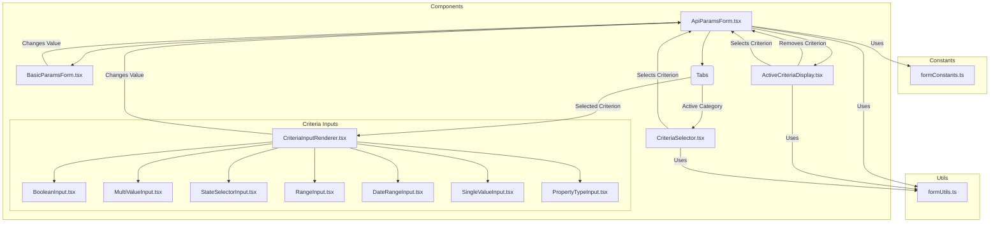

# Plan to Refactor ApiParamsForm.tsx

**1. Identify Core Responsibilities:**

The current `ApiParamsForm.tsx` handles several distinct tasks:

*   **Constants Definition:** Defining static data like `CRITERIA_CATEGORIES`, `US_STATES`, `PROPERTY_TYPES`.
*   **Helper Functions:** Utility functions like `getCategoryColor`, `getCriterionExplanation`, `formatCriteriaValue`.
*   **State Management:** Managing component state for tabs, selected criteria, input values, etc.
*   **Basic Parameter Inputs:** Rendering form controls for `limit`, `start`, `purchase`.
*   **Criteria Selection UI:** Rendering the list of criteria within each category tab (`renderCriteriaSelector`).
*   **Criteria Input Rendering:** Dynamically rendering the correct input control based on the selected criterion's type (`renderCriteriaInput`). This includes complex logic for different types (Boolean, Multiple Values, Ranges, Dates, States, Property Types).
*   **Active Criteria Display:** Showing selected criteria as badges and providing a removal mechanism.
*   **Request Summary:** Displaying a human-readable summary of the configured API request.
*   **Overall Layout:** Structuring the form using `Card`, `Tabs`, `Row`, `Col`.

**2. Proposed Modular Structure:**

We can break down the component into smaller, focused components and utility files:

*   **`src/constants/formConstants.ts`:**
    *   Move `CRITERIA_CATEGORIES`, `US_STATES`, `PROPERTY_TYPES` here.
*   **`src/utils/formUtils.ts`:**
    *   Move helper functions: `getCategoryColor`, `getCriterionExplanation`, `formatCriteriaValue`.
*   **`src/components/form/BasicParamsForm.tsx`:**
    *   New component responsible for rendering the 'Limit', 'Start', and 'Purchase' form fields (Lines 591-637).
    *   Receives `apiParams` and `handleParamChange` as props.
*   **`src/components/criteria/CriteriaSelector.tsx`:**
    *   New component encapsulating the logic from `renderCriteriaSelector` (Lines 145-227).
    *   Displays the list of criteria for the active category.
    *   Receives `criteriaDefs`, `activeCategoryKey`, `selectedCriterion`, `apiParams.criteria`, and `onCriterionSelect` (renamed `handleCriterionSelect`) as props.
*   **`src/components/criteria/inputs/` (New Directory):**
    *   **`BooleanInput.tsx`:** Component for rendering Yes/No dropdown (Lines 233-246).
    *   **`MultiValueInput.tsx`:** Component for comma-separated text input (Lines 291-311).
    *   **`StateSelectorInput.tsx`:** Component for the US State checkbox group (Lines 251-288).
    *   **`RangeInput.tsx`:** Component for Min/Max number inputs (Lines 390-424).
    *   **`DateRangeInput.tsx`:** Component handling preset/custom date ranges (Lines 315-388). Requires internal state for `dateSelectionType`.
    *   **`SingleValueInput.tsx`:** Component for a simple text input (Lines 426-436).
    *   **`PropertyTypeInput.tsx`:** Component for property type checkboxes (Lines 438-472).
    *   *(Each input component receives the specific `criterionDefinition`, the current `value` from `apiParams.criteria`, and the `onCriteriaChange` handler as props)*
*   **`src/components/criteria/CriteriaInputRenderer.tsx`:**
    *   New component replacing the `renderCriteriaInput` function (Lines 229-481).
    *   Takes `selectedCriterion` definition, `apiParams.criteria`, and `onCriteriaChange` as props.
    *   Contains the `switch` statement to determine which specific input component from `src/components/criteria/inputs/` to render based on `selectedCriterion.criteriaType`.
*   **`src/components/criteria/ActiveCriteriaDisplay.tsx`:**
    *   New component responsible for rendering the active criteria badges and the request summary (Lines 673-781).
    *   Receives `apiParams.criteria`, `criteriaDefs`, `onRemoveCriterion` (renamed `handleCriteriaChange` with value `undefined`), and `onSelectCriterion` (to handle clicking badges) as props.
*   **`src/components/ApiParamsForm.tsx` (Refactored):**
    *   Manages the core state (`apiParams`, `setApiParams`, `activeTab`, `selectedCriterion`).
    *   Imports and orchestrates the new child components (`BasicParamsForm`, `CriteriaSelector`, `CriteriaInputRenderer`, `ActiveCriteriaDisplay`).
    *   Handles top-level logic like tab switching (`onSelect` for `Tabs`) and the main `handleParamChange`, `handleCriteriaChange`, `handleCriterionSelect` functions (passing them down as props).
    *   Renders the main `Card` and `Tabs` structure.

**3. Data Flow:**

*   The main `ApiParamsForm` holds the `apiParams` state and the `setApiParams` function.
*   Callbacks (`handleParamChange`, `handleCriteriaChange`, `handleCriterionSelect`) are defined in `ApiParamsForm` and passed down to the relevant child components.
*   Child components receive necessary data slices (e.g., `apiParams.limit`, `selectedCriterion`, `apiParams.criteria`) and the callbacks as props.
*   When a user interacts with a child component (e.g., changes an input), the child calls the appropriate callback prop, which updates the state in the parent `ApiParamsForm`.
*   React's reconciliation process re-renders the necessary components with the updated props.

**4. Mermaid Diagram:**

**5. Benefits:**

*   **Improved Readability:** Each file/component has a single, clear responsibility.
*   **Easier Maintenance:** Changes related to a specific part (e.g., date input logic) are isolated to one component.
*   **Increased Reusability:** Individual input components or the criteria selector could potentially be reused elsewhere.
*   **Better Testability:** Smaller components are easier to unit test in isolation.