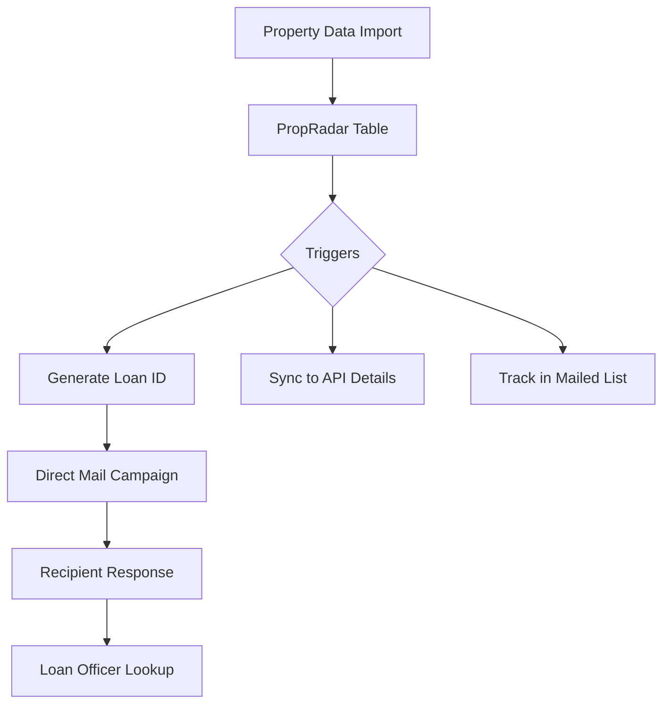
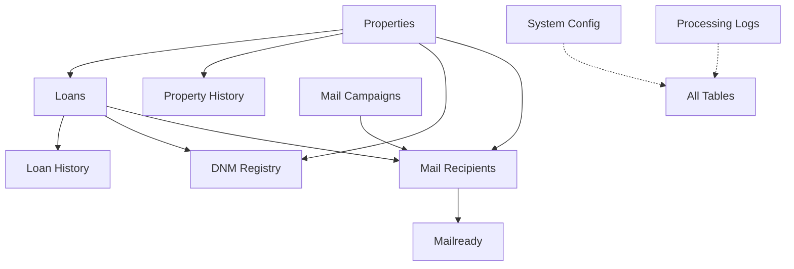

# System Patterns

## Architecture
The Property Mail System follows a relational database-centric architecture with automated workflows triggered by data changes.

The database structure follows this relationship model:

## Key Technical Decisions
- **PostgreSQL Database**: Using PostgreSQL for its robust transaction support, triggers, and functions.
- **Unique Loan ID Generation**: Implementing a specialized format `[LoanType][State][YY][Week]-[Sequence]` with collision handling.
- **Trigger-Based Automation**: Using database triggers to automate workflows when data changes.
- **History Tracking**: Maintaining complete history tables for audit and compliance purposes.
- **Materialized Views**: Using materialized views for performance-optimized reporting.
- **Archival Strategy**: Implementing automated archival processes to maintain performance while preserving historical data.

## Design Patterns
- **Repository Pattern**: Centralizing data access through structured tables and views.
- **Observer Pattern**: Using database triggers to observe changes and execute workflows.
- **Factory Pattern**: Implementing loan ID generation as a factory that creates standardized identifiers.
- **Strategy Pattern**: Using configurable system parameters to adjust business logic without code changes.
- **Decorator Pattern**: Enhancing base data with additional information through views and joins.

## Component Relationships
1. **Properties and Loans**: One-to-many relationship where a property can have multiple loans.
2. **Properties/Loans and History**: One-to-many relationship tracking all changes to core data.
3. **Properties/Loans and DNM Registry**: Many-to-many relationship managing mailing restrictions.
4. **Mail Campaigns and Recipients**: One-to-many relationship organizing mailings into campaigns.
5. **Recipients and Mailready**: One-to-one relationship maintaining backward compatibility.
6. **System Config**: Global configuration affecting all components.
7. **Processing Logs**: System-wide logging capturing events across all components.

The system uses database views, particularly the `complete_property_view`, to present unified data across these relationships for loan officer interfaces.
