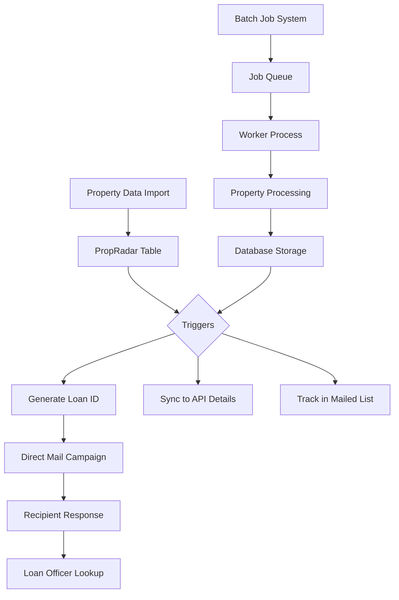
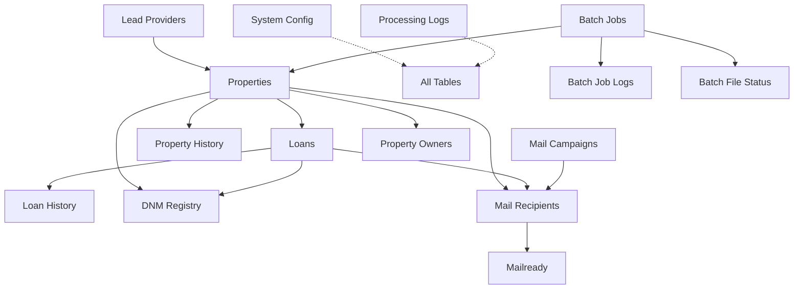

# System Patterns

## Architecture
The Property Mail System follows a relational database-centric architecture with automated workflows triggered by data changes, now enhanced with a batch job processing system for handling large volumes of property data.

The database structure follows this normalized relationship model:

## Key Technical Decisions
- **PostgreSQL Database**: Using PostgreSQL for its robust transaction support, triggers, and functions.
- **Normalized Database Structure**: Implementing a normalized structure to support multiple lead providers and multiple owners per property.
- **Unique Loan ID Generation**: Implementing a specialized format `[LoanType][State][YY][Week]-[Sequence]` with collision handling.
- **Trigger-Based Automation**: Using database triggers to automate workflows when data changes.
- **History Tracking**: Maintaining complete history tables for audit and compliance purposes.
- **Materialized Views**: Using materialized views for performance-optimized reporting.
- **Archival Strategy**: Implementing automated archival processes to maintain performance while preserving historical data.
- **Batch Job Processing**: Using a worker-based approach for asynchronous processing of large property datasets.
- **Job Queue Management**: Implementing a database-based job queue for managing and prioritizing property processing jobs.
- **JWT Authentication**: Using JSON Web Tokens for stateless authentication with automatic token refresh.
- **Type-Safe Development**: Using TypeScript throughout the application for improved code quality and maintainability.

## Design Patterns
- **Repository Pattern**: Centralizing data access through structured repositories for each entity type.
- **Observer Pattern**: Using database triggers to observe changes and execute workflows.
- **Factory Pattern**: Implementing loan ID generation as a factory that creates standardized identifiers.
- **Strategy Pattern**: Using configurable system parameters to adjust business logic without code changes.
- **Decorator Pattern**: Enhancing base data with additional information through views and joins.
- **Adapter Pattern**: Using a consistent field naming convention to adapt data from different lead providers.
- **Worker Pattern**: Using separate processes for background job execution to maintain API responsiveness.
- **Queue Pattern**: Managing asynchronous jobs through a prioritized queue system.
- **Provider Pattern**: Abstracting lead data sources through a common interface for flexibility.

## Component Relationships
1. **Properties and Loans**: One-to-many relationship where a property can have multiple loans.
2. **Properties and Owners**: One-to-many relationship where a property can have multiple owners.
3. **Lead Providers and Properties**: One-to-many relationship where a lead provider can supply multiple properties.
4. **Properties/Loans and History**: One-to-many relationship tracking all changes to core data.
5. **Properties/Loans and DNM Registry**: Many-to-many relationship managing mailing restrictions.
6. **Mail Campaigns and Recipients**: One-to-many relationship organizing mailings into campaigns.
7. **Recipients and Mailready**: One-to-one relationship maintaining backward compatibility.
8. **System Config**: Global configuration affecting all components.
9. **Processing Logs**: System-wide logging capturing events across all components.
10. **Batch Jobs and Properties**: One-to-many relationship where a batch job processes multiple properties.
11. **Batch Jobs and Logs**: One-to-many relationship tracking detailed job execution information.
12. **Batch Jobs and File Status**: One-to-many relationship tracking property file processing status.

The system uses database views, particularly the `complete_property_view`, to present unified data across these relationships for loan officer interfaces. The batch job processing system adds a layer of asynchronous processing capabilities, allowing for efficient handling of large property datasets while maintaining system responsiveness.
