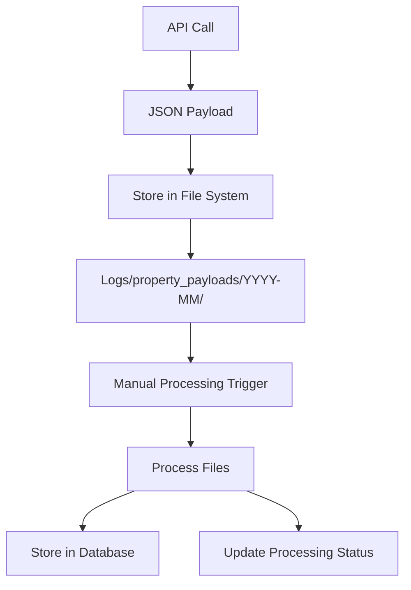

# Property Data Storage and Processing Plan

## 1. Problem Statement

When fetching property data from the API, we need a robust system to:
- Preserve the raw JSON payload in case of processing failures
- Allow manual control over when database processing occurs
- Prevent duplicate processing
- Maintain data integrity
- Track processing status and history

## 2. Proposed Architecture

### Revised Flow (Two-Phase Approach)



This approach separates the process into two distinct phases:
1. **Data Capture Phase**: API data is fetched and stored as JSON files only
2. **Processing Phase**: Files are processed and inserted into the database when manually triggered

The property data is only inserted into the database once, during the processing phase.

## 3. Directory Structure

```
logs/
├── property_payloads/      # Original JSON files (never modified)
│   └── YYYY-MM/            # Organized by month
│       └── {campaignId}_batch{number}_{timestamp}.json
├── pending/                # Symbolic links or markers for pending files
├── processing/             # Temporary copies during processing
└── processed/              # Record of processed files
```

## 4. Database Schema

We've already created the `batch_file_status` table with:
- `file_id`: Primary key
- `file_path`: Path to the JSON file
- `campaign_id`: Campaign identifier
- `batch_number`: Batch sequence number
- `status`: PENDING, PROCESSING, COMPLETED, FAILED
- `created_at`: When file was created
- `processed_at`: When processing completed/failed
- `error_details`: Any error information
- `properties_count`: Number of properties in the file
- `success_count`: Number of successfully processed properties
- `error_count`: Number of properties that failed processing
- `processing_time_ms`: Processing time in milliseconds

## 5. Processing Flow

### 5.1 Data Capture Phase
1. API call fetches property data (batches of 400)
2. JSON payload is saved to `logs/property_payloads/YYYY-MM/` directory
3. Record is created in `batch_file_status` table with status 'PENDING'
4. Marker file or symbolic link is created in `pending/` directory
5. **No database insertion of property data happens at this point**

### 5.2 Processing Phase (Manual Trigger)
1. User runs a script to process pending files
2. For each pending file:
   - Create a temporary copy in `processing/` directory
   - Update status to 'PROCESSING' in database
   - Process the temporary file (save to database) - **This is when property data is inserted**
   - Update status to 'COMPLETED' or 'FAILED' in database
   - Delete the temporary file
   - Create a marker in `processed/` directory

## 6. Data Integrity Measures

1. **Checksums**: Calculate and store checksums for each file to verify integrity
2. **File Locking**: Prevent concurrent processing of the same file
3. **Transaction Management**: Use database transactions for atomic operations
4. **Error Handling**: Comprehensive error handling with detailed logging
5. **Retry Mechanism**: Allow failed files to be retried manually

## 7. Implementation Components

1. **PropertyPayloadService**: Handles file operations and status tracking
   - Save property payloads to files
   - Track file status in database
   - Process files with proper error handling

2. **PropertyBatchService**: Handles API calls and database operations
   - Fetch properties from API
   - Save properties to files via PropertyPayloadService
   - Process files and save properties to database when triggered

3. **Manual Processing Script**: Triggers processing of pending files
   - Simple command-line script
   - Can be scheduled or run manually
   - Reports processing results

4. **Monitoring Component**: Tracks processing status
   - Dashboard or simple UI to view processing status
   - Alerts for stuck or failed files

## 8. Cleanup and Retention

1. Monthly cleanup process to remove old files
2. Keep files for the current month plus previous month
3. Archive option for important data

## 9. Implementation Phases

### Phase 1: Core Infrastructure
- Create directory structure
- Implement PropertyPayloadService
- Modify PropertyBatchService to save files

### Phase 2: Processing System
- Implement manual processing script
- Add file integrity checks
- Implement retry mechanism

### Phase 3: Monitoring and Management
- Create simple dashboard
- Add reporting capabilities
- Implement cleanup process