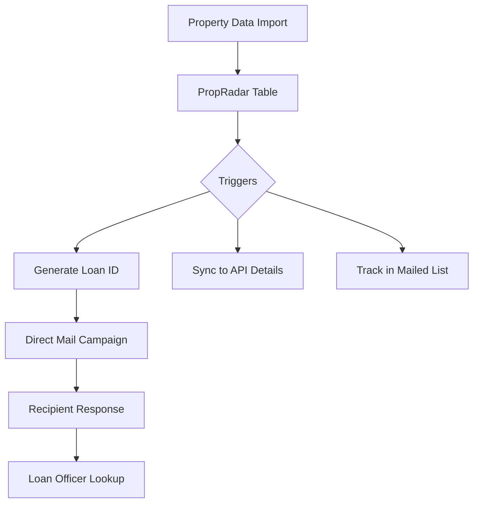

# Property Mail System Overview

## System Purpose
This system manages a direct mail campaign workflow for property owners, focusing on loan opportunities. It handles:
1. Property data collection and standardization
2. Lead tracking and mailing management
3. Loan officer lookup capabilities via unique loan IDs

## Core Workflow

## Key Components

### 1. Data Collection (PropRadar)
- Serves as the source of truth for property data
- Contains property details, owner info, and financial metrics
- Triggers automated workflows when new data arrives

### 2. Data Processing 
- Standardizes property data format
- Generates unique loan IDs for tracking
- Structures data for mail campaigns and lookups

### 3. Mailing System
- Tracks which properties have been mailed to
- Records mailing dates and states
- Prevents duplicate mailings

### 4. Loan ID System
The loan ID is a crucial identifier used to:
- Track leads through the system
- Enable quick lookups when recipients call
- Connect mail campaigns to responses

## Data Flow Sequence

1. **Initial Data Entry**
   - Property data enters through PropRadar
   - System validates and standardizes information

2. **Automated Processing**
   - Triggers fire to:
     * Generate unique loan ID
     * Sync data to API format
     * Add to mailing tracker

3. **Campaign Management**
   - System prepares data for mail campaigns
   - Tracks which properties have been contacted
   - Maintains mailing history

4. **Response Handling**
   - Recipients can reference loan ID when calling
   - Loan officers use ID to quickly access property/owner info
   - System maintains complete contact history

## Purpose and Goals

The system aims to:
1. Streamline property data management
2. Automate direct mail campaigns
3. Enable quick response lookups
4. Track campaign effectiveness
5. Maintain accurate mailing records

This documentation provides a high-level overview for system reconstruction, focusing on the essential workflows and components rather than specific database implementation details.
