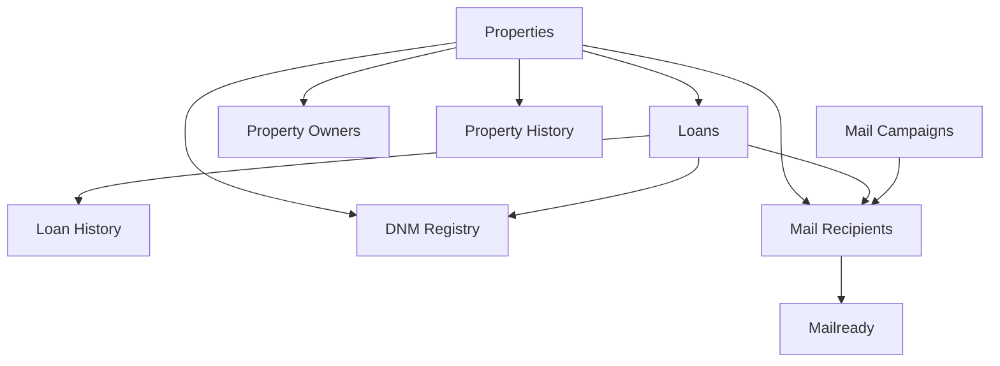

# PropertyRadar to Normalized Database Field Mapping

This document outlines how PropertyRadar fields map to our normalized database structure, which supports multiple lead providers.

## Normalization Approach

Our database is designed with these principles:

1. **Consistent field naming** across all data sources
2. **Separation of concerns** with dedicated tables for properties, owners, loans, etc.
3. **Flexible structure** that can accommodate data from multiple providers
4. **Standardized data types** for consistent processing

## Database Tables Overview



## Field Mapping Table

### Properties Table

| Normalized Field Name      | PropertyRadar Field          | Data Type        | Description                                           |
|----------------------------|------------------------------|------------------|-------------------------------------------------------|
| property_id                | (Generated)                  | SERIAL           | Primary key                                           |
| external_id                | RadarID                      | VARCHAR(50)      | PropertyRadar's unique identifier                     |
| external_source            | (Constant: 'PROPERTYRADAR')  | VARCHAR(50)      | Source system identifier                              |
| property_address           | Address                      | VARCHAR(255)     | Property street address                               |
| property_city              | City                         | VARCHAR(100)     | Property city                                         |
| property_state             | State                        | VARCHAR(2)       | Property state                                        |
| property_zip               | ZipFive                      | VARCHAR(10)      | Property ZIP code                                     |
| property_county            | County                       | VARCHAR(100)     | Property county                                       |
| property_apn               | APN                          | VARCHAR(50)      | Assessor's Parcel Number                              |
| property_type              | (Derived from PType)         | VARCHAR(50)      | Descriptive property type (Single Family, Condo, etc.)|
| property_type_code         | PType                        | VARCHAR(10)      | Property type code (SFR, CND, etc.)                   |
| year_built                 | YearBuilt                    | INTEGER          | Year the property was built                           |
| is_owner_occupied          | isSameMailingOrExempt        | BOOLEAN          | Whether the owner lives at the property               |
| ownership_type             | OwnershipType                | VARCHAR(50)      | How title is held (Individual, Joint, Trust, etc.)    |
| owner_mailing_address      | MailingAddress               | VARCHAR(255)     | Owner's mailing address                               |
| owner_mailing_city         | MailingCity                  | VARCHAR(100)     | Owner's mailing city                                  |
| owner_mailing_state        | MailingState                 | VARCHAR(2)       | Owner's mailing state                                 |
| owner_mailing_zip          | MailingZip                   | VARCHAR(10)      | Owner's mailing ZIP code                              |
| is_mailing_vacant          | isMailVacant                 | BOOLEAN          | Whether the mailing address is vacant                 |
| estimated_value            | AVM                          | DECIMAL(15, 2)   | Estimated property value                              |
| assessed_value             | AssessedValue                | DECIMAL(15, 2)   | Tax assessed value                                    |
| annual_taxes               | AnnualTaxes                  | DECIMAL(15, 2)   | Annual property tax amount                            |
| tax_rate                   | EstimatedTaxRate             | DECIMAL(5, 3)    | Property tax rate                                     |
| is_listed_for_sale         | isListedForSale              | BOOLEAN          | Whether the property is listed for sale               |
| listing_price              | ListingPrice                 | DECIMAL(15, 2)   | Current listing price                                 |
| days_on_market             | DaysOnMarket                 | INTEGER          | Days the property has been on the market              |
| is_vacant                  | isVacant                     | BOOLEAN          | Whether the property is vacant                        |
| last_sale_date             | LastTransferRecDate          | DATE             | Date of last property transfer                        |
| last_sale_price            | LastTransferValue            | DECIMAL(15, 2)   | Price of last property transfer                       |
| last_sale_down_payment_pct | LastTransferDownPaymentPercent | DECIMAL(5, 2)  | Down payment percentage of last transfer              |
| last_seller                | LastTransferSeller           | VARCHAR(255)     | Seller in last property transfer                      |
| is_in_foreclosure          | inForeclosure                | BOOLEAN          | Whether the property is in foreclosure                |
| foreclosure_stage          | ForeclosureStage             | VARCHAR(50)      | Current stage of foreclosure                          |
| is_tax_delinquent          | inTaxDelinquency             | BOOLEAN          | Whether property taxes are delinquent                 |
| tax_delinquent_amount      | DelinquentAmount             | DECIMAL(15, 2)   | Amount of delinquent taxes                            |
| tax_delinquent_year        | DelinquentYear               | INTEGER          | Year when taxes became delinquent                     |
| available_equity           | AvailableEquity              | DECIMAL(15, 2)   | Estimated available equity                            |
| equity_percentage          | EquityPercent                | DECIMAL(5, 2)    | Equity as percentage of value                         |
| combined_ltv               | CLTV                         | DECIMAL(5, 2)    | Combined loan-to-value ratio                          |

### Property Owners Table

| Normalized Field Name      | PropertyRadar Field          | Data Type        | Description                                           |
|----------------------------|------------------------------|------------------|-------------------------------------------------------|
| owner_id                   | (Generated)                  | SERIAL           | Primary key                                           |
| property_id                | (Foreign key)                | INTEGER          | Reference to properties table                         |
| first_name                 | OwnerFirstName               | VARCHAR(100)     | Owner's first name                                    |
| last_name                  | OwnerLastName                | VARCHAR(100)     | Owner's last name                                     |
| full_name                  | Owner                        | VARCHAR(255)     | Owner's full name                                     |
| email                      | (From EmailAvailability)     | VARCHAR(255)     | Owner's email address                                 |
| phone                      | (From PhoneAvailability)     | VARCHAR(20)      | Owner's phone number                                  |
| owner_position             | (Derived)                    | INTEGER          | Position (1=primary, 2=spouse, etc.)                  |
| relationship_type          | (Derived)                    | VARCHAR(50)      | Relationship to property (PRIMARY, SPOUSE, etc.)      |

### Loans Table

| Normalized Field Name      | PropertyRadar Field          | Data Type        | Description                                           |
|----------------------------|------------------------------|------------------|-------------------------------------------------------|
| loan_id                    | (Generated)                  | VARCHAR(20)      | Primary key (format: [Type][State][YY][WW]-[RANDOM])  |
| property_id                | (Foreign key)                | INTEGER          | Reference to properties table                         |
| loan_type                  | FirstLoanType/SecondLoanType | VARCHAR(50)      | Type of loan (Conventional, FHA, etc.)                |
| loan_purpose               | FirstPurpose                 | VARCHAR(100)     | Purpose of loan (Purchase, Refinance, etc.)           |
| loan_amount                | FirstAmount/SecondAmount     | DECIMAL(15, 2)   | Original loan amount                                  |
| loan_balance               | (Portion of TotalLoanBalance)| DECIMAL(15, 2)   | Current loan balance                                  |
| interest_rate              | FirstRate                    | DECIMAL(5, 3)    | Current interest rate                                 |
| rate_type                  | FirstRateType                | VARCHAR(20)      | Rate type (FIXED, ARM, etc.)                          |
| term_years                 | FirstTermInYears             | INTEGER          | Original loan term in years                           |
| loan_position              | (Derived: 1=first, 2=second) | INTEGER          | Position of loan (1=first mortgage, 2=second, etc.)   |
| lender_name                | FirstLender                  | VARCHAR(255)     | Name of lending institution                           |
| origination_date           | FirstDate/SecondDate         | DATE             | Date loan was originated                              |
| maturity_date              | (Calculated)                 | DATE             | Date loan will be paid off                            |
| equity_amount              | (Calculated)                 | DECIMAL(15, 2)   | Dollar amount of equity in this loan                  |
| equity_percentage          | (Calculated)                 | DECIMAL(5, 2)    | Percentage of equity in this loan                     |
| default_amount             | DefaultAmount                | DECIMAL(15, 2)   | Amount needed to cure default                         |

## Data Flow Examples

### Example 1: Single Family Home with First Mortgage

**PropertyRadar Data:**
```json
{
  "RadarID": "PR12345678",
  "PType": "SFR",
  "Address": "123 Main St",
  "City": "Phoenix",
  "State": "AZ",
  "ZipFive": "85001",
  "County": "Maricopa",
  "APN": "123-45-678",
  "Owner": "John Smith",
  "OwnerFirstName": "John",
  "OwnerLastName": "Smith",
  "OwnershipType": "INDIVIDUAL",
  "isSameMailingOrExempt": true,
  "AVM": 350000,
  "FirstLoanType": "CONVENTIONAL",
  "FirstAmount": 280000,
  "FirstRate": 4.5,
  "FirstRateType": "FIXED",
  "FirstTermInYears": 30,
  "FirstDate": "2018-06-15",
  "TotalLoanBalance": 260000,
  "EquityPercent": 25.7,
  "CLTV": 74.3
}
```
