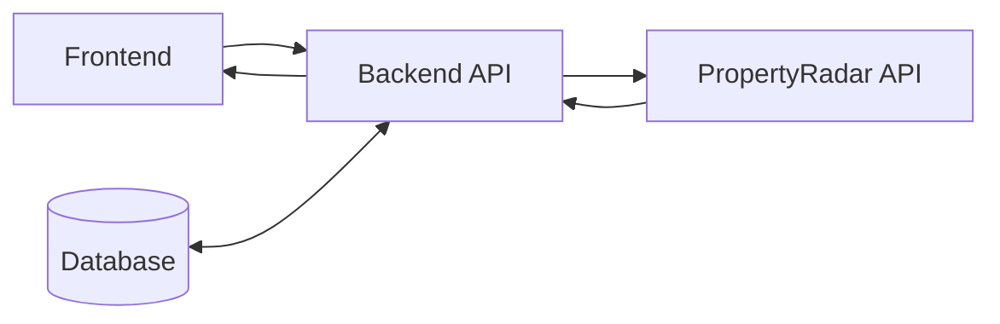
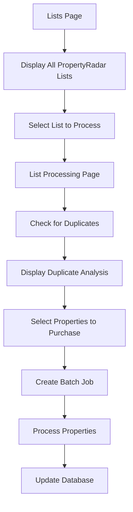

# Revised Implementation Plan: PropertyRadar Lists UI with Backend Integration

## Overview

This plan outlines how to set up a UI that displays PropertyRadar lists and allows users to purchase properties from those lists, with all API calls proxied through our backend to maintain token security.

## Architecture



## UI Flow



## Implementation Components

### 1. Backend Services

#### 1.1 Update PropertyRadarListService

```typescript
// property-data-tester/server/services/PropertyRadarListService.ts
export class PropertyRadarListService {
  private apiBaseUrl: string;
  private authToken: string;
  private pool: Pool;

  constructor(pool: Pool) {
    this.apiBaseUrl = 'https://api.propertyradar.com';
    this.authToken = process.env.PROPERTY_RADAR_TOKEN || '';
    this.pool = pool;
  }

  /**
   * Get all lists from PropertyRadar
   */
  async getLists(): Promise<PropertyRadarList[]> {
    try {
      const response = await axios.get(`${this.apiBaseUrl}/v1/lists`, {
        headers: this.getAuthHeaders()
      });
      
      return response.data.results || [];
    } catch (error) {
      console.error('Error fetching PropertyRadar lists:', error);
      throw error;
    }
  }

  /**
   * Get items (RadarIDs) from a specific list with pagination
   */
  async getListItems(listId: number, start: number = 0, limit: number = 1000): Promise<PropertyRadarListItem[]> {
    try {
      const response = await axios.get(`${this.apiBaseUrl}/v1/lists/${listId}/items`, {
        params: {
          Start: start,
          Limit: limit
        },
        headers: this.getAuthHeaders()
      });
      
      return response.data.results || [];
    } catch (error) {
      console.error(`Error fetching items for list ${listId}:`, error);
      throw error;
    }
  }

  /**
   * Get all items from a list with pagination handling
   */
  async getAllListItems(listId: number): Promise<PropertyRadarListItem[]> {
    let allItems: PropertyRadarListItem[] = [];
    let hasMore = true;
    let start = 0;
    const limit = 1000; // PropertyRadar's maximum limit
    
    while (hasMore) {
      const items = await this.getListItems(listId, start, limit);
      allItems = [...allItems, ...items];
      
      if (items.length < limit) {
        hasMore = false;
      } else {
        start += limit;
      }
    }
    
    return allItems;
  }

  /**
   * Check which RadarIDs already exist in our database
   */
  async checkDuplicates(radarIds: string[]): Promise<DuplicateProperty[]> {
    if (radarIds.length === 0) return [];
    
    const result = await this.pool.query(`
      SELECT 
        p.radar_id,
        p.address,
        p.city,
        p.state,
        p.zip_code,
        p.created_at,
        c.campaign_id as last_campaign_id,
        c.name as last_campaign_name,
        c.created_at as last_campaign_date
      FROM properties p
      LEFT JOIN campaign_properties cp ON p.property_id = cp.property_id
      LEFT JOIN campaigns c ON cp.campaign_id = c.campaign_id
      WHERE p.radar_id = ANY($1)
      ORDER BY c.created_at DESC
    `, [radarIds]);
    
    // Group by radar_id to get the latest campaign for each property
    const duplicateMap = new Map<string, DuplicateProperty>();
    
    for (const row of result.rows) {
      if (!duplicateMap.has(row.radar_id)) {
        duplicateMap.set(row.radar_id, row);
      }
    }
    
    return Array.from(duplicateMap.values());
  }

  /**
   * Get authentication headers for PropertyRadar API
   */
  private getAuthHeaders() {
    return {
      'Authorization': `Bearer ${this.authToken}`,
      'Content-Type': 'application/json'
    };
  }
}
```

#### 1.2 Update ListController

```typescript
// property-data-tester/server/controllers/ListController.ts
export class ListController {
  private listService: PropertyRadarListService;
  private batchJobService: BatchJobService;
  
  constructor(pool: Pool) {
    this.listService = new PropertyRadarListService(pool);
    const batchJobRepository = new BatchJobRepository(pool);
    this.batchJobService = new BatchJobService(batchJobRepository);
  }
  
  /**
   * Get all PropertyRadar lists
   */
  async getLists(req: Request, res: Response): Promise<void> {
    try {
      const lists = await this.listService.getLists();
      res.json({
        success: true,
        lists: lists
      });
    } catch (error) {
      console.error('Error in getLists:', error);
      res.status(500).json({ 
        success: false,
        error: 'Failed to fetch lists' 
      });
    }
  }
  
  /**
   * Get items from a specific list
   */
  async getListItems(req: Request, res: Response): Promise<void> {
    try {
      const listId = parseInt(req.params.listId);
      const start = req.query.start ? parseInt(req.query.start as string) : 0;
      const limit = req.query.limit ? parseInt(req.query.limit as string) : 1000;
      
      const items = await this.listService.getListItems(listId, start, limit);
      res.json({
        success: true,
        items: items,
        hasMore: items.length === limit
      });
    } catch (error) {
      console.error('Error in getListItems:', error);
      res.status(500).json({ 
        success: false,
        error: 'Failed to fetch list items' 
      });
    }
  }
  
  /**
   * Check for duplicates in a list
   */
  async checkDuplicates(req: Request, res: Response): Promise<void> {
    try {
      const listId = parseInt(req.params.listId);
      const items = await this.listService.getAllListItems(listId);
      const radarIds = items.map(item => item.RadarID);
      
      const duplicates = await this.listService.checkDuplicates(radarIds);
      
      res.json({
        success: true,
        totalItems: radarIds.length,
        duplicateCount: duplicates.length,
        duplicates
      });
    } catch (error) {
      console.error('Error in checkDuplicates:', error);
      res.status(500).json({ 
        success: false,
        error: 'Failed to check duplicates' 
      });
    }
  }
  
  /**
   * Process a list (excluding specified duplicates)
   */
  async processList(req: Request, res: Response): Promise<void> {
    try {
      const listId = parseInt(req.params.listId);
      const excludeRadarIds = req.body.excludeRadarIds || [];
      
      // Get all items from the list
      const items = await this.listService.getAllListItems(listId);
      
      // Filter out excluded RadarIDs
      const filteredRadarIds = items
        .map(item => item.RadarID)
        .filter(id => !excludeRadarIds.includes(id));
      
      if (filteredRadarIds.length === 0) {
        res.status(400).json({ 
          success: false,
          error: 'No properties to process after exclusions' 
        });
        return;
      }
      
      // Create a batch job with the filtered RadarIDs
      const job = await this.batchJobService.createJob({
        status: 'PENDING',
        criteria: {
          RadarID: filteredRadarIds,
          sourceListId: listId // Store list ID in criteria instead
        },
        created_by: req.body.userId || 'system',
        priority: 1
      });
      
      res.json({
        success: true,
        jobId: job.job_id,
        processedCount: filteredRadarIds.length,
        excludedCount: excludeRadarIds.length
      });
    } catch (error) {
      console.error('Error in processList:', error);
      res.status(500).json({ 
        success: false,
        error: 'Failed to process list' 
      });
    }
  }
}
```

#### 1.3 Update Routes

```typescript
// property-data-tester/server/routes/listRoutes.ts
import { Router } from 'express';
import { ListController } from '../controllers/ListController';
import { Pool } from 'pg';

export function createListRoutes(pool: Pool): Router {
  const router = Router();
  const listController = new ListController(pool);
  
  // Get all lists
  router.get('/lists', (req, res) => listController.getLists(req, res));
  
  // Get items from a specific list
  router.get('/lists/:listId/items', (req, res) => listController.getListItems(req, res));
  
  // Check for duplicates in a list
  router.get('/lists/:listId/check-duplicates', (req, res) => listController.checkDuplicates(req, res));
  
  // Process a list (excluding specified duplicates)
  router.post('/lists/:listId/process', (req, res) => listController.processList(req, res));
  
  return router;
}
```

### 2. Frontend Services

#### 2.1 Update List Service

```typescript
// property-data-tester/src/services/list.service.ts
import api from './api';

class ListService {
  /**
   * Get all PropertyRadar lists
   */
  async getLists() {
    const response = await api.get('/lists');
    return response.data.lists;
  }
  
  /**
   * Get items from a specific list
   */
  async getListItems(listId: number, start: number = 0, limit: number = 1000) {
    const response = await api.get(`/lists/${listId}/items`, {
      params: { start, limit }
    });
    return response.data.items;
  }
  
  /**
   * Check for duplicates in a list
   */
  async checkDuplicates(listId: number) {
    const response = await api.get(`/lists/${listId}/check-duplicates`);
    return response.data;
  }
  
  /**
   * Process a list (excluding specified duplicates)
   */
  async processList(listId: number, excludeRadarIds: string[] = []) {
    const response = await api.post(`/lists/${listId}/process`, {
      excludeRadarIds,
      userId: localStorage.getItem('userId') || 'system'
    });
    return response.data;
  }
}

export const listService = new ListService();
```

### 3. Frontend Components

#### 3.1 Lists Page

The Lists Page will display all PropertyRadar lists with key information:
- List name
- List type (dynamic, static, import)
- Item count
- Created date
- Modified date

**Key Features:**
- Sortable columns
- Search/filter functionality
- "Process" button for each list

#### 3.2 List Processing Page

The List Processing Page will handle the analysis and processing of a selected list:

**Key Features:**
- Display list details
- Fetch RadarIDs from the list
- Check for duplicates against the database
- Show duplicate analysis with statistics
- Allow excluding/including specific properties
- "Process" button to create a batch job

## Database Schema Updates

We'll need to track which properties came from which PropertyRadar list:

```sql
-- Add source_list_id column to batch_jobs table
ALTER TABLE batch_jobs 
ADD COLUMN source_list_id INTEGER;

-- Create index for faster lookups
CREATE INDEX idx_batch_jobs_source_list_id ON batch_jobs(source_list_id);
```

## Implementation Steps

1. **Backend Implementation**:
   - Update PropertyRadarListService.ts
   - Create ListController.ts
   - Add list routes to routes/index.ts

2. **Frontend Implementation**:
   - Update list.service.ts
   - Implement ListsPage.tsx
   - Implement ListProcessPage.tsx
   - Update App.tsx to include the new pages

3. **Database Updates**:
   - Add source_list_id column to batch_jobs table
   - Create necessary indexes

4. **Testing**:
   - Test backend API endpoints
   - Test frontend components
   - Test end-to-end flow

## Security Considerations

1. **API Token Security**:
   - Token is stored securely on the server
   - All API calls are proxied through our backend
   - No sensitive information is exposed to the frontend

2. **Error Handling**:
   - Proper error handling on both frontend and backend
   - Informative error messages for users
   - Detailed logging for debugging

3. **Rate Limiting**:
   - Implement delays between API calls to avoid hitting rate limits
   - Add exponential backoff for retries

## Conclusion

This implementation plan provides a secure and efficient way to integrate PropertyRadar lists into our application. By proxying all API calls through our backend, we maintain token security while providing a seamless user experience for viewing and processing PropertyRadar lists.